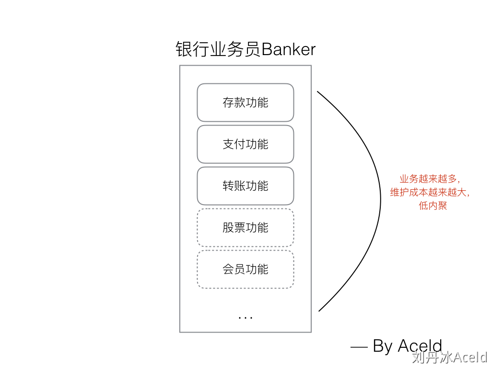
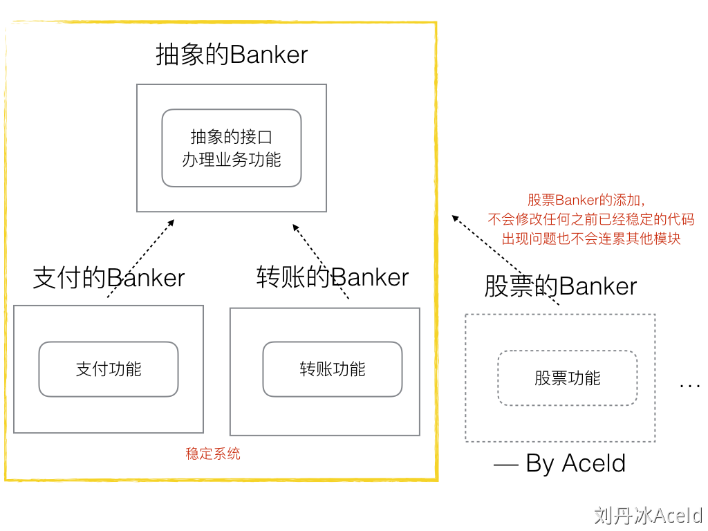
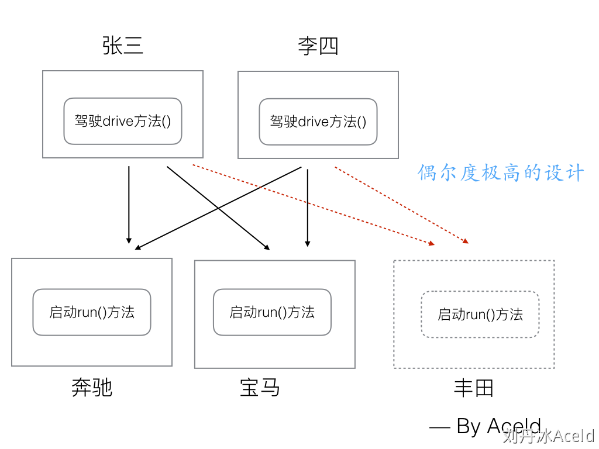
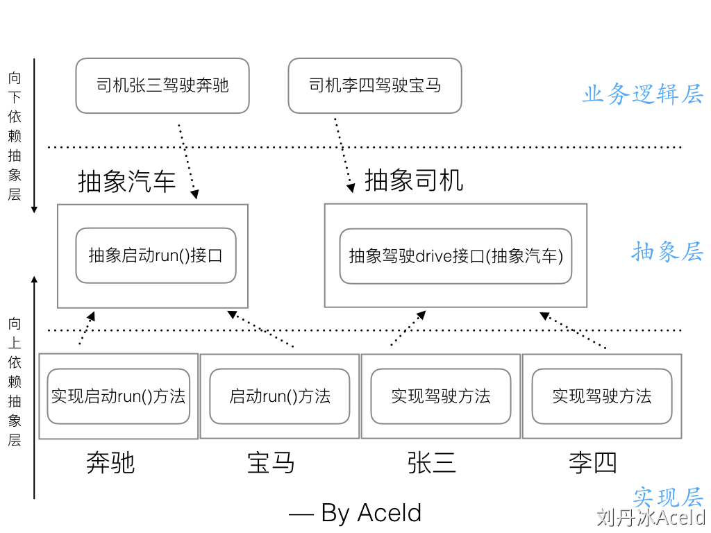
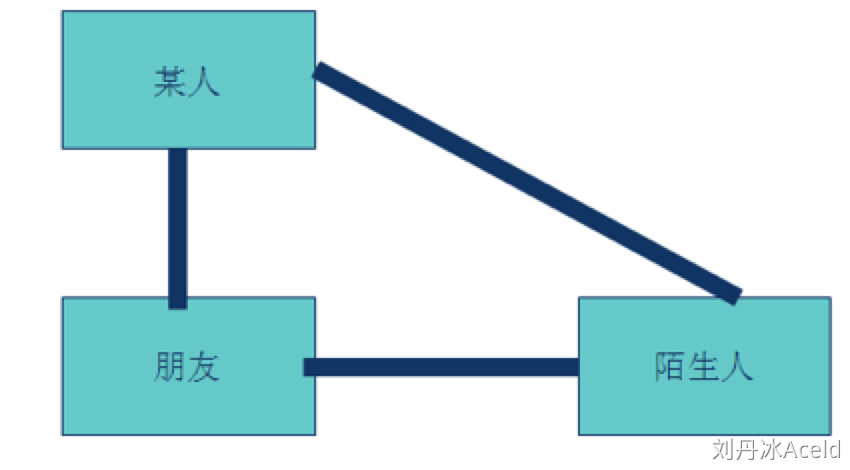
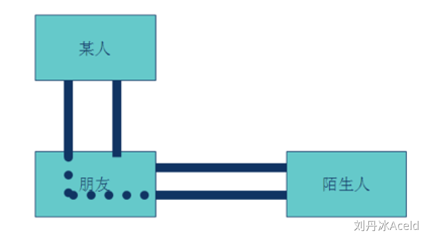

对于面向对象软件系统的设计而言，在支持可维护性的同时，提高系统的可复用性是一个至关重要的问题，**如何同时提高一个软件系统的可维护性和可复用性是面向对象设计需要解决的核心问题之一。**在面向对象设计中，可维护性的复用是以设计原则为基础的。每一个原则都蕴含一些面向对象设计的思想，可以从不同的角度提升一个软件结构的设计水平。

**面向对象设计原则为支持可维护性复用而诞生，这些原则蕴含在很多设计模式中，它们是从许多设计方案中总结出的指导性原则。**面向对象设计原则也是我们用于评价一个设计模式的使用效果的重要指标之一。

原则的目的： 高内聚，低耦合

# 2.1 面向对象设计原则表

| **名称**                                                     | **定义**                                                     |
| ------------------------------------------------------------ | ------------------------------------------------------------ |
| **单一职责原则****(Single Responsibility Principle, SRP)****★★★★☆** | 类的职责单一，对外只提供一种功能，而引起类变化的原因都应该只有一个。 |
| **开闭原则****(Open-Closed Principle, OCP)****★★★★★**        | 类的改动是通过增加代码进行的，而不是修改源代码。             |
| **里氏代换原则****(Liskov Substitution Principle, LSP****★★★★★** | 任何抽象类（interface接口）出现的地方都可以用他的实现类进行替换，实际就是虚拟机制，语言级别实现面向对象功能。 |
| **依赖倒转原则****(Dependence**  **Inversion Principle, DIP)****★★★★★** | 依赖于抽象(接口)，不要依赖具体的实现(类)，也就是针对接口编程。 |
| **接口隔离原则****(Interface Segregation Principle, ISP****★★☆☆☆** | 不应该强迫用户的程序依赖他们不需要的接口方法。一个接口应该只提供一种对外功能，不应该把所有操作都封装到一个接口中去。 |
| **合成复用原则****(Composite Reuse Principle, CRP)****★★★★☆** | 如果使用继承，会导致父类的任何变换都可能影响到子类的行为。如果使用对象组合，就降低了这种依赖关系。对于继承和组合，优先使用组合。 |
| **迪米特法则****(Law of Demeter, LoD****★★★☆☆**              | 一个对象应当对其他对象尽可能少的了解，从而降低各个对象之间的耦合，提高系统的可维护性。例如在一个程序中，各个模块之间相互调用时，通常会提供一个统一的接口来实现。这样其他模块不需要了解另外一个模块的内部实现细节，这样当一个模块内部的实现发生改变时，不会影响其他模块的使用。（黑盒原理） |


# 2.2 单一职责原则

类的职责单一，对外只提供一种功能，而引起类变化的原因都应该只有一个。

```go
package main

import "fmt"

type ClothesShop struct {}

func (cs *ClothesShop) OnShop() {
	fmt.Println("休闲的装扮")
}

type ClothesWork struct {}

func (cw *ClothesWork) OnWork() {
	fmt.Println("工作的装扮")
}

func main() {
	//工作的时候
	cw := new(ClothesWork)
	cw.OnWork()

	//shopping的时候
	cs := new(ClothesShop)
	cs.OnShop()
}
```

在面向对象编程的过程中，设计一个类，建议对外提供的功能单一，接口单一，影响一个类的范围就只限定在这一个接口上，一个类的一个接口具备这个类的功能含义，职责单一不复杂。

# 2.3 开闭原则


## 2.3.1 平铺式设计

那么作为`interface`数据类型，他存在的意义在哪呢？ 实际上是为了满足一些面向对象的编程思想。我们知道，软件设计的最高目标就是`高内聚，低耦合`。那么其中有一个设计原则叫`开闭原则`。什么是开闭原则呢，接下来我们看一个例子：


```go
package main

import "fmt"

//我们要写一个类,Banker银行业务员
type Banker struct {
}

//存款业务
func (this *Banker) Save() {
	fmt.Println( "进行了 存款业务...")
}

//转账业务
func (this *Banker) Transfer() {
	fmt.Println( "进行了 转账业务...")
}

//支付业务
func (this *Banker) Pay() {
	fmt.Println( "进行了 支付业务...")
}

func main() {
	banker := &Banker{}

	banker.Save()
	banker.Transfer()
	banker.Pay()
}
```

代码很简单，就是一个银行业务员，他可能拥有很多的业务，比如`Save()`存款、`Transfer()`转账、`Pay()`支付等。那么如果这个业务员模块只有这几个方法还好，但是随着我们的程序写的越来越复杂，银行业务员可能就要增加方法，会导致业务员模块越来越臃肿。



这样的设计会导致，当我们去给Banker添加新的业务的时候，会直接修改原有的Banker代码，那么Banker模块的功能会越来越多，出现问题的几率也就越来越大，假如此时Banker已经有99个业务了，现在我们要添加第100个业务，可能由于一次的不小心，导致之前99个业务也一起崩溃，因为所有的业务都在一个Banker类里，他们的耦合度太高，Banker的职责也不够单一，代码的维护成本随着业务的复杂正比成倍增大。


## 2.3.2 开闭原则设计


那么，如果我们拥有接口, `interface`这个东西，那么我们就可以抽象一层出来，制作一个抽象的Banker模块，然后提供一个抽象的方法。 分别根据这个抽象模块，去实现`支付Banker（实现支付方法）`,`转账Banker（实现转账方法）`
如下：



那么依然可以搞定程序的需求。 然后，当我们想要给Banker添加额外功能的时候，之前我们是直接修改Banker的内容，现在我们可以单独定义一个`股票Banker(实现股票方法)`，到这个系统中。 而且股票Banker的实现成功或者失败都不会影响之前的稳定系统，他很单一，而且独立。


所以以上，当我们给一个系统添加一个功能的时候，不是通过修改代码，而是通过增添代码来完成，那么就是开闭原则的核心思想了。所以要想满足上面的要求，是一定需要interface来提供一层抽象的接口的。


golang代码实现如下:

```go
package main

import "fmt"

//抽象的银行业务员
type AbstractBanker interface{
	DoBusi()	//抽象的处理业务接口
}

//存款的业务员
type SaveBanker struct {
	//AbstractBanker
}

func (sb *SaveBanker) DoBusi() {
	fmt.Println("进行了存款")
}

//转账的业务员
type TransferBanker struct {
	//AbstractBanker
}

func (tb *TransferBanker) DoBusi() {
	fmt.Println("进行了转账")
}

//支付的业务员
type PayBanker struct {
	//AbstractBanker
}

func (pb *PayBanker) DoBusi() {
	fmt.Println("进行了支付")
}


func main() {
	//进行存款
	sb := &SaveBanker{}
	sb.DoBusi()

	//进行转账
	tb := &TransferBanker{}
	tb.DoBusi()
	
	//进行支付
	pb := &PayBanker{}
	pb.DoBusi()

}
```


当然我们也可以根据`AbstractBanker`设计一个小框架

```go
//实现架构层(基于抽象层进行业务封装-针对interface接口进行封装)
func BankerBusiness(banker AbstractBanker) {
	//通过接口来向下调用，(多态现象)
	banker.DoBusi()
}
```

那么main中可以如下实现业务调用:

```go
func main() {
	//进行存款
	BankerBusiness(&SaveBanker{})

	//进行存款
	BankerBusiness(&TransferBanker{})

	//进行存款
	BankerBusiness(&PayBanker{})
}
```


再看开闭原则定义:
开闭原则:一个软件实体如类、模块和函数应该对扩展开放，对修改关闭。
简单的说就是在修改需求的时候，应该尽量通过扩展来实现变化，而不是通过修改已有代码来实现变化。


## 2.3.3 接口的意义

好了，现在interface已经基本了解，那么接口的意义最终在哪里呢，想必现在你已经有了一个初步的认知，实际上接口的最大的意义就是实现多态的思想，就是我们可以根据interface类型来设计API接口，那么这种API接口的适应能力不仅能适应当下所实现的全部模块，也适应未来实现的模块来进行调用。 `调用未来`可能就是接口的最大意义所在吧，这也是为什么架构师那么值钱，因为良好的架构师是可以针对interface设计一套框架，在未来许多年却依然适用。

# 2.3 依赖倒转原则

## 2.3.1  耦合度极高的模块关系设计





```go
package main

import "fmt"

// === > 奔驰汽车 <===
type Benz struct {

}

func (this *Benz) Run() {
	fmt.Println("Benz is running...")
}

// === > 宝马汽车  <===
type BMW struct {

}

func (this *BMW) Run() {
	fmt.Println("BMW is running ...")
}


//===> 司机张三  <===
type Zhang3 struct {
	//...
}

func (zhang3 *Zhang3) DriveBenZ(benz *Benz) {
	fmt.Println("zhang3 Drive Benz")
	benz.Run()
}

func (zhang3 *Zhang3) DriveBMW(bmw *BMW) {
	fmt.Println("zhang3 drive BMW")
	bmw.Run()
}

//===> 司机李四 <===
type Li4 struct {
	//...
}

func (li4 *Li4) DriveBenZ(benz *Benz) {
	fmt.Println("li4 Drive Benz")
	benz.Run()
}

func (li4 *Li4) DriveBMW(bmw *BMW) {
	fmt.Println("li4 drive BMW")
	bmw.Run()
}

func main() {
	//业务1 张3开奔驰
	benz := &Benz{}
	zhang3 := &Zhang3{}
	zhang3.DriveBenZ(benz)

	//业务2 李四开宝马
	bmw := &BMW{}
	li4 := &Li4{}
	li4.DriveBMW(bmw)
}
```


我们来看上面的代码和图中每个模块之间的依赖关系，实际上并没有用到任何的`interface`接口层的代码，显然最后我们的两个业务 `张三开奔驰`, `李四开宝马`，程序中也都实现了。但是这种设计的问题就在于，小规模没什么问题，但是一旦程序需要扩展，比如我现在要增加一个`丰田汽车` 或者 司机`王五`， 那么模块和模块的依赖关系将成指数级递增，想蜘蛛网一样越来越难维护和捋顺。


## 2.3.2 面向抽象层依赖倒转





如上图所示，如果我们在设计一个系统的时候，将模块分为3个层次，抽象层、实现层、业务逻辑层。那么，我们首先将抽象层的模块和接口定义出来，这里就需要了`interface`接口的设计，然后我们依照抽象层，依次实现每个实现层的模块，在我们写实现层代码的时候，实际上我们只需要参考对应的抽象层实现就好了，实现每个模块，也和其他的实现的模块没有关系，这样也符合了上面介绍的开闭原则。这样实现起来每个模块只依赖对象的接口，而和其他模块没关系，依赖关系单一。系统容易扩展和维护。


我们在指定业务逻辑也是一样，只需要参考抽象层的接口来业务就好了，抽象层暴露出来的接口就是我们业务层可以使用的方法，然后可以通过多态的线下，接口指针指向哪个实现模块，调用了就是具体的实现方法，这样我们业务逻辑层也是依赖抽象成编程。


我们就将这种的设计原则叫做`依赖倒转原则`。


来一起看一下修改的代码：


```go
package main

import "fmt"

// ===== >   抽象层  < ========
type Car interface {
	Run()
}

type Driver interface {
	Drive(car Car)
}

// ===== >   实现层  < ========
type BenZ struct {
	//...
}

func (benz * BenZ) Run() {
	fmt.Println("Benz is running...")
}

type Bmw struct {
	//...
}

func (bmw * Bmw) Run() {
	fmt.Println("Bmw is running...")
}

type Zhang_3 struct {
	//...
}

func (zhang3 *Zhang_3) Drive(car Car) {
	fmt.Println("Zhang3 drive car")
	car.Run()
}

type Li_4 struct {
	//...
}

func (li4 *Li_4) Drive(car Car) {
	fmt.Println("li4 drive car")
	car.Run()
}


// ===== >   业务逻辑层  < ========
func main() {
	//张3 开 宝马
	var bmw Car
	bmw = &Bmw{}

	var zhang3 Driver
	zhang3 = &Zhang_3{}

	zhang3.Drive(bmw)

	//李4 开 奔驰
	var benz Car
	benz = &BenZ{}

	var li4 Driver
	li4 = &Li_4{}

	li4.Drive(benz)
}
```


### 2.4 合成复用原则

如果使用继承，会导致父类的任何变换都可能影响到子类的行为。如果使用对象组合，就降低了这种依赖关系。对于继承和组合，优先使用组合。


```go
package main

import "fmt"

type Cat struct {}

func (c *Cat) Eat() {
	fmt.Println("小猫吃饭")
}

//给小猫添加一个 可以睡觉的方法 （使用继承来实现）
type CatB struct {
	Cat
}

func (cb *CatB) Sleep() {
	fmt.Println("小猫睡觉")
}

//给小猫添加一个 可以睡觉的方法 （使用组合的方式）
type CatC struct {
	C *Cat
}

func (cc *CatC) Sleep() {
	fmt.Println("小猫睡觉")
}


func main() {
	//通过继承增加的功能，可以正常使用
	cb := new(CatB)
	cb.Eat()
	cb.Sleep()

	//通过组合增加的功能，可以正常使用
	cc := new(CatC)
	cc.C = new(Cat)
	cc.C.Eat()
	cc.Sleep()
}
```


### 2.5 迪米特法则

1. 和陌生人说话



1. 不和陌生人说话



1. 与依赖倒转原则结合 某人和 抽象陌生人说话  让某人和陌生人进行解耦合

