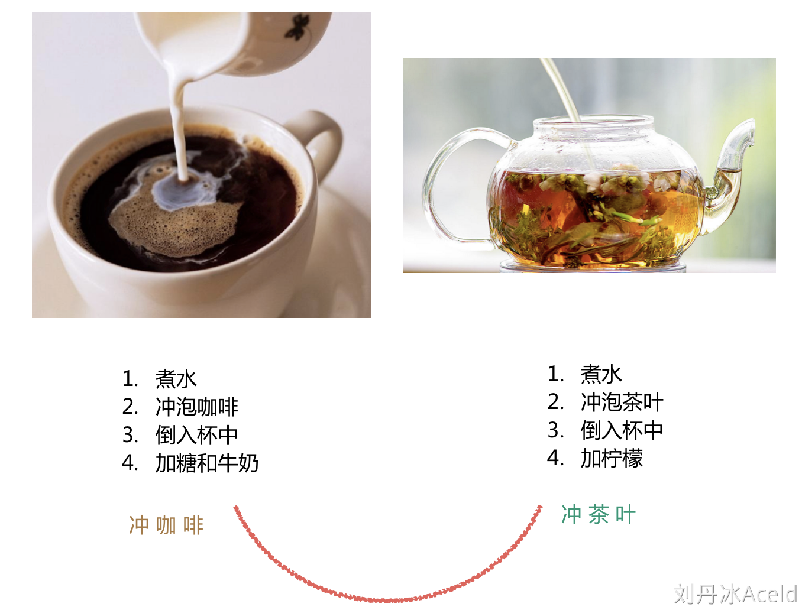
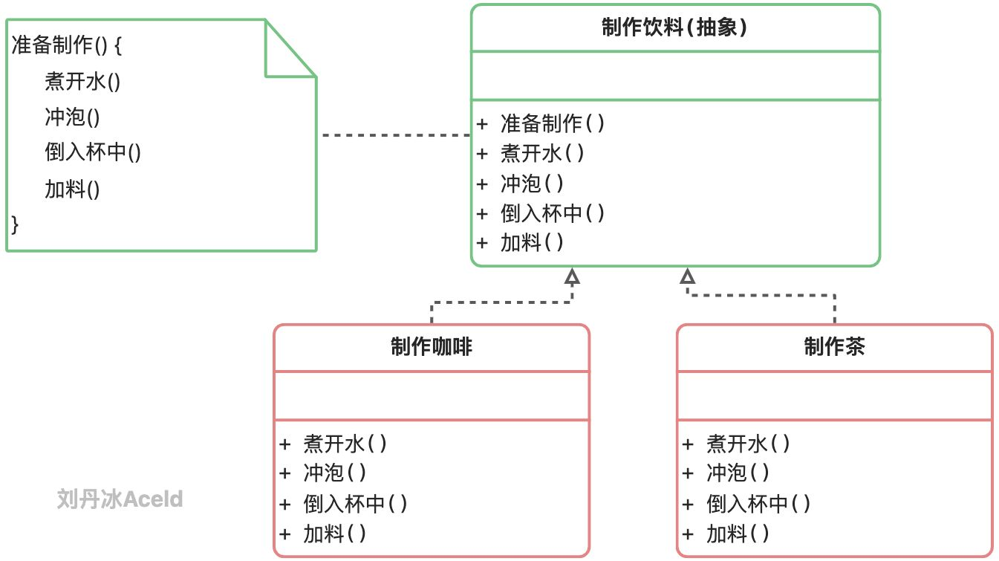

### 5.1.1 模板方法模式中的角色和职责

**AbstractClass（抽象类）：**在抽象类中定义了一系列基本操作(PrimitiveOperations)，这些基本操作可以是具体的，也可以是抽象的，每一个基本操作对应算法的一个步骤，在其子类中可以重定义或实现这些步骤。同时，在抽象类中实现了一个模板方法(Template Method)，用于定义一个算法的框架，模板方法不仅可以调用在抽象类中实现的基本方法，也可以调用在抽象类的子类中实现的基本方法，还可以调用其他对象中的方法。

**ConcreteClass（具体子类）：**它是抽象类的子类，用于实现在父类中声明的抽象基本操作以完成子类特定算法的步骤，也可以覆盖在父类中已经实现的具体基本操作。


### 5.1.2 模板方法模式案例



上图的案例类图如下：




实现代码如下：

```go
package main

import "fmt"

//抽象类，制作饮料,包裹一个模板的全部实现步骤
type Beverage interface {
	BoilWater() //煮开水
	Brew()      //冲泡
	PourInCup() //倒入杯中
	AddThings() //添加酌料

	WantAddThings() bool //是否加入酌料Hook
}

//封装一套流程模板，让具体的制作流程继承且实现
type template struct {
	b Beverage
}

//封装的固定模板
func (t *template) MakeBeverage() {
	if t == nil {
		return
	}

	t.b.BoilWater()
	t.b.Brew()
	t.b.PourInCup()

	//子类可以重写该方法来决定是否执行下面动作
	if t.b.WantAddThings() == true {
		t.b.AddThings()
	}
}


//具体的模板子类 制作咖啡
type MakeCaffee struct {
	template  //继承模板
}

func NewMakeCaffee() *MakeCaffee {
	makeCaffe := new(MakeCaffee)
	//b 为Beverage，是MakeCaffee的接口，这里需要给接口赋值，指向具体的子类对象
	//来触发b全部接口方法的多态特性。
	makeCaffe.b = makeCaffe
	return makeCaffe
}

func (mc *MakeCaffee) BoilWater() {
	fmt.Println("将水煮到100摄氏度")
}

func (mc *MakeCaffee) Brew() {
	fmt.Println("用水冲咖啡豆")
}

func (mc *MakeCaffee) PourInCup() {
	fmt.Println("将充好的咖啡倒入陶瓷杯中")
}

func (mc *MakeCaffee) AddThings() {
	fmt.Println("添加牛奶和糖")
}

func (mc *MakeCaffee) WantAddThings() bool {
	return true //启动Hook条件
}

//具体的模板子类 制作茶
type MakeTea struct {
	template  //继承模板
}

func NewMakeTea() *MakeTea {
	makeTea := new(MakeTea)
	//b 为Beverage，是MakeTea，这里需要给接口赋值，指向具体的子类对象
	//来触发b全部接口方法的多态特性。
	makeTea.b = makeTea
	return makeTea
}

func (mt *MakeTea) BoilWater() {
	fmt.Println("将水煮到80摄氏度")
}

func (mt *MakeTea) Brew() {
	fmt.Println("用水冲茶叶")
}

func (mt *MakeTea) PourInCup() {
	fmt.Println("将充好的咖啡倒入茶壶中")
}

func (mt *MakeTea) AddThings() {
	fmt.Println("添加柠檬")
}

func (mt *MakeTea) WantAddThings() bool {
	return false //关闭Hook条件
}

func main() {
	//1. 制作一杯咖啡
	makeCoffee := NewMakeCaffee()
	makeCoffee.MakeBeverage() //调用固定模板方法

	fmt.Println("------------")

	//2. 制作茶
	makeTea := NewMakeTea()
	makeTea.MakeBeverage()
}
```


运行结果如下：

```bash
将水煮到100摄氏度
用水冲咖啡豆
将充好的咖啡倒入陶瓷杯中
添加牛奶和糖
------------
将水煮到80摄氏度
用水冲茶叶
将充好的咖啡倒入茶壶中
```


### 5.1.3 模板方法的优缺点

优点：

(1) 在父类中形式化地定义一个算法，而由它的子类来实现细节的处理，在子类实现详细的处理算法时并不会改变算法中步骤的执行次序。

(2) 模板方法模式是一种代码复用技术，它在类库设计中尤为重要，它提取了类库中的公共行为，将公共行为放在父类中，而通过其子类来实现不同的行为，它鼓励我们恰当使用继承来实现代码复用。

(3) 可实现一种反向控制结构，通过子类覆盖父类的钩子方法来决定某一特定步骤是否需要执行。

(4) 在模板方法模式中可以通过子类来覆盖父类的基本方法，不同的子类可以提供基本方法的不同实现，更换和增加新的子类很方便，符合单一职责原则和开闭原则。


缺点：

需要为每一个基本方法的不同实现提供一个子类，如果父类中可变的基本方法太多，将会导致类的个数增加，系统更加庞大，设计也更加抽象。


### 5.1.4 适用场景

(1)具有统一的操作步骤或操作过程;

(2) 具有不同的操作细节;

(3) 存在多个具有同样操作步骤的应用场景，但某些具体的操作细节却各不相同;

在抽象类中统一操作步骤，并规定好接口；让子类实现接口。这样可以把各个具体的子类和操作步骤解耦合。