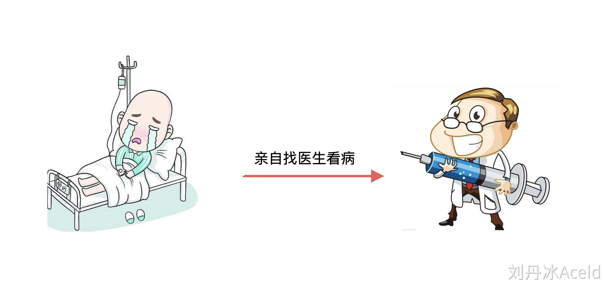
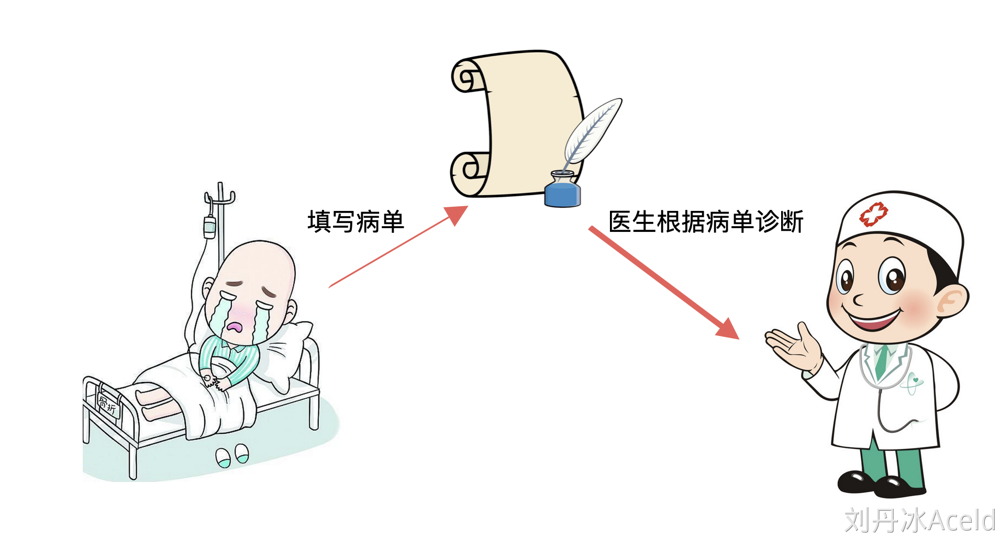
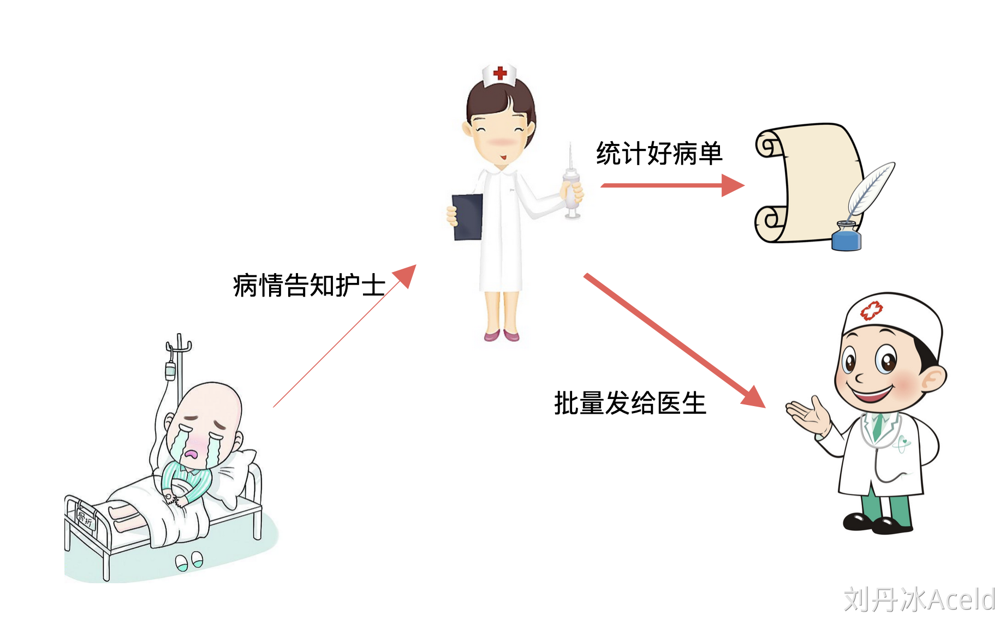
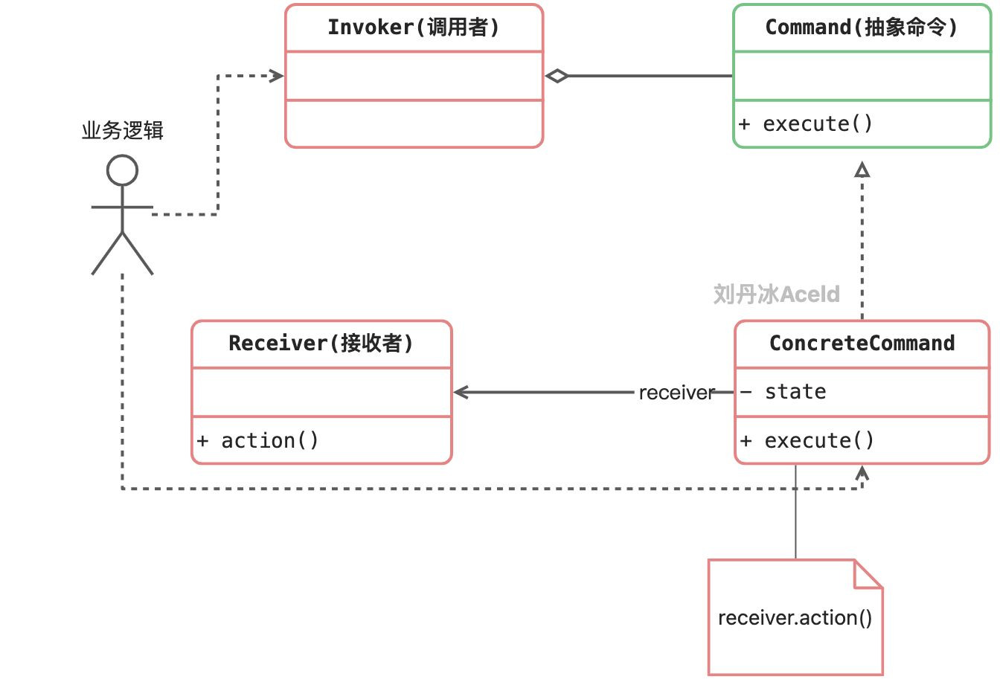
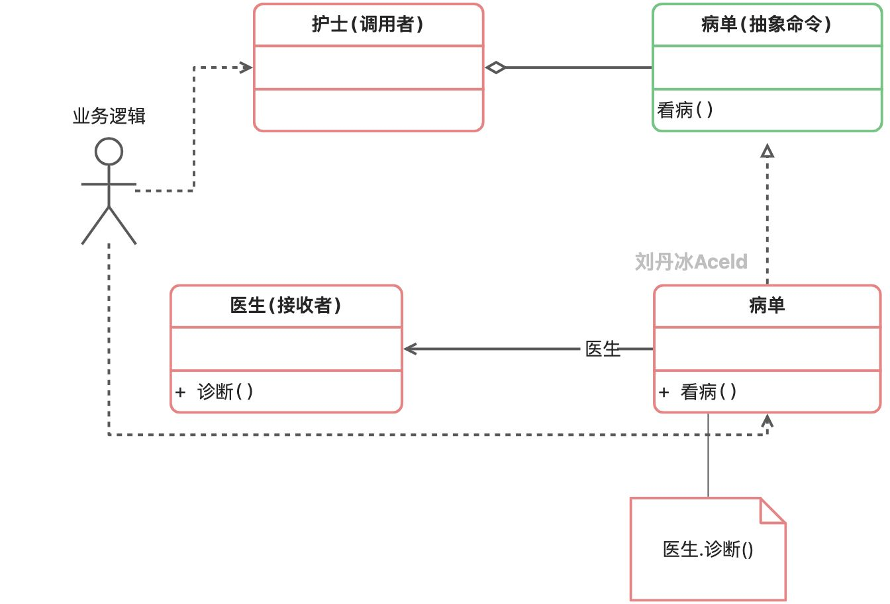

将一个请求封装为一个对象，从而让我们可用不同的请求对客户进行参数化；对请求排队或者记录请求日志，以及支持可撤销的操作。命令模式是一种对象行为型模式，其别名为动作(Action)模式或事务(Transaction)模式。

​	命令模式可以将请求发送者和接收者完全解耦，发送者与接收者之间没有直接引用关系，发送请求的对象只需要知道如何发送请求，而不必知道如何完成请求。


下面来看一种场景，如果去医院看病，病人作为业务方用户，直接找医生看病，这样的场景如下：



那么实现这个模块依赖流程的代码如下：

```go
package main

import "fmt"

type Doctor struct {}

func (d *Doctor) treatEye() {
	fmt.Println("医生治疗眼睛")
}

func (d *Doctor) treatNose() {
	fmt.Println("医生治疗鼻子")
}


//病人
func main() {
	doctor := new(Doctor)
	doctor.treatEye()
	doctor.treatNose()
}
```

结果如下：

```plain
医生治疗眼睛
医生治疗鼻子
```


这样Doctor作为核心的消息接受者和计算模块，将和业务模块高耦合，每个业务方都需要直接面向Doctor依赖和编程。

那么可以通过下述方式，新增一个订单模块，将业务方和核心医生模块进行解耦和隔离。



病人可以先填写病单，并不会直接和医生进行交互和耦合，医生只对接订单的接口，实现的代码方式如下：

```go
package main

import "fmt"

type Doctor struct {}

func (d *Doctor) treatEye() {
	fmt.Println("医生治疗眼睛")
}

func (d *Doctor) treatNose() {
	fmt.Println("医生治疗鼻子")
}

//治疗眼睛的病单
type CommandTreatEye struct {
	doctor *Doctor
}

func (cmd *CommandTreatEye) Treat() {
	cmd.doctor.treatEye()
}

//治疗鼻子的病单
type CommandTreatNose struct {
	doctor *Doctor
}

func (cmd *CommandTreatNose) Treat() {
	cmd.doctor.treatNose()
}


//病人
func main() {
	//依赖病单，通过填写病单，让医生看病
	//治疗眼睛的病单
	doctor := new(Doctor)
	cmdEye := CommandTreatEye{doctor}
	cmdEye.Treat() //通过病单来让医生看病

	cmdNose := CommandTreatNose{doctor}
	cmdNose.Treat() //通过病单来让医生看病
}
```

结果如下：

```go
医生治疗眼睛
医生治疗鼻子
```

这样就通过病单将医生（核心计算）和病人（业务）解耦，但是随着病单种类的繁多，病人（业务）依然需要了解各个订单的业务，所以应该将病单抽象出来变成一个interface，然后再新增一个管理病单集合的模块，以这个按理来讲就是一名医护人员。



### 5.2.1 命令模式中的角色和职责


命令模式的标准的类图如下：



**Command（抽象命令类）：**抽象命令类一般是一个抽象类或接口，在其中声明了用于执行请求的execute()等方法，通过这些方法可以调用请求接收者的相关操作。

**ConcreteCommand（具体命令类）：**具体命令类是抽象命令类的子类，实现了在抽象命令类中声明的方法，它对应具体的接收者对象，将接收者对象的动作绑定其中。在实现execute()方法时，将调用接收者对象的相关操作(Action)。

**Invoker（调用者）：**调用者即请求发送者，它通过命令对象来执行请求。一个调用者并不需要在设计时确定其接收者，因此它只与抽象命令类之间存在关联关系。在程序运行时可以将一个具体命令对象注入其中，再调用具体命令对象的execute()方法，从而实现间接调用请求接收者的相关操作。

**Receiver（接收者）：**接收者执行与请求相关的操作，它具体实现对请求的业务处理。


### 5.2.2 命令模式中的的代码实现

结合本章的例子，可以得到类图如下：




代码实现如下：

```go
package main

import "fmt"

//医生-命令接收者
type Doctor struct {}

func (d *Doctor) treatEye() {
	fmt.Println("医生治疗眼睛")
}

func (d *Doctor) treatNose() {
	fmt.Println("医生治疗鼻子")
}


//抽象的命令
type Command interface {
	Treat()
}

//治疗眼睛的病单
type CommandTreatEye struct {
	doctor *Doctor
}

func (cmd *CommandTreatEye) Treat() {
	cmd.doctor.treatEye()
}

//治疗鼻子的病单
type CommandTreatNose struct {
	doctor *Doctor
}

func (cmd *CommandTreatNose) Treat() {
	cmd.doctor.treatNose()
}


//护士-调用命令者
type Nurse struct {
	CmdList []Command //收集的命令集合
}

//发送病单，发送命令的方法
func (n *Nurse) Notify() {
	if n.CmdList == nil {
		return
	}

	for _, cmd := range n.CmdList {
		cmd.Treat()	//执行病单绑定的命令(这里会调用病单已经绑定的医生的诊断方法)
	}
}

//病人
func main() {
	//依赖病单，通过填写病单，让医生看病
	doctor := new(Doctor)
	//治疗眼睛的病单
	cmdEye := CommandTreatEye{doctor}
	//治疗鼻子的病单
	cmdNose := CommandTreatNose{doctor}

	//护士
	nurse := new(Nurse)
	//收集管理病单
	nurse.CmdList = append(nurse.CmdList, &cmdEye)
	nurse.CmdList = append(nurse.CmdList, &cmdNose)

	//执行病单指令
	nurse.Notify()
}
```


运行结果：

```go
医生治疗眼睛
医生治疗鼻子
```


练习：

​	联想路边撸串烧烤场景， 有烤羊肉，烧鸡翅命令，有烤串师傅，和服务员MM。根据命令模式，设计烤串场景。

```go
package main

import "fmt"

type Cooker struct {}

func (c *Cooker) MakeChicken() {
	fmt.Println("烤串师傅烤了鸡肉串儿")
}

func (c *Cooker) MakeChuaner() {
	fmt.Println("烤串师傅烤了羊肉串儿")
}

//抽象的命令
type Command interface {
	Make()
}


type CommandCookChicken struct {
	cooker *Cooker
}

func (cmd *CommandCookChicken) Make() {
	cmd.cooker.MakeChicken()
}

type CommandCookChuaner struct {
	cooker *Cooker
}

func (cmd *CommandCookChuaner) Make() {
	cmd.cooker.MakeChuaner()
}

type WaiterMM struct {
	CmdList []Command //收集的命令集合
}

func (w *WaiterMM) Notify() {
	if w.CmdList == nil {
		return
	}

	for _, cmd := range w.CmdList {
		cmd.Make()
	}
}


func main() {
	cooker := new(Cooker)
	cmdChicken := CommandCookChicken{cooker}
	cmdChuaner := CommandCookChuaner{cooker}

	mm := new(WaiterMM)
	mm.CmdList = append(mm.CmdList, &cmdChicken)
	mm.CmdList = append(mm.CmdList, &cmdChuaner)

	mm.Notify()
}
```


### 5.2.3 命令模式的优缺点

优点：

(1) 降低系统的耦合度。由于请求者与接收者之间不存在直接引用，因此请求者与接收者之间实现完全解耦，相同的请求者可以对应不同的接收者，同样，相同的接收者也可以供不同的请求者使用，两者之间具有良好的独立性。

(2) 新的命令可以很容易地加入到系统中。由于增加新的具体命令类不会影响到其他类，因此增加新的具体命令类很容易，无须修改原有系统源代码，甚至客户类代码，满足“开闭原则”的要求。

(3) 可以比较容易地设计一个命令队列或宏命令（组合命令）。

缺点：

使用命令模式可能会导致某些系统有过多的具体命令类。因为针对每一个对请求接收者的调用操作都需要设计一个具体命令类，因此在某些系统中可能需要提供大量的具体命令类，这将影响命令模式的使用。


### 5.2.4 适用场景

(1) 系统需要将请求调用者和请求接收者解耦，使得调用者和接收者不直接交互。请求调用者无须知道接收者的存在，也无须知道接收者是谁，接收者也无须关心何时被调用。

(2) 系统需要在不同的时间指定请求、将请求排队和执行请求。一个命令对象和请求的初始调用者可以有不同的生命期，换言之，最初的请求发出者可能已经不在了，而命令对象本身仍然是活动的，可以通过该命令对象去调用请求接收者，而无须关心请求调用者的存在性，可以通过请求日志文件等机制来具体实现。

(3) 系统需要将一组操作组合在一起形成宏命令。