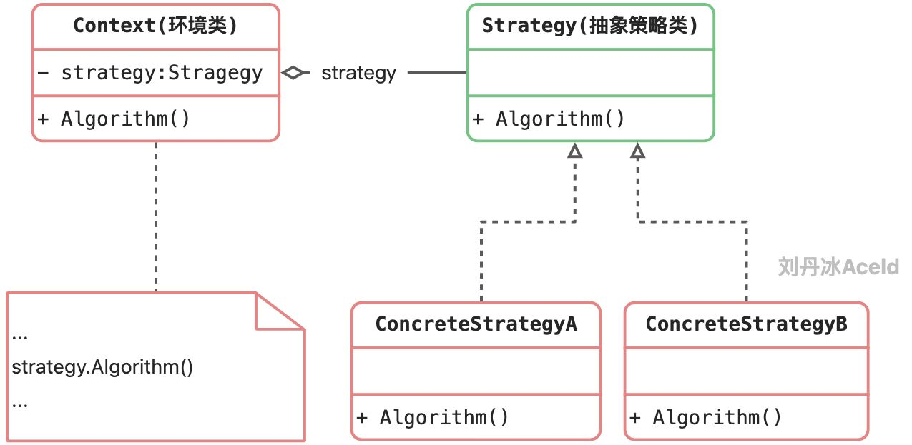

### 5.3.1 策略模式中的角色和职责

策略模式的标准类图如下：




**Context（环境类）**：环境类是使用算法的角色，它在解决某个问题（即实现某个方法）时可以采用多种策略。在环境类中维持一个对抽象策略类的引用实例，用于定义所采用的策略。

**Strategy（抽象策略类）**：它为所支持的算法声明了抽象方法，是所有策略类的父类，它可以是抽象类或具体类，也可以是接口。环境类通过抽象策略类中声明的方法在运行时调用具体策略类中实现的算法。

**ConcreteStrategy（具体策略类）**：它实现了在抽象策略类中声明的算法，在运行时，具体策略类将覆盖在环境类中定义的抽象策略类对象，使用一种具体的算法实现某个业务处理。


### 5.3.2 策略模式案例


代码实现如下：

```go
package main

import "fmt"

//武器策略(抽象的策略)
type WeaponStrategy interface {
	UseWeapon()  //使用武器
}


//具体的策略
type Ak47 struct {}

func (ak *Ak47) UseWeapon() {
	fmt.Println("使用Ak47 去战斗")
}

//具体的策略
type Knife struct {}

func (k *Knife) UseWeapon() {
	fmt.Println("使用匕首 去战斗")
}

//环境类
type Hero struct {
	strategy WeaponStrategy //拥有一个抽象的策略
}

//设置一个策略
func (h *Hero) SetWeaponStrategy(s WeaponStrategy) {
	h.strategy = s
}

func (h *Hero) Fight() {
	h.strategy.UseWeapon() //调用策略
}

func main() {
	hero := Hero{}
	//更换策略1
	hero.SetWeaponStrategy(new(Ak47))
	hero.Fight()

	hero.SetWeaponStrategy(new(Knife))
	hero.Fight()
}
```

运行结果如下：

```bash
使用Ak47 去战斗
使用匕首 去战斗
```


练习：

​	商场促销有策略A（0.8折）策略B（消费满200，返现100），用策略模式模拟场景

```go
package main

import "fmt"

/*
	练习：
	商场促销有策略A（0.8折）策略B（消费满200，返现100），用策略模式模拟场景
 */

//销售策略
type SellStrategy interface {
	//根据原价得到售卖价
	GetPrice(price float64)	 float64
}

type StrategyA struct {}

func (sa *StrategyA) GetPrice(price float64) float64 {
	fmt.Println("执行策略A, 所有商品打八折")
	return price * 0.8;
}

type StrategyB struct {}

func (sb *StrategyB) GetPrice(price float64) float64 {
	fmt.Println("执行策略B, 所有商品满200 减100")

	if price >= 200 {
		price -= 100
	}

	return price;
}

//环境类
type Goods struct {
	Price float64
	Strategy SellStrategy
}

func (g *Goods) SetStrategy(s SellStrategy) {
	g.Strategy = s
}

func (g *Goods) SellPrice() float64 {
	fmt.Println("原价值 ", g.Price , " .")
	return g.Strategy.GetPrice(g.Price)
}

func main() {
	nike := Goods{
		Price: 200.0,
	}
	//上午 ，商场执行策略A
	nike.SetStrategy(new(StrategyA))
	fmt.Println("上午nike鞋卖", nike.SellPrice())

	//下午， 商场执行策略B
	nike.SetStrategy(new(StrategyB))
	fmt.Println("下午nike鞋卖", nike.SellPrice())
}
```

结果:

```bash
原价值  200  .
执行策略A, 所有商品打八折
上午nike鞋卖 160
原价值  200  .
执行策略B, 所有商品满200 减100
下午nike鞋卖 100
```

### 5.3.3 策略模式的优缺点

优点：

(1) 策略模式提供了对“开闭原则”的完美支持，用户可以在不修改原有系统的基础上选择算法或行为，也可以灵活地增加新的算法或行为。

(2) 使用策略模式可以避免多重条件选择语句。多重条件选择语句不易维护，它把采取哪一种算法或行为的逻辑与算法或行为本身的实现逻辑混合在一起，将它们全部硬编码(Hard Coding)在一个庞大的多重条件选择语句中，比直接继承环境类的办法还要原始和落后。

(3) 策略模式提供了一种算法的复用机制。由于将算法单独提取出来封装在策略类中，因此不同的环境类可以方便地复用这些策略类。


缺点：

(1) 客户端必须知道所有的策略类，并自行决定使用哪一个策略类。这就意味着客户端必须理解这些算法的区别，以便适时选择恰当的算法。换言之，策略模式只适用于客户端知道所有的算法或行为的情况。

(2) 策略模式将造成系统产生很多具体策略类，任何细小的变化都将导致系统要增加一个新的具体策略类。


### 5.3.4 适用场景

​	准备一组算法，并将每一个算法封装起来，使得它们可以互换。