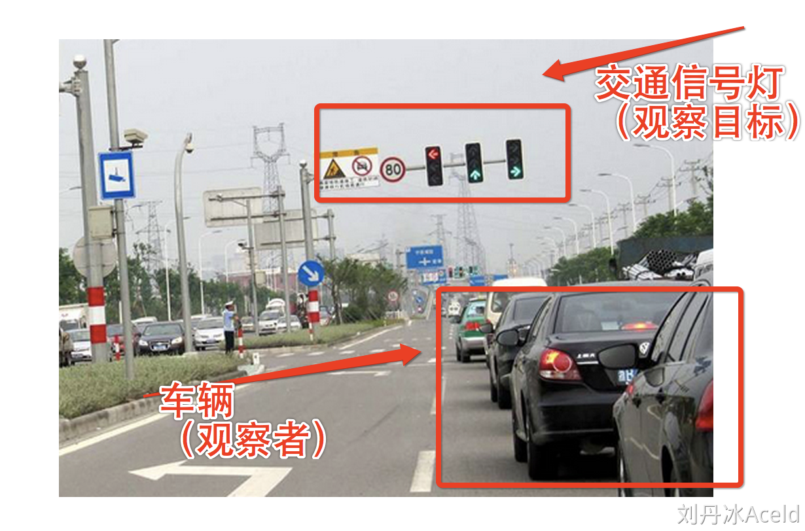
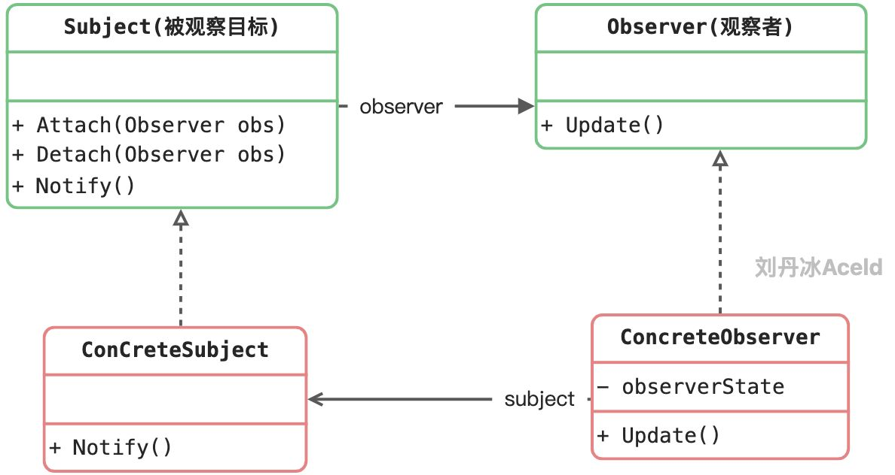
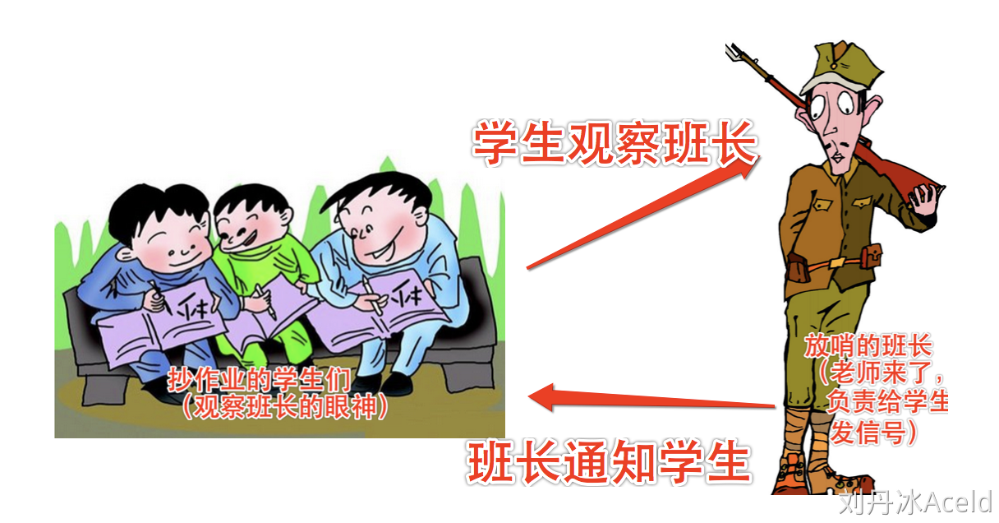
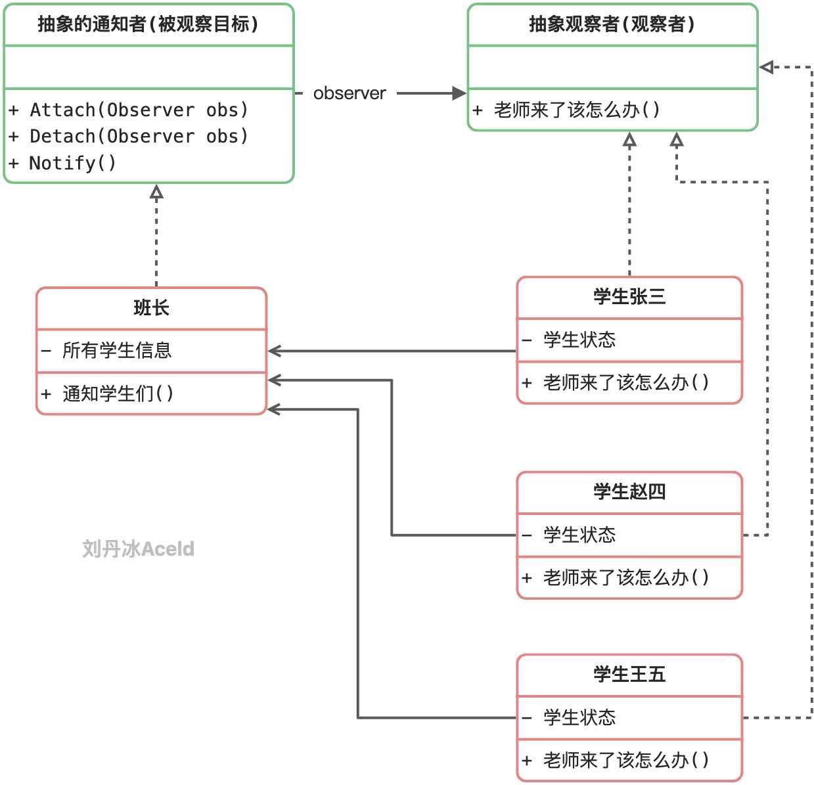
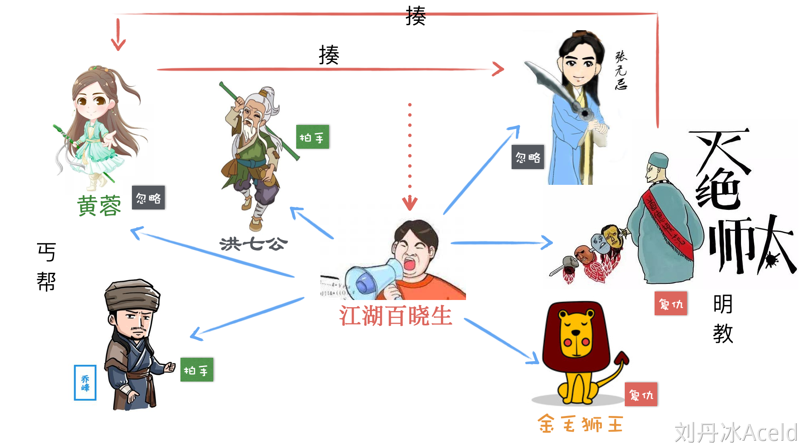

如上图，随着交通信号灯的变化，汽车的行为也将随之而变化，一盏交通信号灯可以指挥多辆汽车。

观察者模式是用于建立一种对象与对象之间的依赖关系，一个对象发生改变时将自动通知其他对象，其他对象将相应作出反应。在观察者模式中，发生改变的对象称为观察目标，而被通知的对象称为观察者，一个观察目标可以对应多个观察者，而且这些观察者之间可以没有任何相互联系，可以根据需要增加和删除观察者，使得系统更易于扩展。


### 5.4.1 观察者模式中的角色和职责



**Subject（被观察者或目标，抽象主题）：**被观察的对象。当需要被观察的状态发生变化时，需要通知队列中所有观察者对象。Subject需要维持（添加，删除，通知）一个观察者对象的队列列表。

**ConcreteSubject（具体被观察者或目标，具体主题）：**被观察者的具体实现。包含一些基本的属性状态及其他操作。

**Observer（观察者）：**接口或抽象类。当Subject的状态发生变化时，Observer对象将通过一个callback函数得到通知。

**ConcreteObserver（具体观察者）：**观察者的具体实现。得到通知后将完成一些具体的业务逻辑处理。


### 5.4.2 观察者模式案例 



以上场景中学生作为观察者，班长作为通知者(被观察对象)，案例的类图如下：



代码实现如下：

```go
package main

import "fmt"

//--------- 抽象层 --------

//抽象的观察者
type Listener interface {
	OnTeacherComming()	 //观察者得到通知后要触发的动作
}

type Notifier interface {
	AddListener(listener Listener)
	RemoveListener(listener Listener)
	Notify()
}

//--------- 实现层 --------
//观察者学生
type StuZhang3 struct {
	Badthing string
}

func (s *StuZhang3) OnTeacherComming() {
	fmt.Println("张3 停止 ", s.Badthing)
}

func (s *StuZhang3) DoBadthing() {
	fmt.Println("张3 正在", s.Badthing)
}

type StuZhao4 struct {
	Badthing string
}

func (s *StuZhao4) OnTeacherComming() {
	fmt.Println("赵4 停止 ", s.Badthing)
}

func (s *StuZhao4) DoBadthing() {
	fmt.Println("赵4 正在", s.Badthing)
}

type StuWang5 struct {
	Badthing string
}

func (s *StuWang5) OnTeacherComming() {
	fmt.Println("王5 停止 ", s.Badthing)
}

func (s *StuWang5) DoBadthing() {
	fmt.Println("王5 正在", s.Badthing)
}


//通知者班长
type ClassMonitor struct {
	listenerList []Listener //需要通知的全部观察者集合
}

func (m *ClassMonitor) AddListener(listener Listener) {
	m.listenerList = append(m.listenerList, listener)
}

func (m *ClassMonitor) RemoveListener(listener Listener) {
	for index, l := range m.listenerList {
		//找到要删除的元素位置
		if listener == l {
			//将删除的点前后的元素链接起来
			m.listenerList = append(m.listenerList[:index], m.listenerList[index+1:]...)
			break
		}
	}
}

func (m* ClassMonitor) Notify() {
	for _, listener := range m.listenerList {
		//依次调用全部观察的具体动作
		listener.OnTeacherComming()
	}
}


func main() {
	s1 := &StuZhang3{
		Badthing: "抄作业",
	}
	s2 := &StuZhao4{
		Badthing: "玩王者荣耀",
	}
	s3 := &StuWang5{
		Badthing: "看赵四玩王者荣耀",
	}

	classMonitor := new(ClassMonitor)

	fmt.Println("上课了，但是老师没有来，学生们都在忙自己的事...")
	s1.DoBadthing()
	s2.DoBadthing()
	s3.DoBadthing()

	classMonitor.AddListener(s1)
	classMonitor.AddListener(s2)
	classMonitor.AddListener(s3)

	fmt.Println("这时候老师来了，班长给学什么使了一个眼神...")
	classMonitor.Notify()
}
```

运行结果如下：

```bash
张3 正在 抄作业
赵4 正在 玩王者荣耀
王5 正在 看赵四玩王者荣耀
这时候老师来了，班长给学什么使了一个眼神...
张3 停止  抄作业
赵4 停止  玩王者荣耀
王5 停止  看赵四玩王者荣耀
```


### 5.4.3 观察者模式武林群侠版

假设江湖有一名无事不知，无话不说的大嘴巴，“江湖百晓生”，任何江湖中发生的事件都会被百晓生知晓，且进行广播。

先江湖中有两个帮派，分别为：

丐帮：黄蓉、洪七公、乔峰。

明教：张无忌、灭绝师太、金毛狮王。

现在需要用观察者模式模拟如下场景：

（1）事件一：丐帮的黄蓉把明教的张无忌揍了，这次武林事件被百晓生知晓，并且进行广播。

​         主动打人方的帮派收到消息要拍手叫好。

​         被打的帮派收到消息应该报仇，如：灭绝师太得知消息进行报仇，将丐帮黄蓉揍了。触发事件二。

（2）事件二：明教的灭绝师太把丐帮的黄蓉揍了，这次武林事件被百姓生知晓，并且进行广播。

   ......

   ......



实现的代码如下：

```go
package main

import "fmt"

/*
               百晓生
	[丐帮]               [明教]
    洪七公               张无忌
    黄蓉					韦一笑
    乔峰				    金毛狮王
*/

const (
	PGaiBang string = "丐帮"
	PMingJiao string = "明教"
)


//-------- 抽象层 -------
type Listener interface {
	//当同伴被揍了该怎么办
	OnFriendBeFight(event *Event)
	GetName() string
	GetParty() string
	Title() string
}

type Notifier interface {
	//添加观察者
	AddListener(listener Listener)
	//删除观察者
	RemoveListener(listener Listener)
	//通知广播
	Notify(event *Event)
}

type Event struct {
	Noti Notifier //被知晓的通知者
	One Listener  //事件主动发出者
	Another Listener //事件被动接收者
	Msg string		//具体消息
}


//-------- 实现层 -------
//英雄(Listener)
type Hero struct {
	Name string
	Party string
}

func (hero *Hero) Fight(another Listener, baixiao Notifier) {
	msg := fmt.Sprintf("%s 将 %s 揍了...", hero.Title(), another.Title(),)

	//生成事件
	event := new(Event)
	event.Noti = baixiao
	event.One = hero
	event.Another = another
	event.Msg = msg

	baixiao.Notify(event)
}

func (hero *Hero) Title() string {
	return fmt.Sprintf("[%s]:%s", hero.Party, hero.Name)
}

func (hero *Hero) OnFriendBeFight(event *Event) {
	//判断是否为当事人
	if hero.Name == event.One.GetName() || hero.Name == event.Another.GetName() {
		return
	}

	//本帮派同伴将其他门派揍了，要拍手叫好!
	if hero.Party == event.One.GetParty() {
		fmt.Println(hero.Title(), "得知消息，拍手叫好！！！")
		return
	}

	//本帮派同伴被其他门派揍了，要主动报仇反击!
	if hero.Party == event.Another.GetParty() {
		fmt.Println(hero.Title(), "得知消息，发起报仇反击！！！")
		hero.Fight(event.One, event.Noti)
		return
	}
}

func (hero *Hero) GetName() string {
	return hero.Name
}

func (hero *Hero) GetParty() string {
	return hero.Party
}


//百晓生(Nofifier)
type BaiXiao struct {
	heroList []Listener
}

//添加观察者
func (b *BaiXiao) AddListener(listener Listener) {
	b.heroList = append(b.heroList, listener)
}

//删除观察者
func (b *BaiXiao) RemoveListener(listener Listener) {
	for index, l := range b.heroList {
		//找到要删除的元素位置
		if listener == l {
			//将删除的点前后的元素链接起来
			b.heroList = append(b.heroList[:index], b.heroList[index+1:]...)
			break
		}
	}
}

//通知广播
func (b *BaiXiao) Notify(event *Event) {
	fmt.Println("【世界消息】 百晓生广播消息: ", event.Msg)
	for _, listener := range b.heroList {
		//依次调用全部观察的具体动作
		listener.OnFriendBeFight(event)
	}
}

func main() {
	hero1 := Hero{
		"黄蓉",
		PGaiBang,
	}

	hero2 := Hero{
		"洪七公",
		PGaiBang,
	}

	hero3 := Hero{
		"乔峰",
		PGaiBang,
	}

	hero4 := Hero{
		"张无忌",
		PMingJiao,
	}

	hero5 := Hero{
		"韦一笑",
		PMingJiao,
	}

	hero6 := Hero{
		"金毛狮王",
		PMingJiao,
	}

	baixiao := BaiXiao{}

	baixiao.AddListener(&hero1)
	baixiao.AddListener(&hero2)
	baixiao.AddListener(&hero3)
	baixiao.AddListener(&hero4)
	baixiao.AddListener(&hero5)
	baixiao.AddListener(&hero6)

	fmt.Println("武林一片平静.....")
	hero1.Fight(&hero5, &baixiao)
}
```

当我们运行的时候，发现触发了观察者模式的无限循环。

```bash
武林一片平静.....
【世界消息】 百晓生广播消息:  [丐帮]:黄蓉 将 [明教]:韦一笑 揍了...
[丐帮]:洪七公 得知消息，拍手叫好！！！
[丐帮]:乔峰 得知消息，拍手叫好！！！
[明教]:张无忌 得知消息，发起报仇反击！！！
【世界消息】 百晓生广播消息:  [明教]:张无忌 将 [丐帮]:黄蓉 揍了...
[丐帮]:洪七公 得知消息，发起报仇反击！！！
【世界消息】 百晓生广播消息:  [丐帮]:洪七公 将 [明教]:张无忌 揍了...
[丐帮]:黄蓉 得知消息，拍手叫好！！！
[丐帮]:乔峰 得知消息，拍手叫好！！！
[明教]:韦一笑 得知消息，发起报仇反击！！！
【世界消息】 百晓生广播消息:  [明教]:韦一笑 将 [丐帮]:洪七公 揍了...
[丐帮]:黄蓉 得知消息，发起报仇反击！！！
【世界消息】 百晓生广播消息:  [丐帮]:黄蓉 将 [明教]:韦一笑 揍了...
[丐帮]:洪七公 得知消息，拍手叫好！！！
[丐帮]:乔峰 得知消息，拍手叫好！！！
[明教]:张无忌 得知消息，发起报仇反击！！！
【世界消息】 百晓生广播消息:  [明教]:张无忌 将 [丐帮]:黄蓉 揍了...
[丐帮]:洪七公 得知消息，发起报仇反击！！！
【世界消息】 百晓生广播消息:  [丐帮]:洪七公 将 [明教]:张无忌 揍了...
[丐帮]:黄蓉 得知消息，拍手叫好！！！
[丐帮]:乔峰 得知消息，拍手叫好！！！
[明教]:韦一笑 得知消息，发起报仇反击！！！
【世界消息】 百晓生广播消息:  [明教]:韦一笑 将 [丐帮]:洪七公 揍了...
[丐帮]:黄蓉 得知消息，发起报仇反击！！！
【世界消息】 百晓生广播消息:  [丐帮]:黄蓉 将 [明教]:韦一笑 揍了...
[丐帮]:洪七公 得知消息，拍手叫好！！！
[丐帮]:乔峰 得知消息，拍手叫好！！！
[明教]:张无忌 得知消息，发起报仇反击！！！
【世界消息】 百晓生广播消息:  [明教]:张无忌 将 [丐帮]:黄蓉 揍了...
[丐帮]:洪七公 得知消息，发起报仇反击！！！
【世界消息】 百晓生广播消息:  [丐帮]:洪七公 将 [明教]:张无忌 揍了...
[丐帮]:黄蓉 得知消息，拍手叫好！！！
[丐帮]:乔峰 得知消息，拍手叫好！！！
[明教]:韦一笑 得知消息，发起报仇反击！！！
【世界消息】 百晓生广播消息:  [明教]:韦一笑 将 [丐帮]:洪七公 揍了...
[丐帮]:黄蓉 得知消息，发起报仇反击！！！
【世界消息】 百晓生广播消息:  [丐帮]:黄蓉 将 [明教]:韦一笑 揍了...
...
...
```

### 5.4.4 观察者模式的优缺点

优点：

(1) 观察者模式可以实现表示层和数据逻辑层的分离，定义了稳定的消息更新传递机制，并抽象了更新接口，使得可以有各种各样不同的表示层充当具体观察者角色。

(2) 观察者模式在观察目标和观察者之间建立一个抽象的耦合。观察目标只需要维持一个抽象观察者的集合，无须了解其具体观察者。由于观察目标和观察者没有紧密地耦合在一起，因此它们可以属于不同的抽象化层次。

(3) 观察者模式支持广播通信，观察目标会向所有已注册的观察者对象发送通知，简化了一对多系统设计的难度。

(4) 观察者模式满足“开闭原则”的要求，增加新的具体观察者无须修改原有系统代码，在具体观察者与观察目标之间不存在关联关系的情况下，增加新的观察目标也很方便。


缺点：

(1) 如果一个观察目标对象有很多直接和间接观察者，将所有的观察者都通知到会花费很多时间。

(2) 如果在观察者和观察目标之间存在循环依赖，观察目标会触发它们之间进行循环调用，可能导致系统崩溃。

(3) 观察者模式没有相应的机制让观察者知道所观察的目标对象是怎么发生变化的，而仅仅只是知道观察目标发生了变化。


### 5.4.5 适用场景

​	(1) 一个抽象模型有两个方面，其中一个方面依赖于另一个方面，将这两个方面封装在独立的对象中使它们可以各自独立地改变和复用。

​	(2) 一个对象的改变将导致一个或多个其他对象也发生改变，而并不知道具体有多少对象将发生改变，也不知道这些对象是谁。

​	(3) 需要在系统中创建一个触发链，A对象的行为将影响B对象，B对象的行为将影响C对象……，可以使用观察者模式创建一种链式触发机制。