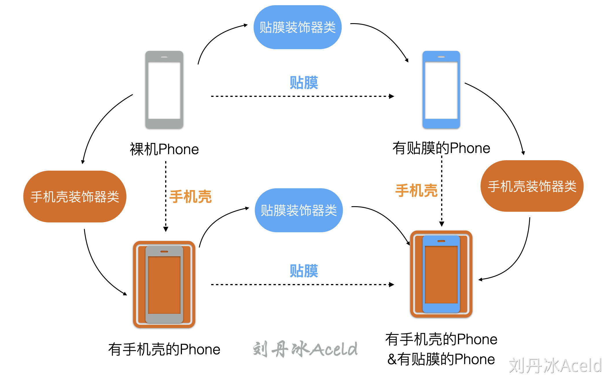
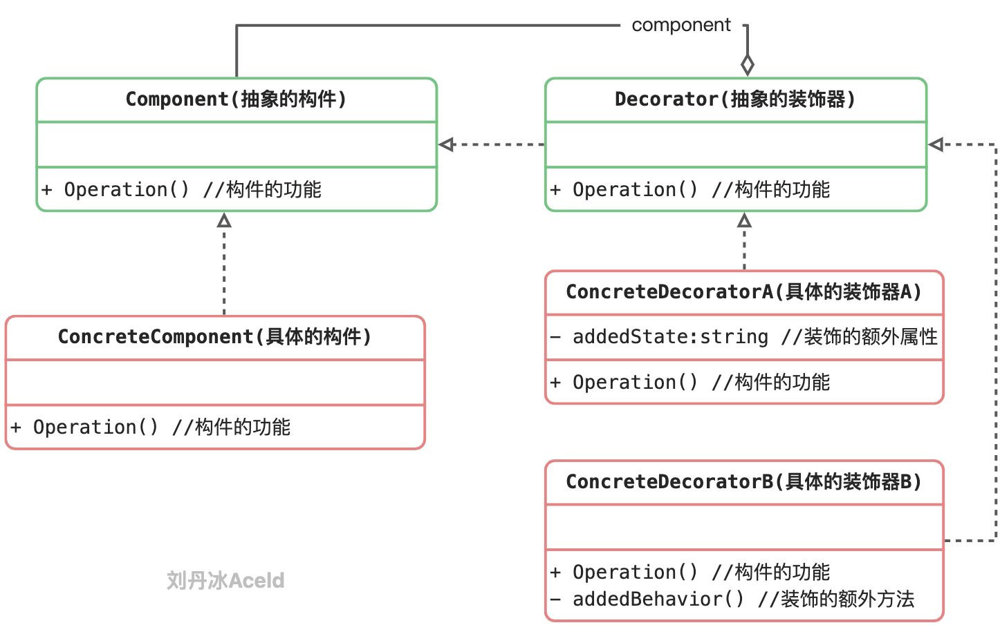
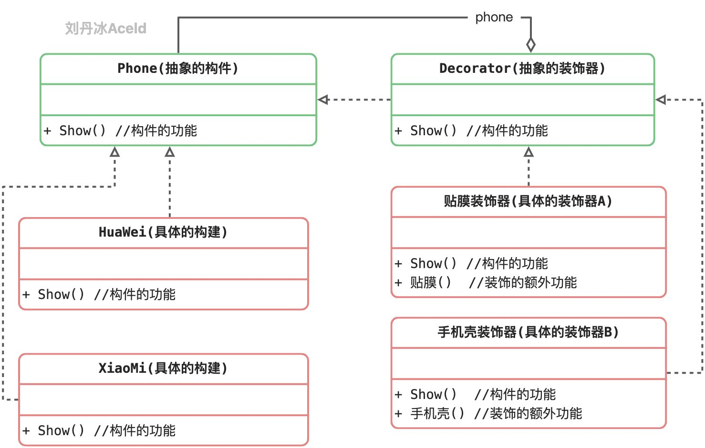

装饰模式(Decorator Pattern)：动态地给一个对象增加一些额外的职责，就增加对象功能来说，装饰模式比生成子类实现更为灵活。装饰模式是一种对象结构型模式。




以上图为例，一开始有个手机（裸机Phone类），如果需要不断的为这个Phone增添某个功能从而变成一个新功能的Phone，就需要一个装饰器的类，来动态的给一个类额外添加一个指定的功能，而生成另一个类，但原先的类又没有改变，不影响原有系统的稳定。


在装饰器模式中，“裸机”、“有贴膜的手机”、“有手机壳的手机”、“有手机壳&贴膜的手机”都是一个构件。

“贴膜装饰器”、“手机壳装饰器”是装饰器也是一个构件。


### 4.2.1 装饰模式中的角色和职责

**Component（抽象构件）**：它是具体构件和抽象装饰类的共同父类，声明了在具体构件中实现的业务方法，它的引入可以使客户端以一致的方式处理未被装饰的对象以及装饰之后的对象，实现客户端的透明操作。

**ConcreteComponent（具体构件）**：它是抽象构件类的子类，用于定义具体的构件对象，实现了在抽象构件中声明的方法，装饰器可以给它增加额外的职责（方法）。

其标准的类图如下所示：





### 4.2.2 装饰模式中的代码实现

接下来按照上述手机案例，结合装饰器的设计模式特点，得到对应案例的类图，如下：




实现的代码如下：

```go
package main

import "fmt"

// ---------- 抽象层 ----------
//抽象的构件
type Phone interface {
    Show() //构件的功能
}

//装饰器基础类（该类本应该为interface，但是Golang interface语法不可以有成员属性）
type Decorator struct {
    phone Phone
}

func (d *Decorator) Show() {}


// ----------- 实现层 -----------
// 具体的构件
type HuaWei struct {}

func (hw *HuaWei) Show() {
    fmt.Println("秀出了HuaWei手机")
}

type XiaoMi struct{}

func (xm *XiaoMi) Show() {
    fmt.Println("秀出了XiaoMi手机")
}

// 具体的装饰器类
type MoDecorator struct {
    Decorator   //继承基础装饰器类(主要继承Phone成员属性)
}

func (md *MoDecorator) Show() {
    md.phone.Show() //调用被装饰构件的原方法
    fmt.Println("贴膜的手机") //装饰额外的方法
}

func NewMoDecorator(phone Phone) Phone {
    return &MoDecorator{Decorator{phone}}
}

type KeDecorator struct {
    Decorator   //继承基础装饰器类(主要继承Phone成员属性)
}

func (kd *KeDecorator) Show() {
    kd.phone.Show()
    fmt.Println("手机壳的手机") //装饰额外的方法
}

func NewKeDecorator(phone Phone) Phone {
    return &KeDecorator{Decorator{phone}}
}


// ------------ 业务逻辑层 ---------
func main() {
    var huawei Phone
    huawei = new(HuaWei)
    huawei.Show()	 //调用原构件方法

    fmt.Println("---------")
    //用贴膜装饰器装饰，得到新功能构件
    var moHuawei Phone
    moHuawei = NewMoDecorator(huawei) //通过HueWei ---> MoHuaWei
    moHuawei.Show() //调用装饰后新构件的方法

    fmt.Println("---------")
    var keHuawei Phone
    keHuawei = NewKeDecorator(huawei) //通过HueWei ---> KeHuaWei
    keHuawei.Show()

    fmt.Println("---------")
    var keMoHuaWei Phone
    keMoHuaWei = NewMoDecorator(keHuawei) //通过KeHuaWei ---> KeMoHuaWei
    keMoHuaWei.Show()
}
```

运行结果如下：

```bash
秀出了HuaWei手机
---------
秀出了HuaWei手机
贴膜的手机
---------
秀出了HuaWei手机
手机壳的手机
---------
秀出了HuaWei手机
手机壳的手机
贴膜的手机
```


思考：

​		装饰模式 和 代理模式 有何不同？


### 4.2.3 装饰模式的优缺点

优点：

(1) 对于扩展一个对象的功能，装饰模式比继承更加灵活性，不会导致类的个数急剧增加。

(2) 可以通过一种动态的方式来扩展一个对象的功能，从而实现不同的行为。

(3) 可以对一个对象进行多次装饰。

(4) 具体构件类与具体装饰类可以独立变化，用户可以根据需要增加新的具体构件类和具体装饰类，原有类库代码无须改变，符合“开闭原则”。

缺点：

(1) 使用装饰模式进行系统设计时将产生很多小对象，大量小对象的产生势必会占用更多的系统资源，影响程序的性能。

(2) 装饰模式提供了一种比继承更加灵活机动的解决方案，但同时也意味着比继承更加易于出错，排错也很困难，对于多次装饰的对象，调试时寻找错误可能需要逐级排查，较为繁琐。


### 4.2.3 适用场景

(1) 动态、透明的方式给单个对象添加职责。

(2) 当不能采用继承的方式对系统进行扩展或者采用继承不利于系统扩展和维护时可以使用装饰模式。

装饰器模式关注于在一个对象上动态的添加方法，然而代理模式关注于控制对对象的访问。换句话说，用代理模式，代理类（proxy class）可以对它的客户隐藏一个对象的具体信息。因此，当使用代理模式的时候，我们常常在一个代理类中创建一个对象的实例。并且，当我们使用装饰器模式的时候，我们通常的做法是将原始对象作为一个参数传给装饰者的构造器。