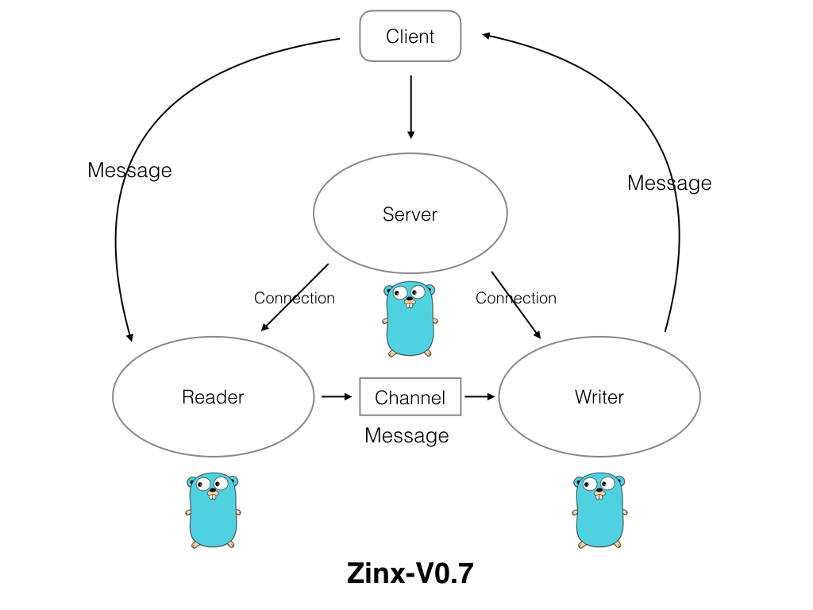

​	好了，接下来我们就要对Zinx做一个小小的改变，就是与客户端进修数据交互的Gouroutine由一个变成两个，一个专门负责从客户端读取数据，一个专门负责向客户端写数据。这么设计有什么好处，当然是目的就是高内聚，模块的功能单一，对于我们今后扩展功能更加方便。

​	我们希望Zinx在升级到V0.7版本的时候，架构是下面这样的：

​        

Server依然是处理客户端的响应，主要关键的几个方法是Listen、Accept等。当建立与客户端的套接字后，那么就会开启两个Goroutine分别处理读数据业务和写数据业务，读写数据之间的消息通过一个Channel传递。


## 7.1 Zinx-V0.7代码实现


我们的代码改动并不是很大。


##### A) 添加读写模块交互数据的管道


zinx/znet/connection.go


```go
type Connection struct {
	//当前连接的socket TCP套接字
	Conn *net.TCPConn
	//当前连接的ID 也可以称作为SessionID，ID全局唯一
	ConnID uint32
	//当前连接的关闭状态
	isClosed bool
	//消息管理MsgId和对应处理方法的消息管理模块
	MsgHandler ziface.IMsgHandle
	//告知该链接已经退出/停止的channel
	ExitBuffChan chan bool
	//无缓冲管道，用于读、写两个goroutine之间的消息通信
	msgChan		chan []byte
}

//创建连接的方法
func NewConntion(conn *net.TCPConn, connID uint32, msgHandler ziface.IMsgHandle) *Connection{
	c := &Connection{
		Conn:     conn,
		ConnID:   connID,
		isClosed: false,
		MsgHandler: msgHandler,
		ExitBuffChan: make(chan bool, 1),
		msgChan:make(chan []byte), //msgChan初始化
	}

	return c
}
```


我们给`Connection`新增一个管道成员`msgChan`,作用是用于读写两个go的通信。


##### B) 创建Writer Goroutine


zinx/znet/connection.go


```go
/*
	写消息Goroutine， 用户将数据发送给客户端
 */
 func (c *Connection) StartWriter() {

	fmt.Println("[Writer Goroutine is running]")
	defer fmt.Println(c.RemoteAddr().String(), "[conn Writer exit!]")

 	for {
 		select {
 			case data := <-c.msgChan:
 				//有数据要写给客户端
 				if _, err := c.Conn.Write(data); err != nil {
 					fmt.Println("Send Data error:, ", err, " Conn Writer exit")
 					return
				}
 			case <- c.ExitBuffChan:
 				//conn已经关闭
 				return
		}
	}
 }
```


##### C) Reader讲发送客户端的数据改为发送至Channel


修改Reader调用的`SendMsg()`方法


zinx/znet/connection.go


```go
//直接将Message数据发送数据给远程的TCP客户端
func (c *Connection) SendMsg(msgId uint32, data []byte) error {
	if c.isClosed == true {
		return errors.New("Connection closed when send msg")
	}
	//将data封包，并且发送
	dp := NewDataPack()
	msg, err := dp.Pack(NewMsgPackage(msgId, data))
	if err != nil {
		fmt.Println("Pack error msg id = ", msgId)
		return  errors.New("Pack error msg ")
	}

	//写回客户端
	c.msgChan <- msg   //将之前直接回写给conn.Write的方法 改为 发送给Channel 供Writer读取

	return nil
}
```


D) 启动Reader和Writer


zinx/znet/connection.go


```go
//启动连接，让当前连接开始工作
func (c *Connection) Start() {

	//1 开启用户从客户端读取数据流程的Goroutine
	go c.StartReader()
	//2 开启用于写回客户端数据流程的Goroutine
	go c.StartWriter()

	for {
		select {
		case <- c.ExitBuffChan:
			//得到退出消息，不再阻塞
			return
		}
	}
}
```


## 7.2 使用Zinx-V0.7完成应用程序

测试代码和V0.6的代码一样。

现在我们已经将读写模块分离了，那么接下来我们就可以再升级添加任务队列机制了。