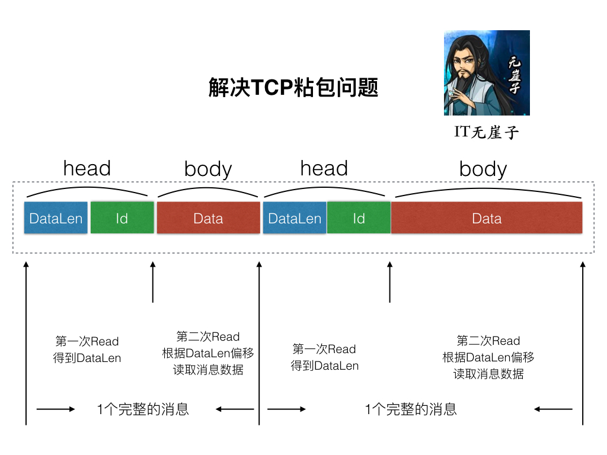

我们这里就是采用经典的TLV(Type-Len-Value)封包格式来解决TCP粘包问题吧。




由于Zinx也是TCP流的形式传播数据，难免会出现消息1和消息2一同发送，那么zinx就需要有能力区分两个消息的边界，所以Zinx此时应该提供一个统一的拆包和封包的方法。在发包之前打包成如上图这种格式的有head和body的两部分的包，在收到数据的时候分两次进行读取，先读取固定长度的head部分，得到后续Data的长度，再根据DataLen读取之后的body。这样就能够解决粘包的问题了。


##### A) 创建拆包封包抽象类


在`zinx/ziface`下，创建`idatapack.go`文件


zinx/ziface/idatapack.go


```go
package ziface

/*
	封包数据和拆包数据
	直接面向TCP连接中的数据流,为传输数据添加头部信息，用于处理TCP粘包问题。
 */
type IDataPack interface{
	GetHeadLen() uint32					//获取包头长度方法
	Pack(msg IMessage)([]byte, error)	//封包方法
	Unpack([]byte)(IMessage, error)		//拆包方法
}
```


##### B) 实现拆包封包类


在`zinx/znet/`下，创建`datapack.go`文件.


zinx/znet/datapack.go


```go
package znet

import (
	"bytes"
	"encoding/binary"
	"errors"
	"zinx/utils"
	"zinx/ziface"
)

//封包拆包类实例，暂时不需要成员
type DataPack struct {}

//封包拆包实例初始化方法
func NewDataPack() *DataPack {
	return &DataPack{}
}

//获取包头长度方法
func(dp *DataPack) GetHeadLen() uint32 {
	//Id uint32(4字节) +  DataLen uint32(4字节)
	return 8
}
//封包方法(压缩数据)
func(dp *DataPack) Pack(msg ziface.IMessage)([]byte, error) {
	//创建一个存放bytes字节的缓冲
	dataBuff := bytes.NewBuffer([]byte{})
    
    
	//写dataLen
	if err := binary.Write(dataBuff, binary.LittleEndian, msg.GetDataLen()); err != nil {
		return nil, err
	}

	//写msgID
	if err := binary.Write(dataBuff, binary.LittleEndian, msg.GetMsgId()); err != nil {
		return nil, err
	}

	//写data数据
	if err := binary.Write(dataBuff, binary.LittleEndian, msg.GetData()); err != nil {
		return nil ,err
	}

	return dataBuff.Bytes(), nil
}
//拆包方法(解压数据)
func(dp *DataPack) Unpack(binaryData []byte)(ziface.IMessage, error) {
	//创建一个从输入二进制数据的ioReader
	dataBuff := bytes.NewReader(binaryData)

	//只解压head的信息，得到dataLen和msgID
	msg := &Message{}

	//读dataLen
	if err := binary.Read(dataBuff, binary.LittleEndian, &msg.DataLen); err != nil {
		return nil, err
	}
    
	//读msgID
	if err := binary.Read(dataBuff, binary.LittleEndian, &msg.Id); err != nil {
		return nil, err
	}

	//判断dataLen的长度是否超出我们允许的最大包长度
	if (utils.GlobalObject.MaxPacketSize > 0 && msg.DataLen > utils.GlobalObject.MaxPacketSize) {
		return nil, errors.New("Too large msg data recieved")
	}

	//这里只需要把head的数据拆包出来就可以了，然后再通过head的长度，再从conn读取一次数据
	return msg, nil
}
```


需要注意的是整理的`Unpack`方法，因为我们从上图可以知道，我们进行拆包的时候是分两次过程的，第二次是依赖第一次的dataLen结果，所以`Unpack`只能解压出包头head的内容，得到msgId 和 dataLen。之后调用者再根据dataLen继续从io流中读取body中的数据。


##### C) 测试拆包封包功能


为了容易理解，我们先不用集成zinx框架来测试，而是单独写一个Server和Client来测试一下封包拆包的功能


Server.go


```go
package main

import (
	"fmt"
	"io"
	"net"
	"zinx/znet"
)

//只是负责测试datapack拆包，封包功能
func main() {
	//创建socket TCP Server
	listener, err := net.Listen("tcp", "127.0.0.1:7777")
	if err != nil {
		fmt.Println("server listen err:", err)
		return
	}

	//创建服务器gotoutine，负责从客户端goroutine读取粘包的数据，然后进行解析

	for {
		conn, err := listener.Accept()
		if err != nil {
			fmt.Println("server accept err:", err)
		}

		//处理客户端请求
		go func(conn net.Conn) {
			//创建封包拆包对象dp
			dp := znet.NewDataPack()
			for {
				//1 先读出流中的head部分
				headData := make([]byte, dp.GetHeadLen())
				_, err := io.ReadFull(conn, headData) //ReadFull 会把msg填充满为止
				if err != nil {
					fmt.Println("read head error")
					break
				}
				//将headData字节流 拆包到msg中
				msgHead, err := dp.Unpack(headData)
				if err != nil {
					fmt.Println("server unpack err:", err)
					return
				}

				if msgHead.GetDataLen() > 0 {
					//msg 是有data数据的，需要再次读取data数据
					msg := msgHead.(*znet.Message)
					msg.Data = make([]byte, msg.GetDataLen())

					//根据dataLen从io中读取字节流
					_, err := io.ReadFull(conn, msg.Data)
					if err != nil {
						fmt.Println("server unpack data err:", err)
						return
					}

					fmt.Println("==> Recv Msg: ID=", msg.Id, ", len=", msg.DataLen, ", data=", string(msg.Data))
				}
			}
		}(conn)
	}

}
```


Client.go


```go
package main

import (
	"fmt"
	"net"
	"zinx/znet"
)

func main() {
	//客户端goroutine，负责模拟粘包的数据，然后进行发送
	conn, err := net.Dial("tcp", "127.0.0.1:7777")
	if err != nil {
		fmt.Println("client dial err:", err)
		return
	}

	//创建一个封包对象 dp
	dp := znet.NewDataPack()

	//封装一个msg1包
	msg1 := &znet.Message{
		Id:      0,
		DataLen: 5,
		Data:    []byte{'h', 'e', 'l', 'l', 'o'},
	}

	sendData1, err := dp.Pack(msg1)
	if err != nil {
		fmt.Println("client pack msg1 err:", err)
		return
	}

	msg2 := &znet.Message{
		Id:      1,
		DataLen: 7,
		Data:    []byte{'w', 'o', 'r', 'l', 'd', '!', '!'},
	}
	sendData2, err := dp.Pack(msg2)
	if err != nil {
		fmt.Println("client temp msg2 err:", err)
		return
	}

	//将sendData1，和 sendData2 拼接一起，组成粘包
	sendData1 = append(sendData1, sendData2...)

	//向服务器端写数据
	conn.Write(sendData1)

	//客户端阻塞
	select {}
}
```


运行Server.go


```plain
go run Server.go
```


运行Client.go


```plain
go run Client.go
```


我们从服务端看到运行结果


```bash
$go run Server.go 
==> Recv Msg: ID= 0 , len= 5 , data= hello
==> Recv Msg: ID= 1 , len= 7 , data= world!!
```


我们成功的得到了客户端发送的两个包，并且成功的解析出来。