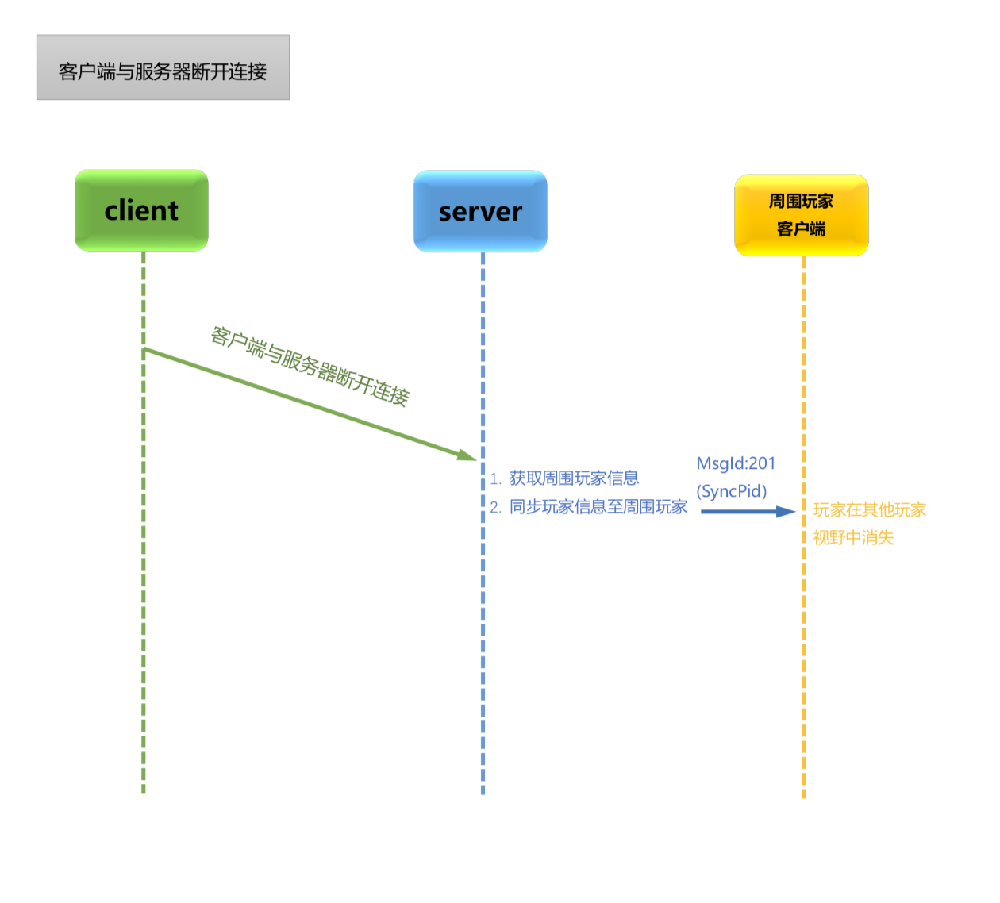
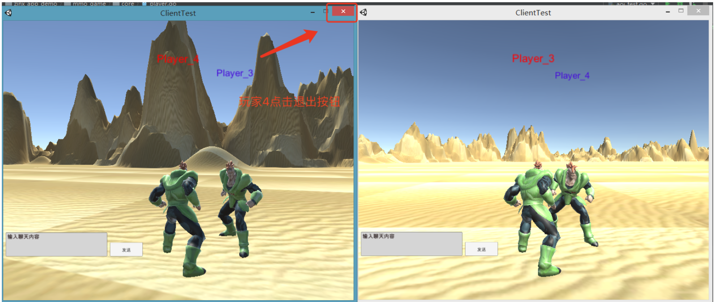
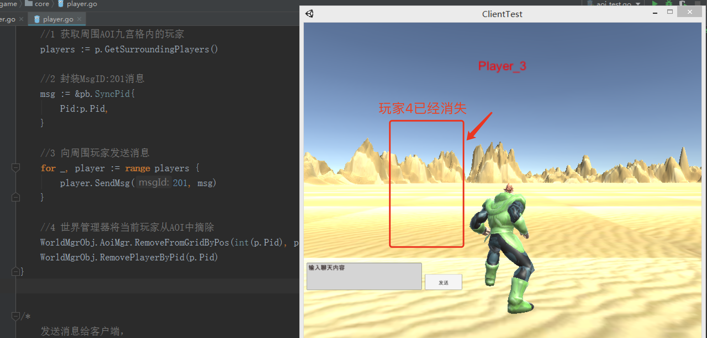

那么玩家客户端点击关闭应该触发玩家下线的功能.玩家应该在其他的客户端消失。具体流程如下：




玩家下线，这里采用了`MsgID:201`消息。触发该流程的时机是客户端与服务端断开链接，那么我们就可以在连接断开前的Hook方法中，实现此业务.


mmo_game/server.go

```go
//当客户端断开连接的时候的hook函数
func OnConnectionLost(conn ziface.IConnection) {
    //获取当前连接的Pid属性
    pid, _ := conn.GetProperty("pid")

    //根据pid获取对应的玩家对象
    player := core.WorldMgrObj.GetPlayerByPid(pid.(int32))

    //触发玩家下线业务
    if pid != nil {
        player.LostConnection()
    }

    fmt.Println("====> Player ", pid , " left =====")

}

func main() {
    //创建服务器句柄
    s := znet.NewServer()

    //注册客户端连接建立和丢失函数
    s.SetOnConnStart(OnConnecionAdd)
    // ========== 注册 hook 函数 =====
    s.SetOnConnStop(OnConnectionLost)
    // ==============================

    //注册路由
    s.AddRouter(2, &api.WorldChatApi{})
    s.AddRouter(3, &api.MoveApi{})

    //启动服务
    s.Serve()
}
```

然后我们就要给player模块提供一个`LostConnection()`方法。


mmo_game/core/player.go

```go
//玩家下线
func (p *Player) LostConnection() {
	//1 获取周围AOI九宫格内的玩家
	players := p.GetSurroundingPlayers()

	//2 封装MsgID:201消息
	msg := &pb.SyncPid{
		Pid:p.Pid,
	}

	//3 向周围玩家发送消息
	for _, player := range players {
		player.SendMsg(201, msg)
	}

	//4 世界管理器将当前玩家从AOI中摘除
	WorldMgrObj.AoiMgr.RemoveFromGridByPos(int(p.Pid), p.X, p.Z)
	WorldMgrObj.RemovePlayerByPid(p.Pid)
}
```

接下来我们启动服务器，再启动两个客户端分别测试一下结果。







当我们退出一个客户端的时候，另外一个客户端的玩家的地图已经会摘除当前玩家了。