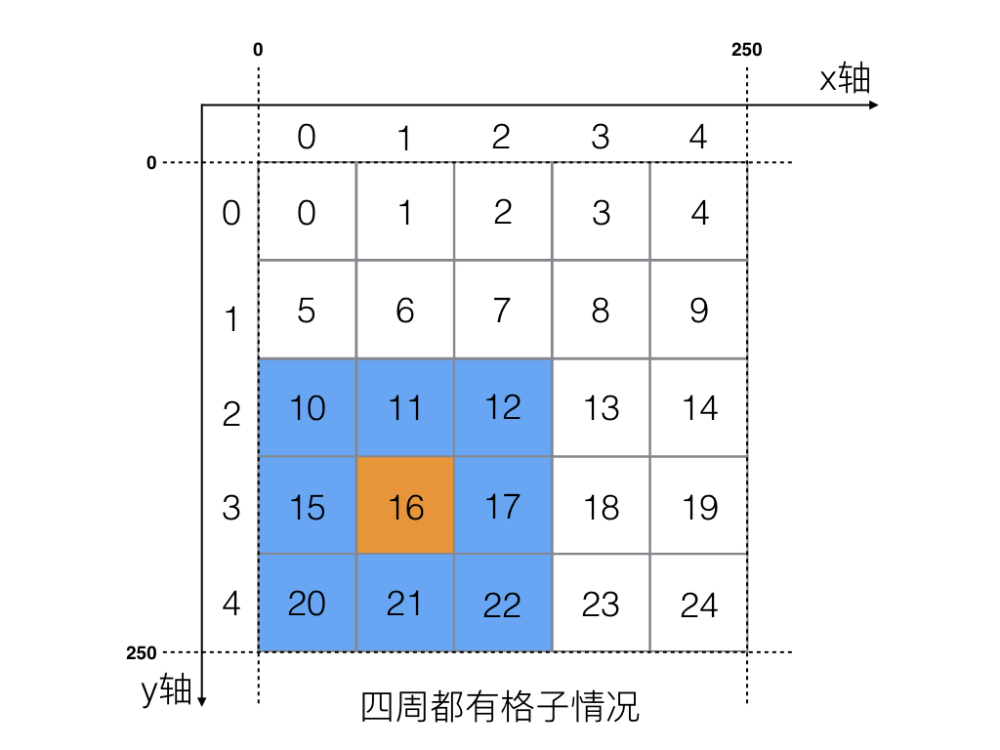
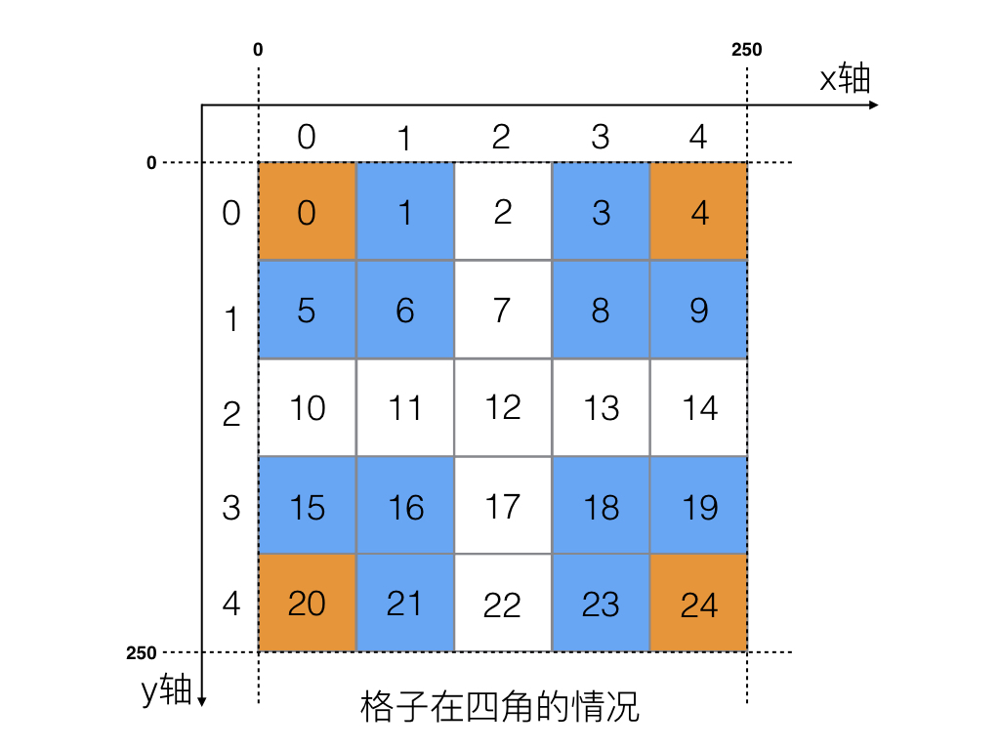
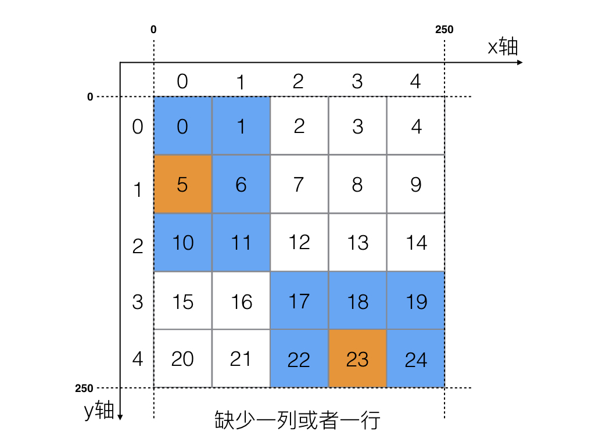
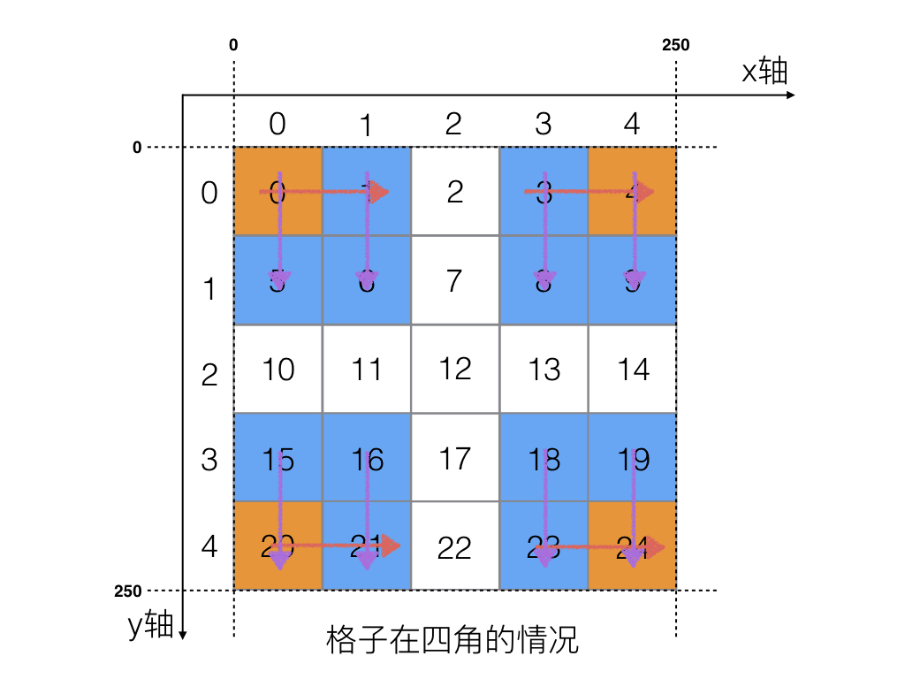
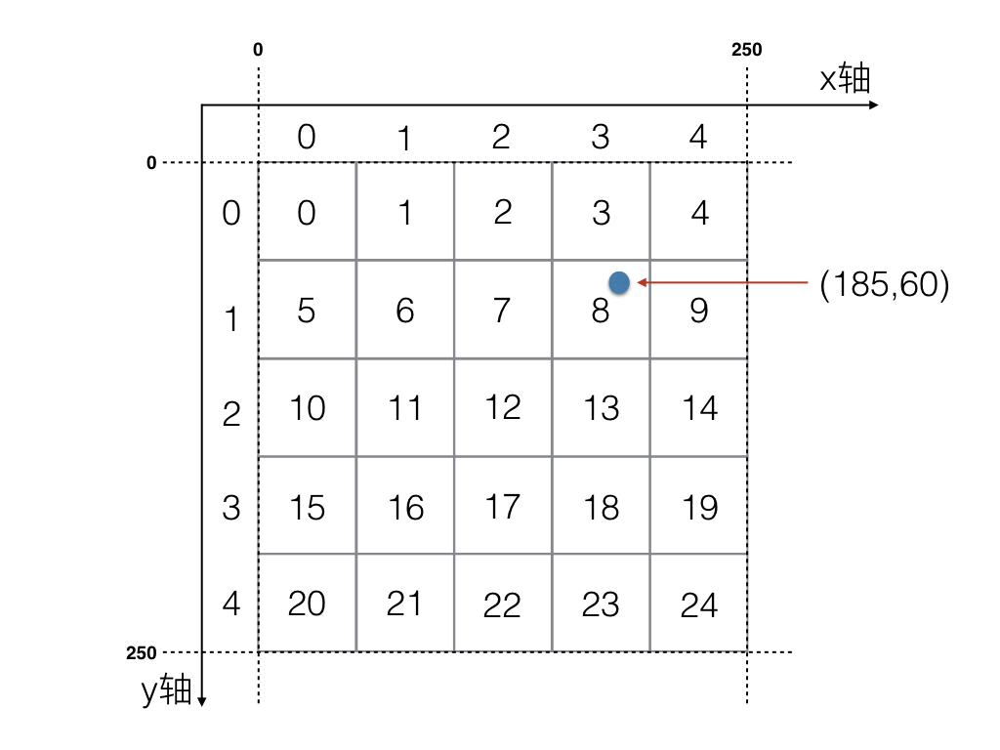

游戏的AOI(Area Of Interest)算法应该算作游戏的基础核心了，许多逻辑都是因为AOI进出事件驱动的，许多网络同步数据也是因为AOI进出事件产生的。因此，良好的AOI算法和基于AOI算法的优化，是提高游戏性能的关键。


为此，需要为每个玩家设定一个AOI，当一个对象状态发生改变时，需要将信息广播给全部玩家，那些AOI覆盖到的玩家都会收到这条广播消息，从而做出对应的响应状态。


功能：


1.  服务器上的玩家或 NPC 状态发生改变时，将消息广播到附近的玩家。 
2.  玩家进入NPC警戒区域时，AOI 模块将消息发送给NPC，NPC再做出相应的AI反应。 


下面我们来创建一个mmo游戏，首先创建一个文件夹


mmo_game/


`mmo_game`作为我们服务端游戏应用的主项目目录。


### 11.3.1 网络法实现AOI算法


让我们首先绘制一个2D的地图


我们给这个地图定义一些数值：


**场景相关数值计算**


-  场景大小： 250*250 ， w(x轴宽度) = 250，l(y轴长度) = 250 
-  x轴格子数量：nx = 5 
-  y轴格子数量：ny = 5 
-  格子宽度: dx = w / nx = 250 / 5 = 50 
-  格子长度: dy = l / ny = 250 / 5 = 50 
-  格子的x轴坐标：idx 
-  格子的y轴坐标：idy 
-  格子编号：id = idy *nx + idx (利用格子坐标得到格子编号) 
-  格子坐标：idx = id % nx , idy = id / nx (利用格子id得到格子坐标) 
-  格子的x轴坐标: idx = id % nx (利用格子id得到x轴坐标编号) 
-  格子的y轴坐标: idy = id / nx (利用格子id得到y轴坐标编号) 


以上几个数值，请参考图，简单过一下，就可以理解的，初中的几何计算而已。


### 11.3.2 实现AOI格子结构


将aoi模块放在一个`core`模块中


mmo_game/core/grid.go


```go
package core

import "sync"

/*
	一个地图中的格子类
*/
type Grid struct {
	GID       int          //格子ID
	MinX      int          //格子左边界坐标
	MaxX      int          //格子右边界坐标
	MinY      int          //格子上边界坐标
	MaxY      int          //格子下边界坐标
	playerIDs map[int]bool //当前格子内的玩家或者物体成员ID
	pIDLock   sync.RWMutex   //playerIDs的保护map的锁
}

//初始化一个格子
func NewGrid(gID, minX, maxX, minY, maxY int) *Grid {
	return &Grid{
		GID:gID,
		MinX:minX,
		MaxX:maxX,
		MinY:minY,
		MaxY:maxY,
		playerIDs:make(map[int] bool),
	}
}

//向当前格子中添加一个玩家
func (g *Grid) Add(playerID int) {
	g.pIDLock.Lock()
	defer g.pIDLock.Unlock()

	g.playerIDs[playerID] = true
}

//从格子中删除一个玩家
func (g *Grid) Remove(playerID int) {
	g.pIDLock.Lock()
	defer g.pIDLock.Unlock()

	delete(g.playerIDs, playerID)
}

//得到当前格子中所有的玩家
func (g *Grid) GetPlyerIDs() (playerIDs []int) {
	g.pIDLock.RLock()
	defer g.pIDLock.RUnlock()

	for k, _ := range g.playerIDs {
		playerIDs = append(playerIDs, k)
	}

	return
}


//打印信息方法
func (g *Grid) String() string {
	return fmt.Sprintf("Grid id: %d, minX:%d, maxX:%d, minY:%d, maxY:%d, playerIDs:%v",
		g.GID, g.MinX, g.MaxX, g.MinY, g.MaxY, g.playerIDs)
```


`Grid`这个格子类型，很好理解，分别有上下左右四个坐标，确定格子的领域范围，还是有格子ID，其中`playerIDs`是一个map，表示当前格子中存在的玩家有哪些。这里提供了一个方法`GetPlyerIDs()`可以返回当前格子中所有玩家的ID切片。


### 11.3.3 实现AOI管理模块


那么接下来我们就要对格子添加到一个AOI模块中进行管理。我们创建一个aoi模块文件。


mmo_game/core/aoi.go


```go
package core

/*
   AOI管理模块
*/
type AOIManager struct {
	MinX  int           //区域左边界坐标
	MaxX  int           //区域右边界坐标
	CntsX int           //x方向格子的数量
	MinY  int           //区域上边界坐标
	MaxY  int           //区域下边界坐标
	CntsY int           //y方向的格子数量
	grids map[int]*Grid //当前区域中都有哪些格子，key=格子ID， value=格子对象
}

/*
	初始化一个AOI区域
*/
func NewAOIManager(minX, maxX, cntsX, minY, maxY, cntsY int) *AOIManager {
	aoiMgr := &AOIManager{
		MinX:  minX,
		MaxX:  maxX,
		CntsX: cntsX,
		MinY:  minY,
		MaxY:  maxY,
		CntsY: cntsY,
		grids: make(map[int]*Grid),
	}

	//给AOI初始化区域中所有的格子
	for y := 0; y < cntsY; y++ {
		for x := 0; x < cntsX; x++ {
			//计算格子ID
			//格子编号：id = idy *nx + idx  (利用格子坐标得到格子编号)
			gid := y*cntsX + x

			//初始化一个格子放在AOI中的map里，key是当前格子的ID
			aoiMgr.grids[gid] = NewGrid(gid,
				aoiMgr.MinX+ x*aoiMgr.gridWidth(),
				aoiMgr.MinX+(x+1)*aoiMgr.gridWidth(),
				aoiMgr.MinY+ y*aoiMgr.gridLength(),
				aoiMgr.MinY+(y+1)*aoiMgr.gridLength())
		}
	}

	return aoiMgr
}

//得到每个格子在x轴方向的宽度
func (m *AOIManager) gridWidth() int {
	return (m.MaxX - m.MinX) / m.CntsX
}

//得到每个格子在x轴方向的长度
func (m *AOIManager) gridLength() int {
	return (m.MaxY - m.MinY) / m.CntsY
}

//打印信息方法
func (m *AOIManager) String() string {
	s := fmt.Sprintf("AOIManagr:\nminX:%d, maxX:%d, cntsX:%d, minY:%d, maxY:%d, cntsY:%d\n Grids in AOI Manager:\n",
		m.MinX, m.MaxX, m.CntsX, m.MinY, m.MaxY, m.CntsY)
	for _,grid := range m.grids {
		s += fmt.Sprintln(grid)
	}

	return s
}
```


以上是创建一个AOI模块(可以理解为一个2D的矩形地图)，里面有若干份`grids`。


`NewAOIManager()`会平均划分多分小格子，并初始化格子的坐标，计算方式很简单，初步的几何计算。


### 11.3.4 求出九宫格


##### A)根据格子ID求出九宫格


现在我们根据格子ID`gid`求出周边的格子有哪些？


我们可能要考虑一些情况，比如格子的四周都有，如下图：




或者，格子所在AOI区域的四个顶角，如下图：




或者给所在AOI边界，周边的格子缺少一列，或者缺少一行。




思考一下，我们是否可以想一个统一的方法，将所有的条件都满足。


如果求出一个gid的周边九宫格，那么可以先算出该gid所处一行左边和右边是否有，然后在分别计算这一行的上边和下边的格子是否有，就可以了。


思路如下：





参考代码如下：


mmo_game/core/aoi.go


```go
//根据格子的gID得到当前周边的九宫格信息
func (m *AOIManager) GetSurroundGridsByGid(gID int) (grids []*Grid) {
	//判断gID是否存在
	if _, ok := m.grids[gID]; !ok  {
		return
	}

	//将当前gid添加到九宫格中
	grids  = append(grids, m.grids[gID])

	//根据gid得到当前格子所在的X轴编号
	idx := gID % m.CntsX

	//判断当前idx左边是否还有格子
	if idx > 0 {
		grids = append(grids, m.grids[gID-1])
	}
	//判断当前的idx右边是否还有格子
	if idx < m.CntsX - 1 {
		grids = append(grids, m.grids[gID+1])
	}

	//将x轴当前的格子都取出，进行遍历，再分别得到每个格子的上下是否有格子

	//得到当前x轴的格子id集合
	gidsX := make([]int, 0, len(grids))
	for _, v := range grids {
		gidsX = append(gidsX, v.GID)
	}

	//遍历x轴格子
	for _, v := range gidsX {
		//计算该格子处于第几列
		idy := v / m.CntsX

		//判断当前的idy上边是否还有格子
		if idy > 0 {
			grids = append(grids, m.grids[v-m.CntsX])
		}
		//判断当前的idy下边是否还有格子
		if idy < m.CntsY - 1 {
			grids = append(grids, m.grids[v+m.CntsX])
		}
	}

	return
}
```


##### B)根据坐标求出九宫格


还有一种情况是玩家只知道自己的坐标，那么如何确定玩家AOI九宫格的区域都有哪些玩家呢，那就需要设计一个根据坐标求出周边九宫格中玩家的接口。




我们首先应该根据坐标得到所属的格子ID，然后再走根据格子ID获取九宫格信息就可以了。


mmo_game/core/aoi.go


```go
//通过横纵坐标获取对应的格子ID
func (m *AOIManager) GetGIDByPos(x, y float32) int {
	gx := (int(x) - m.MinX) / m.gridWidth()
	gy := (int(x) - m.MinY) / m.gridLength()

	return gy * m.CntsX + gx
}

//通过横纵坐标得到周边九宫格内的全部PlayerIDs
func (m *AOIManager) GetPIDsByPos(x, y float32) (playerIDs []int) {
	//根据横纵坐标得到当前坐标属于哪个格子ID
	gID := m.GetGIDByPos(x, y)

	//根据格子ID得到周边九宫格的信息
	grids := m.GetSurroundGridsByGid(gID)
	for _, v := range grids {
		playerIDs = append(playerIDs, v.GetPlyerIDs()...)
		fmt.Printf("===> grid ID : %d, pids : %v  ====", v.GID, v.GetPlyerIDs())
	}

	return
}
```


### 11.3.5 AOI格子添加删除操作


mmo_game/core/aoi.go


```go
//通过GID获取当前格子的全部playerID
func (m *AOIManager) GetPidsByGid(gID int) (playerIDs []int) {
	playerIDs = m.grids[gID].GetPlyerIDs()
	return
}

//移除一个格子中的PlayerID
func (m *AOIManager) RemovePidFromGrid(pID, gID int) {
	m.grids[gID].Remove(pID)
}

//添加一个PlayerID到一个格子中
func (m *AOIManager) AddPidToGrid(pID, gID int) {
	m.grids[gID].Add(pID)
}

//通过横纵坐标添加一个Player到一个格子中
func (m *AOIManager) AddToGridByPos(pID int, x, y float32) {
	gID := m.GetGidByPos(x, y)
	grid := m.grids[gID]
	grid.Add(pID)
}

//通过横纵坐标把一个Player从对应的格子中删除
func (m *AOIManager) RemoveFromGridByPos(pID int, x, y float32) {
	gID := m.GetGidByPos(x, y)
	grid := m.grids[gID]
	grid.Remove(pID)
}
```


### 11.3.6 AOI模块单元测试


```go
package core

import (
	"fmt"
	"testing"
)

func TestNewAOIManager(t *testing.T) {
	aoiMgr := NewAOIManager(100,300, 4, 200,450, 5)
	fmt.Println(aoiMgr)
}

func TestAOIManagerSuroundGridsByGid(t *testing.T) {
	aoiMgr := NewAOIManager(0,250, 5, 0,250, 5)

	for k, _ := range aoiMgr.grids {
		//得到当前格子周边的九宫格
		grids := aoiMgr.GetSurroundGridsByGid(k)
		//得到九宫格所有的IDs
		fmt.Println("gid : ", k, " grids len = ", len(grids))
		gIDs := make([]int, 0, len(grids))
		for _, grid := range grids {
			gIDs = append(gIDs, grid.GID)
		}
		fmt.Printf("grid ID: %d, surrounding grid IDs are %v\n", k, gIDs)
	}
}
```


结果


```bash
AOIManagr:
minX:100, maxX:300, cntsX:4, minY:200, maxY:450, cntsY:5
 Grids in AOI Manager:
Grid id: 1, minX:150, maxX:200, minY:200, maxY:250, playerIDs:map[]
Grid id: 5, minX:150, maxX:200, minY:250, maxY:300, playerIDs:map[]
Grid id: 6, minX:200, maxX:250, minY:250, maxY:300, playerIDs:map[]
Grid id: 12, minX:100, maxX:150, minY:350, maxY:400, playerIDs:map[]
Grid id: 19, minX:250, maxX:300, minY:400, maxY:450, playerIDs:map[]
Grid id: 7, minX:250, maxX:300, minY:250, maxY:300, playerIDs:map[]
Grid id: 8, minX:100, maxX:150, minY:300, maxY:350, playerIDs:map[]
Grid id: 10, minX:200, maxX:250, minY:300, maxY:350, playerIDs:map[]
Grid id: 11, minX:250, maxX:300, minY:300, maxY:350, playerIDs:map[]
Grid id: 15, minX:250, maxX:300, minY:350, maxY:400, playerIDs:map[]
Grid id: 18, minX:200, maxX:250, minY:400, maxY:450, playerIDs:map[]
Grid id: 0, minX:100, maxX:150, minY:200, maxY:250, playerIDs:map[]
Grid id: 3, minX:250, maxX:300, minY:200, maxY:250, playerIDs:map[]
Grid id: 4, minX:100, maxX:150, minY:250, maxY:300, playerIDs:map[]
Grid id: 14, minX:200, maxX:250, minY:350, maxY:400, playerIDs:map[]
Grid id: 16, minX:100, maxX:150, minY:400, maxY:450, playerIDs:map[]
Grid id: 2, minX:200, maxX:250, minY:200, maxY:250, playerIDs:map[]
Grid id: 9, minX:150, maxX:200, minY:300, maxY:350, playerIDs:map[]
Grid id: 13, minX:150, maxX:200, minY:350, maxY:400, playerIDs:map[]
Grid id: 17, minX:150, maxX:200, minY:400, maxY:450, playerIDs:map[]

gid :  3  grids len =  6
grid ID: 3, surrounding grid IDs are [3 2 4 8 7 9]
gid :  5  grids len =  6
grid ID: 5, surrounding grid IDs are [5 6 0 10 1 11]
gid :  6  grids len =  9
grid ID: 6, surrounding grid IDs are [6 5 7 1 11 0 10 2 12]
gid :  11  grids len =  9
grid ID: 11, surrounding grid IDs are [11 10 12 6 16 5 15 7 17]
gid :  18  grids len =  9
grid ID: 18, surrounding grid IDs are [18 17 19 13 23 12 22 14 24]
gid :  2  grids len =  6
grid ID: 2, surrounding grid IDs are [2 1 3 7 6 8]
gid :  4  grids len =  4
grid ID: 4, surrounding grid IDs are [4 3 9 8]
gid :  7  grids len =  9
grid ID: 7, surrounding grid IDs are [7 6 8 2 12 1 11 3 13]
gid :  8  grids len =  9
grid ID: 8, surrounding grid IDs are [8 7 9 3 13 2 12 4 14]
gid :  19  grids len =  6
grid ID: 19, surrounding grid IDs are [19 18 14 24 13 23]
gid :  22  grids len =  6
grid ID: 22, surrounding grid IDs are [22 21 23 17 16 18]
gid :  0  grids len =  4
grid ID: 0, surrounding grid IDs are [0 1 5 6]
gid :  1  grids len =  6
grid ID: 1, surrounding grid IDs are [1 0 2 6 5 7]
gid :  13  grids len =  9
grid ID: 13, surrounding grid IDs are [13 12 14 8 18 7 17 9 19]
gid :  14  grids len =  6
grid ID: 14, surrounding grid IDs are [14 13 9 19 8 18]
gid :  16  grids len =  9
grid ID: 16, surrounding grid IDs are [16 15 17 11 21 10 20 12 22]
gid :  17  grids len =  9
grid ID: 17, surrounding grid IDs are [17 16 18 12 22 11 21 13 23]
gid :  23  grids len =  6
grid ID: 23, surrounding grid IDs are [23 22 24 18 17 19]
gid :  24  grids len =  4
grid ID: 24, surrounding grid IDs are [24 23 19 18]
gid :  9  grids len =  6
grid ID: 9, surrounding grid IDs are [9 8 4 14 3 13]
gid :  10  grids len =  6
grid ID: 10, surrounding grid IDs are [10 11 5 15 6 16]
gid :  12  grids len =  9
grid ID: 12, surrounding grid IDs are [12 11 13 7 17 6 16 8 18]
gid :  15  grids len =  6
grid ID: 15, surrounding grid IDs are [15 16 10 20 11 21]
gid :  20  grids len =  4
grid ID: 20, surrounding grid IDs are [20 21 15 16]
gid :  21  grids len =  6
grid ID: 21, surrounding grid IDs are [21 20 22 16 15 17]
PASS
ok  	zinx/zinx_app_demo/mmo_game/core	0.002s
```


我们可以用我们的AOI地图验证一下，是一致的。