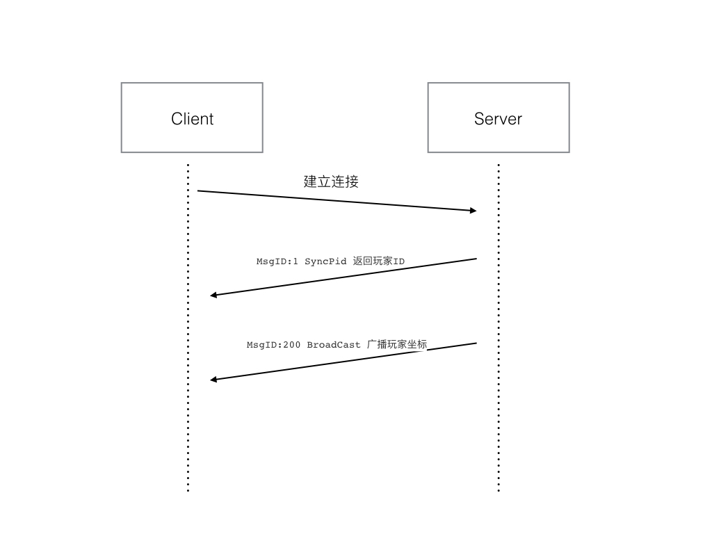
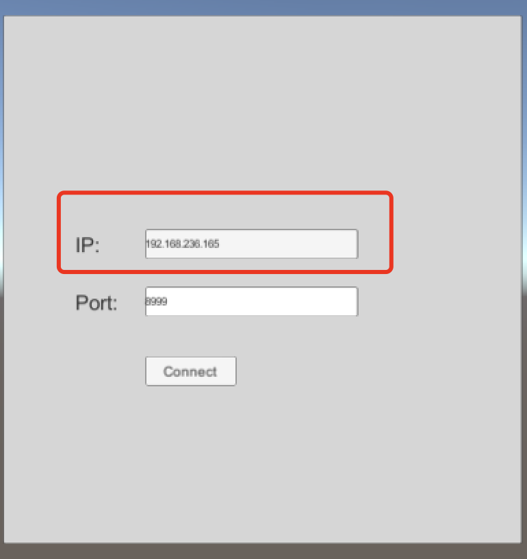
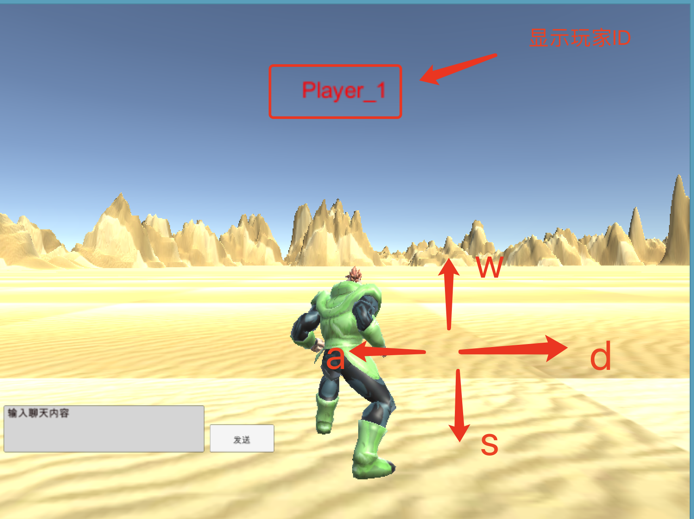

现在，我们应该基于Zinx框架来构建一个MMO的游戏服务器应用程序的项目了。

我们这里创建一个项目mmo_game,在项目内分别创建几个文件夹api,conf,core,game_client,pb等


### 11.6.1 构建项目


`api`:主要是注册一些mmo业务的一些Router处理业务。


`conf`:存放mmo_game的一些配置文件,比如"zinx.json"。


`core`:存放一些核心算法，或者游戏控制等模块。


`game_client`:存放游戏客户端。


`pb`：存放一些protobuf的协议文件和go文件。


1、我们在`mmo_game`下，创建一个`server.go`作为我们main包，主要作为服务器程序的主入口。


mmo_game/server.go


```go
package main

import (
	"zinx/znet"
)

func main() {
	//创建服务器句柄
	s := znet.NewServer()

	//启动服务
	s.Serve()
}
```


2、在`conf`文件添加`zinx.conf`


mmo_game/conf/zinx.conf


```go
{
  "Name":"Zinx Game",
  "Host":"0.0.0.0",
  "TcpPort":8999,
  "MaxConn":3000,
  "WorkerPoolSize":10
}
```


3、在`pb`下创建msg.proto文件和build.sh编译指令脚本


mmo_game/pb/msg.proto


```go
syntax="proto3";                //Proto协议
package pb;                     //当前包名
option csharp_namespace="Pb";   //给C#提供的选项
```


mmo_game/pb/build.sh


```go
#!/bin/bash
protoc --go_out=. *.proto
```


当前我们的项目路径应该结构如下：


```bash
.
└── mmo_game
    ├── api
    ├── conf
    │   └── zinx.json
    ├── core
    │   ├── aoi.go
    │   ├── aoi_test.go
    │   ├── grid.go
    ├── game_client
    │   └── client.exe
    ├── pb
    │   ├── build.sh
    │   └── msg.proto
    ├── README.md
    └── server.go
```


### 11.6.2 用户上线流程


好了，那么我们第一次就要尝试将客户端的MMO游戏和移动端做一次上线测试了。


我们第一个测试用户上线的流程比较简单：




#### A)定义proto协议


我们从图中可以看到，上线的业务会涉及到MsgID:1 和 MsgID:200 两个消息，根据我们上一个章节的介绍，我们需要在msg.proto中定义出两个proto类型，并且声称对应的go代码.


mmo_game/pb/msg.proto


```go
syntax="proto3";                //Proto协议
package pb;                     //当前包名
option csharp_namespace="Pb";   //给C#提供的选项

//同步客户端玩家ID
message SyncPid{
	int32 Pid=1;
}

//玩家位置
message Position{
	float X=1;
	float Y=2;
	float Z=3;
	float V=4;
}

//玩家广播数据
message BroadCast{
	int32 Pid=1;
	int32 Tp=2;
	oneof Data {
        string Content=3;
        Position P=4;
		int32 ActionData=5;
        }
}
```


执行build.sh生成对应的`msg.pb.go`代码.


#### B)创建Player模块


1. 首先我们先创建一个Player玩家模块


mmo_game/core/player.go


```go
//玩家对象
type Player struct {
	Pid int32  	//玩家ID
	Conn ziface.IConnection //当前玩家的连接
	X 	float32 //平面x坐标
	Y   float32 //高度
	Z   float32 //平面y坐标 (注意不是Y)
	V   float32 //旋转0-360度
}

/*
	Player ID 生成器
 */
var PidGen int32 = 1   //用来生成玩家ID的计数器
var IdLock sync.Mutex   //保护PidGen的互斥机制

//创建一个玩家对象
func NewPlayer(conn ziface.IConnection) *Player {
	//生成一个PID
	IdLock.Lock()
	id := PidGen
	PidGen ++
	IdLock.Unlock()

	p := &Player{
		Pid : id,
		Conn:conn,
		X:float32(160 + rand.Intn(10)),//随机在160坐标点 基于X轴偏移若干坐标
		Y:0, //高度为0
		Z:float32(134 + rand.Intn(17)), //随机在134坐标点 基于Y轴偏移若干坐标
		V:0, //角度为0，尚未实现
	}

	return p
}
```


Plyaer类中有当前玩家的ID，和当前玩家与客户端绑定的conn，还有就是地图的坐标信,`NewPlayer()`提供初始化玩家方法。


1. 由于`Player`经常需要和客户端发送消息，那么我们可以给`Player`提供一个`SendMsg()`方法，供客户端发送消息


mmo_game/core/player.go


```go
/*
	发送消息给客户端，
	主要是将pb的protobuf数据序列化之后发送
 */
func (p *Player) SendMsg(msgId uint32, data proto.Message) {
	fmt.Printf("before Marshal data = %+v\n", data)
	//将proto Message结构体序列化
	msg, err := proto.Marshal(data)
	if err != nil {
		fmt.Println("marshal msg err: ", err)
		return
	}
	fmt.Printf("after Marshal data = %+v\n", msg)

	if p.Conn == nil {
		fmt.Println("connection in player is nil")
		return
	}

	//调用Zinx框架的SendMsg发包
	if err := p.Conn.SendMsg(msgId, msg); err != nil {
		fmt.Println("Player SendMsg error !")
		return
	}

	return
}
```


这里要注意的是，`SendMsg()`是将发送的数据，通过proto序列化，然后再调用`Zinx`框架的SendMsg方法发送给对方客户端.


#### C)实现上线业务


我们先在Server的main入口，给链接绑定一个创建之后的hook方法，因为上线的时候是服务器自动回复客户端玩家ID和坐标，那么需要我们在连接创建完毕之后，自动触发，正好我们可以利用`Zinx`框架的`SetOnConnStart`方法.


mmo_game/server.go


```go
package main

import (
	"fmt"
	"zinx/ziface"
	"zinx/zinx_app_demo/mmo_game/core"
	"zinx/znet"
)


//当客户端建立连接的时候的hook函数
func OnConnecionAdd(conn ziface.IConnection)  {
	//创建一个玩家
	player := core.NewPlayer(conn)
	//同步当前的PlayerID给客户端， 走MsgID:1 消息
	player.SyncPid()
	//同步当前玩家的初始化坐标信息给客户端，走MsgID:200消息
	player.BroadCastStartPosition()

	fmt.Println("=====> Player pidId = ", player.Pid, " arrived ====")
}


func main() {
	//创建服务器句柄
	s := znet.NewServer()

	//注册客户端连接建立和丢失函数
	s.SetOnConnStart(OnConnecionAdd)

	//启动服务
	s.Serve()
}
```


根据我们之前的流程分析，那么在客户端建立连接过来之后，Server要自动的回复给客户端一个玩家ID，同时也要讲当前玩家的坐标发送给客户端。所以我们这里面给Player定制了两个方法`Player.SyncPid()`和`Player.BroadCastStartPosition()`


`SyncPid()`则为发送`MsgID:1`的消息，将当前上线的用户ID发送给客户端


mmo_game/core/player.go


```go
//告知客户端pid,同步已经生成的玩家ID给客户端
func (p *Player) SyncPid() {
	//组建MsgId0 proto数据
	data := &pb.SyncPid{
		Pid:p.Pid,
	}

	//发送数据给客户端
	p.SendMsg(1, data)
}
```


`BroadCastStartPosition()`则为发送`MsgID:200`的广播位置消息，虽然现在没有其他用户，不是广播，但是当前玩家自己的坐标也是要告知玩家的。


mmo_game/core/player.go


```go
//广播玩家自己的出生地点
func (p *Player) BroadCastStartPosition() {

	msg := &pb.BroadCast{
		Pid:p.Pid,
		Tp:2,//TP2 代表广播坐标
		Data: &pb.BroadCast_P{
			&pb.Position{
				X:p.X,
				Y:p.Y,
				Z:p.Z,
				V:p.V,
			},
		},
	}

	p.SendMsg(200, msg)
}
```


#### D)测试用户上线业务


```bash
$cd mmo_game/
$go run server.go
```


启动服务端程序。


然后再windows终端打开`client.exe`


注意，要确保windows和启动服务器的Linux端要能够ping通，为了方便测试，建议将Linux的防火墙设置为关闭状态，或者要确保服务器的端口是开放的，以免耽误调试





在此处输入服务器的IP地址，和服务器`zinx.json`配置的端口号。然后点击Connect。




如果游戏界面顺利进入，并且已经显示为`Player_1`玩家ID，表示等录成功，并且我们在服务端也可以看到一些调试信息。操作WASD也可以进行玩家移动。如果没有显示玩家ID或者为`TextView`则为登录失败，我们需要再针对协议的匹配进行调试。