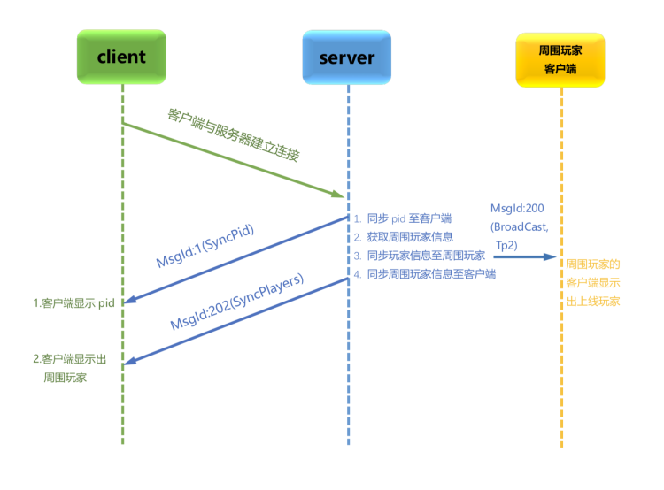
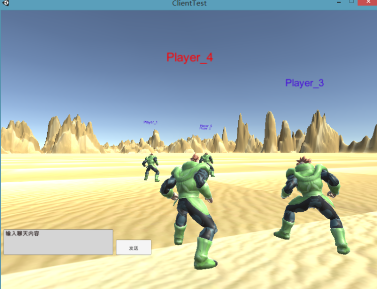
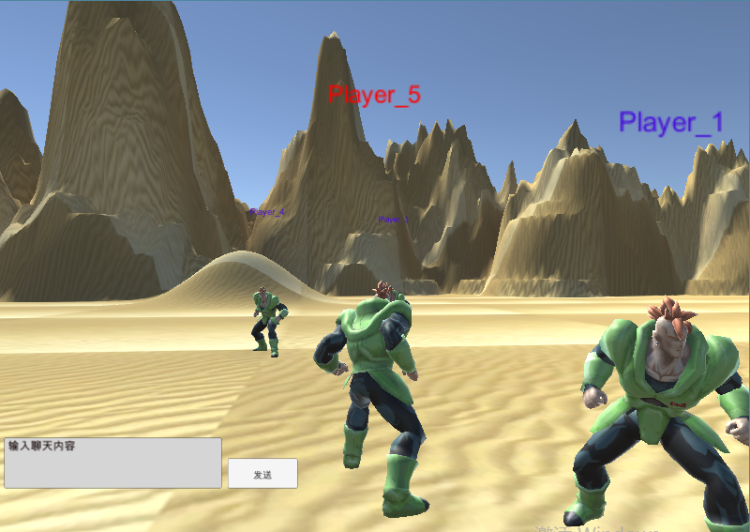

这里涉及到了MsgID:202消息，我们应该在proto文件中，再添加两个消息

mmo_game/pb/msg.proto

```protobuf
//玩家信息
message Player{
	int32 Pid=1;
	Position P=2;
}

//同步玩家显示数据
message SyncPlayers{
	repeated Player ps=1;
}
```

执行build.sh 生成对应的`msg.proto.go`文件。


接下来，我们就要给player提供一个同步位置的方法了。


mmo_game/core/player.go

```go
//给当前玩家周边的(九宫格内)玩家广播自己的位置，让他们显示自己
func (p *Player) SyncSurrounding() {
    //1 根据自己的位置，获取周围九宫格内的玩家pid
    pids := WorldMgrObj.AoiMgr.GetPidsByPos(p.X, p.Z)
    //2 根据pid得到所有玩家对象
    players := make([]*Player, 0, len(pids))
    //3 给这些玩家发送MsgID:200消息，让自己出现在对方视野中
    for _, pid := range pids {
        players = append(players, WorldMgrObj.GetPlayerByPid(int32(pid)))
    }
    //3.1 组建MsgId200 proto数据
    msg := &pb.BroadCast{
        Pid:p.Pid,
        Tp:2,//TP2 代表广播坐标
        Data: &pb.BroadCast_P{
            P:&pb.Position{
                X:p.X,
                Y:p.Y,
                Z:p.Z,
                V:p.V,
            },
        },
    }
    //3.2 每个玩家分别给对应的客户端发送200消息，显示人物
    for _, player := range players {
        player.SendMsg(200, msg)
    }
    //4 让周围九宫格内的玩家出现在自己的视野中
    //4.1 制作Message SyncPlayers 数据
    playersData := make([]*pb.Player, 0, len(players))
    for _, player := range players {
        p := &pb.Player{
            Pid:player.Pid,
            P:&pb.Position{
                X:player.X,
                Y:player.Y,
                Z:player.Z,
                V:player.V,
            },
        }
        playersData = append(playersData, p)
    }

    //4.2 封装SyncPlayer protobuf数据
    SyncPlayersMsg := &pb.SyncPlayers{
        Ps:playersData[:],
    }

    //4.3 给当前玩家发送需要显示周围的全部玩家数据
    p.SendMsg(202, SyncPlayersMsg)
}
```

这里的过程只有两个重要过程，一个是将自己的坐标信息发送给AOI范围周边的玩家，一个是将周边玩家的坐标信息发送给自己的客户端。

最后我们在用户上线的时候，调用同步坐标信息的方法。

mmo_game/server.go

```go
//当客户端建立连接的时候的hook函数
func OnConnecionAdd(conn ziface.IConnection)  {
	//创建一个玩家
	player := core.NewPlayer(conn)
	//同步当前的PlayerID给客户端， 走MsgID:1 消息
	player.SyncPid()
	//同步当前玩家的初始化坐标信息给客户端，走MsgID:200消息
	player.BroadCastStartPosition()
	//将当前新上线玩家添加到worldManager中
	core.WorldMgrObj.AddPlayer(player)
	//将该连接绑定属性Pid
	conn.SetProperty("pid", player.Pid)
    
	//==============同步周边玩家上线信息，与现实周边玩家信息========
	player.SyncSurrounding()
	//=======================================================
    
	fmt.Println("=====> Player pidId = ", player.Pid, " arrived ====")
}
```

最后我们运行程序进行一下简单的测试.

启动server

```bash
$go run server.go
```

分别启动3个客户端，看是否能够互相看到对方。








 