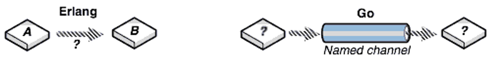
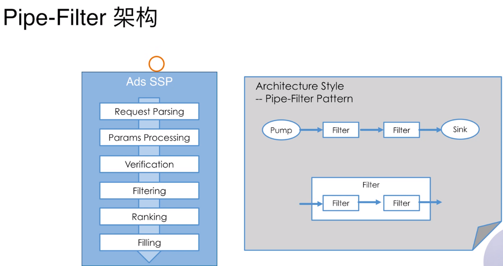
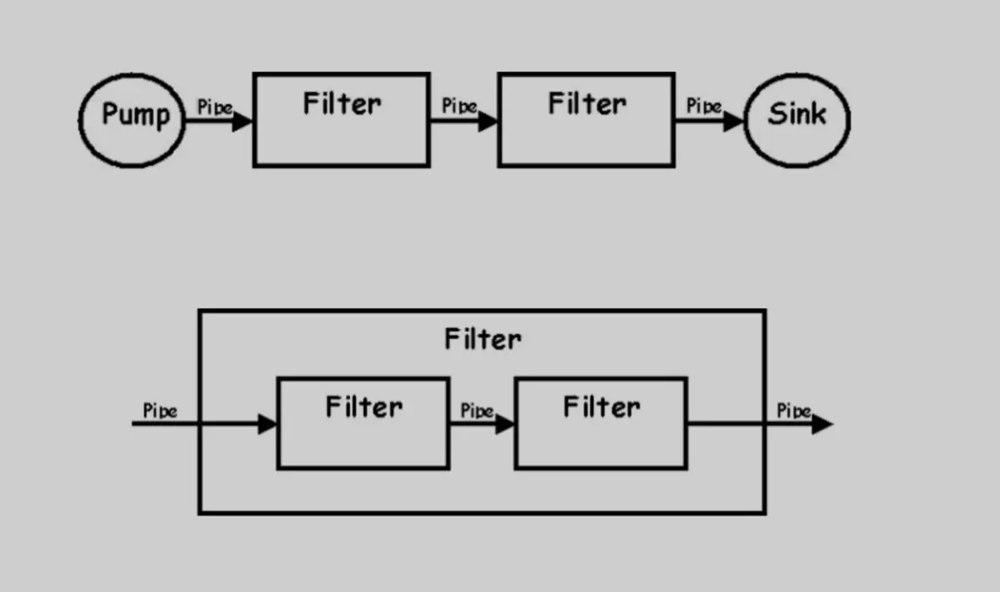
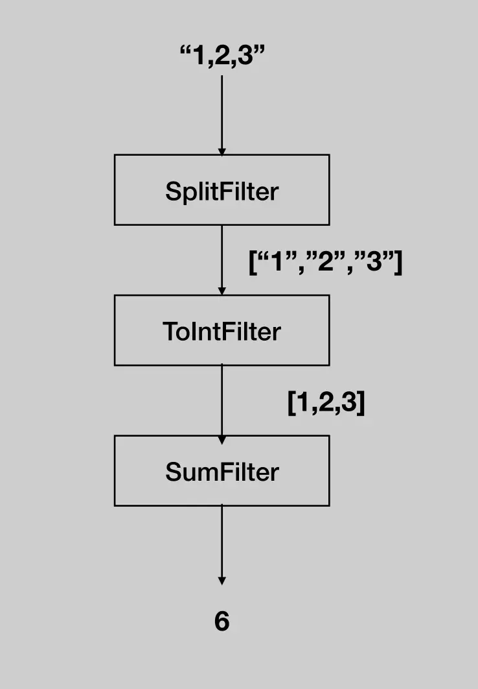
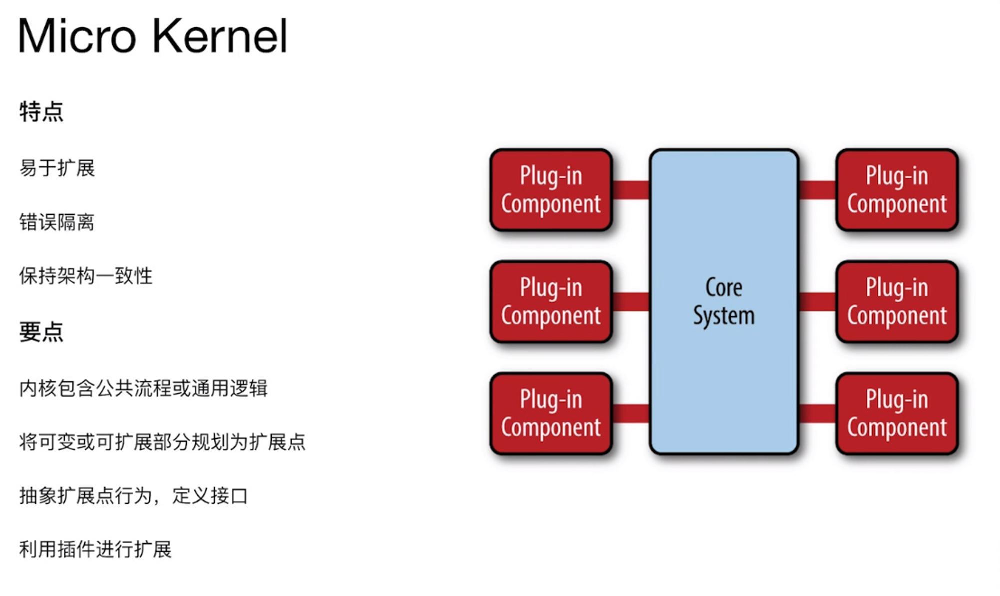
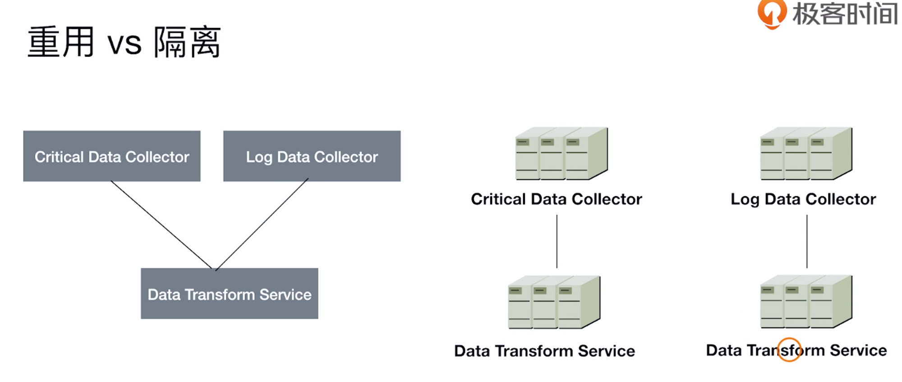
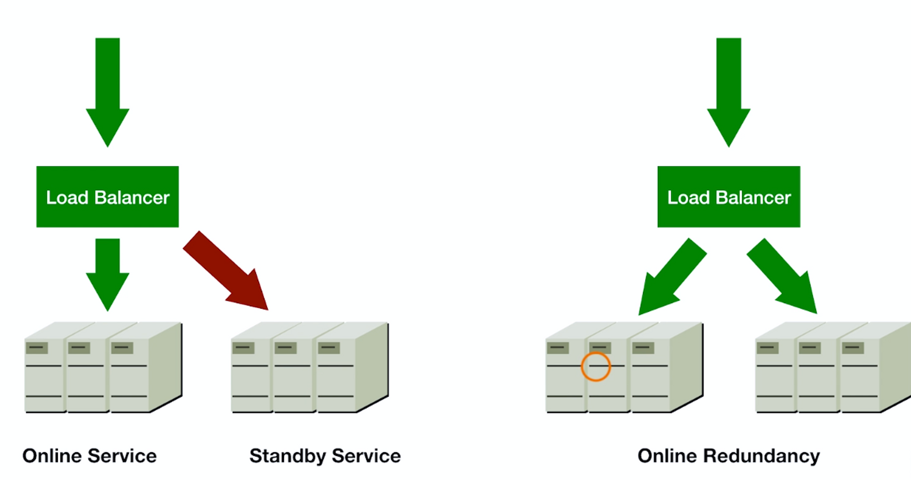
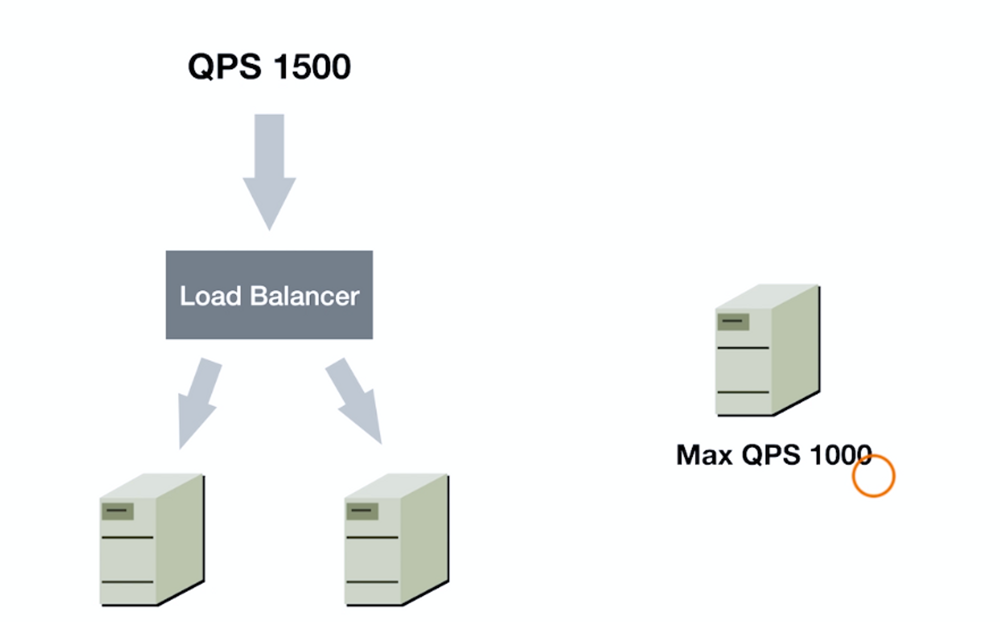

```plain
Go 编程语言是一个开源项目，旨在提高程序员的工作效率。

Go 具有表现力、简洁、干净和高效。 它的并发机制可以轻松编写程序，充分利用多核和联网机器，而其新颖的类型系统可以实现灵活和模块化的程序构建。 Go 可以快速编译为机器代码，但具有垃圾收集的便利性和运行时反射的能力。 它是一种快速的、静态类型的、编译的语言，感觉就像一种动态类型的解释型语言。
```

### 一、语法

### 1、main（）方法

```plain
import (
	"fmt"
	"os"
)

func main() {
	// 获取参数的方法
	args := os.Args
	for _, arg := range args {
		fmt.Println(arg)
	}
	// 传入状态码
	os.Exit(-1);
}
```

### 2、连续赋值

```plain
func TestConst01(t *testing.T)  {
	const (
		ONE=iota +1
		TWO
		THREE
	)
	t.Log(ONE,TWO,THREE)
	// result 1 2 3

	const (
		a = 1<<2
		b
		c
	)
    t.Log(a,b,c)
	// result 4 4 4
}

// 以上结果还是挺让人惊讶的

// 怀疑是const 表达式中iota的值发生了变化
const (
	ONE = 1 << iota
	TWO
	THREE
	Name = iota
)
func TestType07(t *testing.T){
	//const name  = iota
	const n = 1 << iota
	const n1 = 1 << iota
	t.Log(n,n1)
	// result   1   1
	t.Log(ONE,TWO,THREE,Name)
	// result   1   2   4   3
}

// 通过测试案例：得出结论iota的值在逐渐递增    但是iota是常量   常量的值不可修改   这个是怎么做到的？
```

### 3、数据类型

### (1)、Go语言不允许隐式类型转换(Java可以支持 ）

```plain
func TestType01(t *testing.T)  {
	var a int = 1
	var b int64 = 3
	// 必须进行显式转换
	a = int(b)
	t.Log(a,b)
}
```

### (2)、别名与原有类型也不能进行隐式类型转换

```plain
// 定义一个别名
type MyInt int32

func TestType01(t *testing.T)  {
	var a MyInt = 2
	var b int32 = 3
	// 必须进行显式转换
	a = MyInt(b)
	t.Log(a,b)
}
```

- 类型预定义值

```plain
const (
	MaxInt8   = 1<<7 - 1
	MinInt8   = -1 << 7
	MaxInt16  = 1<<15 - 1
	MinInt16  = -1 << 15
	MaxInt32  = 1<<31 - 1
	MinInt32  = -1 << 31
	MaxInt64  = 1<<63 - 1
	MinInt64  = -1 << 63
	MaxUint8  = 1<<8 - 1
	MaxUint16 = 1<<16 - 1
	MaxUint32 = 1<<32 - 1
	MaxUint64 = 1<<64 - 1
)
```

### 4、指针类型

### (1)、与其他主要编程语言的差异

- 不支持指针运算

```plain
func TestType03(t *testing.T) {
	var a int = 1
	aPtr := &a
	// aPtr+1 不支持
	t.Log(aPtr)
}
```

- string是值类型，其默认的初始化值为空字符串，而不是nil(java默认就是null)

### 5、逻辑表达式

### (1)、go语言没有前置的++、--这种写法

### (2)、go语言可以使用==来比较两个数组的值（长度相同）

```plain
func TestType04(t *testing.T)  {
    // 这样定义不行  var b = []int{1,2,3}   因为这个是切片
	var a = [...]int{1,2,3}
	var b = [...]int{1,2,3}
	var result = a == b
	t.Logf("result = %t",result)
}
```

### (3)、&^ 按位清零运算符

```plain
func TestBit(t *testing.T)  {
	var n = 7  // 0111
	var result = n &^ 1
	t.Log(result)  // result  6   0110
}
```

### 6、程序控制流

### (1)、go语言循环只支持for关键字 没有while

```plain
func TestBit01(t *testing.T) {
	var n = 0
	for n < 5 {   // 可以代替其他编程语言中的while
		t.Logf("n = %d",n)
		n++
	}

	for i := 1; i < 5; i++ {
		t.Logf("i = %d",i)
	}
}
```

### (2)、if语句

- condition表达式结果必须为bool值
- 支持变量赋值

```plain
func TestIf(t *testing.T)  {
	if n:=5;n == 5 {
		t.Log("go语言if语句支持变量赋值")
	}
}
```

### (3)、switch条件

- 条件表达式不限制为常量或者是整数

```plain
func TestSwitch01(t *testing.T)  {
	switch os:=runtime.GOOS;os {
	case "windows":   // case后面默认加了break
		t.Log("架构为Windows操作系统")
	case"darwin":
		t.Log("架构为macos操作系统")

	}
}
```

- 单个case中，可以出现多个结果选项，使用分号(在同一行的情况下)来分割
- 与C语言等规则相反，Go语言不要break来明确退出一个case
- 可以不设定switch之后的表达式，在此种情况下，整个switch结构与多个if ... else...的逻辑作用等同

```plain
func TestSwitch02(t *testing.T)  {
	const Num = 10
	switch {
	case 0 < Num:
		t.Log("Num大于0");t.Log("多个选项测试")
	default:
		t.Log("test")
	}
}
```

### 7、数组

### 1、定义

- go语言只有for关键字来遍历数组，但是可以使用range关键字来实现其他编程语言中的forEach的效果

```plain
func TestArray02(t *testing.T)  {
	var array = [...]int{1,2,3,4,5,6,7,8}
	for _, item := range array {
		t.Log(item)
	}
}
```

- 数组的截取 【startIndex : endIndex】 java 不支持这种写法 ,截取出来结果的数据结构为切片

```plain
func TestArray03(t *testing.T) {
	// 测试数组截取以后的数据类型
	var array = [...]int{1, 2, 3, 4, 5, 6, 7, 8}
	result := array[:3]
	t.Logf("result的数据类型为 = %T", result)
	// result []int
}
```

### 2、sort自定义排序

```plain
import (
	"fmt"
	"sort"
	"testing"
)

type Person struct {
	Name   string
	Age    int
	Height int
}

// 1、定义类型
type Persons []Person

// 实现sort 包下sort.go 文件定义的Interface接口

// 获取此 slice 的长度
func (p Persons) Len() int { return len(p) }

// 根据元素的年龄降序排序 （此处按照自己的业务逻辑写）
func (p Persons) Less(i, j int) bool {
	if p[i].Age > p[j].Age {
		return false
	}

	if p[i].Age < p[j].Age {
		return true
	}
	return p[i].Height > p[j].Height
}

// 交换数据
func (p Persons) Swap(i, j int) { p[i], p[j] = p[j], p[i] }

func Test01(t *testing.T) {
	persons := Persons{
		{
			Name:   "test1",
			Age:    20,
			Height: 144,
		},
		{
			Name:   "test2",
			Age:    20,
			Height: 165,
		},
		{
			Name:   "test3",
			Age:    21,
			Height: 160,
		},
	}

	fmt.Println("----------------------排序前----------------------")
	for _, person := range persons {
		fmt.Printf("学生名字:%s,年龄：%d,身高:%d \\\\n", person.Name, person.Age, person.Height)
	}
	sort.Sort(persons)
	fmt.Println("----------------------排序后----------------------")
	for _, person := range persons {
		fmt.Printf("学生名字:%s,年龄：%d,身高:%d \\\\n", person.Name, person.Age, person.Height)
	}
}
```

### 3、list.list的使用

```plain
type entry struct {
	key   string
	value string
}

func TestMylist(t *testing.T) {
	l := list.New()
	l.PushFront(&entry{"a", "b"})
	//front := l.PushFront(1)
	front := l.PushFront(&entry{"c", "d"})
	value := front.Value
	e := value.(*entry)
	fmt.Printf("value 的数值类型 = %T \\\\n", value)
	fmt.Printf("e的数值类型 %T \\\\n", e)
}
```

### 8、切片(slice)

### 1、切片内部结构

内部实现

```plain
// path: Go/src/runtime/slice.go
type slice struct {
	array unsafe.Pointer   // 指向一片来连续地址的指针
	len   int      //  元素的个数
	cap   int      // 内部数组的容量
}
func TestArray04(t *testing.T) {
	var sli []int
	t.Log(len(sli), cap(sli))
    // result 0  0
	t.Log("进行填充数值")
	sli = append(sli, 1, 2, 3, 4, 5, 6, 7, 8, 9, 10, 11)
	t.Log(len(sli), cap(sli))
    // result 11 12   得出的结论就是这个与java里面的list实现是一样的，底层是使用数组实现
    // 自增长开启新的连续空间,以及内容的copy非常消耗性能
}
func TestSlice02(t *testing.T)  {
	// 这种定义方式可以初始化slice的len 、cap
	var sli = make([]int,3,5)
	t.Log(len(sli),cap(sli))
}
func TestSlice03(t *testing.T) {
    // 切片是一个共享结构   本质是一个结构体
	var numbers = []int{1, 2, 3, 4, 5, 6, 7, 8, 9, 10, 11}
	n1 := numbers[3:]
	n2 := numbers[2:]
	t.Log(numbers,n1,n2)
	// result     [1 2 3 4 5 6 7 8 9 10 11] [4 5 6 7 8 9 10 11] [3 4 5 6 7 8 9 10 11]
	n1[0] = 1000
	t.Log(numbers,n1,n2)
	// result     [1 2 3 1000 5 6 7 8 9 10 11] [1000 5 6 7 8 9 10 11] [3 1000 5 6 7 8 9 10 11]
}
```

### 2、与数组的区别

|      | 数组 | 切片 |
| ---- | ---- | ---- |
| 比较 | 是   | 否   |
| 伸缩 | 否   | 是   |

### 3、可变参数

```plain
func TestQ02(t *testing.T) {
	var num = 2
	itoa := strconv.Itoa(num)
	fmt.Printf("itoa 的类型是 = %T \\\\n", itoa)
	str := [...]string{"hello", "world"}
	i := make([]string, 2)
	i = str[:]
	stringArray(i...)
}

// 这种写法不能使用于数组
func stringArray(strs ...string) {
    // 本质是一个切片,里面的数据类型都是一样的
	fmt.Println("--------------------stringArray function test result ---------------------")
	for _, str := range strs {
		fmt.Println(str)
	}
}
```

### 9、map

```plain
// 内部实现
// 路径:Go/src/runtime/map.go

// go语言的map用hash实现，相应的一个map由hmap结构体管理

// A header for a Go map.
type hmap struct {
	// Note: the format of the hmap is also encoded in cmd/compile/internal/gc/reflect.go.
	// Make sure this stays in sync with the compiler's definition.
	count     int // # live cells == size of map.  Must be first (used by len() builtin)
	flags     uint8
	B         uint8  // log_2 of # of buckets (can hold up to loadFactor * 2^B items)
	noverflow uint16 // approximate number of overflow buckets; see incrnoverflow for details
	hash0     uint32 // hash seed

	buckets    unsafe.Pointer // array of 2^B Buckets. may be nil if count==0.
	oldbuckets unsafe.Pointer // previous bucket array of half the size, non-nil only when growing
	nevacuate  uintptr        // progress counter for evacuation (buckets less than this have been evacuated)

	extra *mapextra // optional fields
}

// mapextra holds fields that are not present on all maps.
type mapextra struct {
	// If both key and elem do not contain pointers and are inline, then we mark bucket
	// type as containing no pointers. This avoids scanning such maps.
	// However, bmap.overflow is a pointer. In order to keep overflow buckets
	// alive, we store pointers to all overflow buckets in hmap.extra.overflow and hmap.extra.oldoverflow.
	// overflow and oldoverflow are only used if key and elem do not contain pointers.
	// overflow contains overflow buckets for hmap.buckets.
	// oldoverflow contains overflow buckets for hmap.oldbuckets.
	// The indirection allows to store a pointer to the slice in hiter.
	overflow    *[]*bmap
	oldoverflow *[]*bmap

	// nextOverflow holds a pointer to a free overflow bucket.
	nextOverflow *bmap
}

// A bucket for a Go map.
type bmap struct {
	// tophash generally contains the top byte of the hash value
	// for each key in this bucket. If tophash[0] < minTopHash,
	// tophash[0] is a bucket evacuation state instead.
	tophash [bucketCnt]uint8
	// Followed by bucketCnt keys and then bucketCnt elems.
	// NOTE: packing all the keys together and then all the elems together makes the
	// code a bit more complicated than alternating key/elem/key/elem/... but it allows
	// us to eliminate padding which would be needed for, e.g., map[int64]int8.
	// Followed by an overflow pointer.
}
```

### 1、声明

```plain
func TestMap01(t *testing.T)  {
	m := map[int]int{}
	m2 := map[int]int{1: 1}
	m3 := make(map[int]int, 10)
	t.Log(m,m2,m3)
}
```

### 2、在使用上与其他编程语言的区别

```plain
// 处理当key不存在时，返回零值         其他编程语言当key不存在时，返回null
    func TestMap03(t *testing.T)  {
        m := map[int]int{}
        if v,ok:=m[1];ok {
            t.Logf("key的值存在,值 = %d",v)
        }else {
            t.Log("key的值不存在")
        }
}
func TestMap04(t *testing.T)  {
	m := map[int]int{1:11,2:22,3:33}
	for key, value := range m {
		t.Log(key,value)
	}
	// 特别注意的是遍历是无序的
}
// map的value值可以为函数
func TestMap05(t *testing.T) {
    // 在go语言中函数为一等公民   python也是
	var myMap = map[int]func(parm int) int{}
	myMap[1] = func(parm int) int {
		return int(math.Pow(float64(parm),2))
	}
	i := myMap[1](100)
	t.Log(i)
}
```

### 3、自定义Set

```plain
// go语言中没有set这个数据结构，可以使用map来实现，Java中的set也是使用map来实现的
// 使用map[type]bool来实现
type Set struct {
	content map[int]bool
}

func (set *Set) add(param int)  {
	set.content[param] = true
}

func (set *Set)value()[]int  {
	var values []int
	for key, _ := range set.content {
		values = append(values,key)
	}
	return values
}

func TestMySet(t *testing.T)  {
	set := Set{content: map[int]bool{}}
	set.add(1);
	set.add(2);
	for _, item := range set.value() {
		t.Log(item)
	}
}
```

### 10、字符串

### 1、与其他编程语言的差异

- string是数据类型，不是引用或者指针类型
- string是只读的byte slice，len函数可以求出它所包含的byte数
- string的byte数组可以存放任何数据

### 2、Unicode UTF8

- Unicode是一种字符集（code point）
- UTF8是unicode的存储实现（转换为字节序列的规则）
- GBK也是一种编码实现 ，在GBK编码下：汉字为2字节，而在UTF8编码下：汉字为3字节

```plain
func TestCode01(t *testing.T)  {
	var str = "中"
	runes := []rune(str)
	t.Logf("str utf8 = %X",str)  // result   E4B8AD
	t.Logf("str Unicode = %X",runes[0]) // result     4E2D
}
func TestCode02(t *testing.T)  {
	var str = "小爱同学"
	for _, item := range str {
		// 这种格式化方式真的还是第一次看见
		t.Logf("%[1]c,%[1]x",item)
		//  小,5c0f
		//  爱,7231
		//  同,540c
		//  学,5b66
	}
}
```

### 11、函数

### 1、与其他编程语言的差异

- 可以有多个返回值

```plain
func TestFunc01(t *testing.T)  {
	a, b := returnMultiValues()
	// t是测试框架自带的
	t.Log(a,b)
}
```

- 所有参数都是值传递：slice、map、channel会有引用传递的错觉
- 函数可以作为变量的值
- 函数可以作为参数和返回值

```plain
func RecordTimeFunc(f func()) func() {
	return func() {
		now := time.Now()
		f();
		seconds := time.Since(now).Seconds()
		fmt.Printf("消耗时长为 = %f",seconds)
	}
}

func print()  {
	time.Sleep(time.Second * 10)
}

func TestFunc02(t *testing.T)  {
	timeFunc := RecordTimeFunc(print)
	timeFunc()
}
```

### 2、函数式编程相关书籍

- 《计算机程序的构造和解释》

### 12、结构体

### 1、创建对象

```plain
func TestStruct01(t *testing.T) {
	// 注意这里返回的引用/指针，相当于e :&Person{}
	p := new(Person)
	t.Logf("p的数据类型 = %T",p)   // result *Person
	// 与其他主要的编程语言的差异:通过实例的指针访问成员不需要使用 ->
	name := p.name
	t.Log(name)

    person := Person{name: "小颖", age: 22}
	t.Logf("person的类型 = %T",person)    // result Person
}
```

### 2、行为定义差异

```plain
// 在实例对应的方法被调用时，实例的成员会进行值复制    对象的地址值与原来地址值不一样
func (p Person)String()  {
	fmt.Printf("name = %s,age = %d",p.name,p.age)
}
// 这种定义方式避免内存拷贝           对象的地址值与原来地址值一样
func (p *Person)String()  {
	fmt.Printf("name = %s,age = %d",p.name,p.age)
}
```

### 13、接口

### 1、使用

- 接口为非入侵性，实现不依赖于接口定义
- 所以接口的定义可以包含在接口使用者包内

```plain
type Print interface {
	say()
}

type HelloPrint struct {

}

func (p *HelloPrint)say()  {
	fmt.Println("Hello World")
}

func TestInterface01(t *testing.T)  {
    // 接口变量
	var print Print
	print = &HelloPrint{}
	print.say()
}
```

### 2、自定义类型

```plain
// 例如
type MyInt int
```

3、go接口最佳实践

- 倾向于使用小的接口定义，很多接口只包含一个方法

```plain
type Reader interface {
	Read()
}
type Writer interface {
	Writer()
}
```

- 比较大的接口定义，可以由多个小接口组合而成

```plain
type ReadWriter interface {
	Writer
	Reader
}
```

- 只依赖于必要功能的最小接口

```plain
func StoreData(reader Reader){

}
```

### 14、多态

### 1、代码实现

```plain
type Programme interface {
	writeCode()
}

type GoProgramme struct {

}

type JavaProgramme struct {

}

func (g *GoProgramme)writeCode()  {
	fmt.Println("write go programme")
}

func (j JavaProgramme)writeCode()  {
	fmt.Println("write java programme")
}

func TestInterface(t *testing.T)  {
	// go 接口只能接受指针类型
	var p Programme = new(JavaProgramme)
	p.writeCode()
}
```

### 15、空接口与断言

### 1、空接口可以表示任何类型

```plain
interface{}
任何类型，注意[]interface{}的使用
```

### 2、通过断言来将空接口转换为指定类型

```plain
// 可以传入任何类型   相当于Java的Object
func DoSomething(p interface{}) {
    // 断言
	if i, ok := p.(int); ok {
		fmt.Printf("i = %d \\\\n",i)
	}
}

func TestInheritance(t *testing.T)  {
	DoSomething(5)
}
```

### 16、错误的处理

### 1、定义

- go 语言没有异常机制
- error类型实现了Error接口
- 可以通过errors.New来快速创建错误实例

```plain
func numberCheck(number int) (int,error) {
	if number < 0{
		return number,errors.New("number不能小于0")
	}
	return number,nil;
}

func TestError(t *testing.T)  {
	_, err := numberCheck(-10)
	if err != nil{
		t.Log(err)
	}
}
```

### 2、最佳实践

- 定义不同的错误变量，以便判断错误类型

```plain
var XXError error = errors.New("xxxxxxxxxxxxxxxx")
```

- 快速失败，避免嵌套

### 17、panic、defer

### 1、定义

- panic 用于不可恢复的错误
- panic退出之前会执行defer指定的内容
- os.Exit退出时不会调用defer指定的函数
- os.Exit退出时不输出当前调用栈信息

### 2、最佳实践

- 使用recover来恢复错误，定义在defer 执行的函数体里面
- 错误使用recover()

```plain
defer func(){
	if err:=recover();err!=nil{
		log.Error(err);
	}
}

// 在不错误错误的时候，不要随便使用recover来恢复,最好的是让守护进程来重启
```

### 3、defer的使用

在函数中,程序员经常需要创建资源(比如:数据库连接、文件句柄、锁等) ,为了在函数执行完 毕后,及时的释放资源,Go 的设计者提供 defer (延时机制)

```plain
func TestDefer(t *testing.T)  {
	defer Clear()
	fmt.Println("执行函数 TestDefer")
}

func Clear()  {
	fmt.Println("clear resource")
}
```

### 18、包管理

### 1、基础知识

1、定义

- 基本复用模块单元 首字母大写的方法可以被包外的函数访问
- 代码的package可以和所在的目录不一致
- 同一目录里面的Go代码的package必须一致

2、init方法

- 在main被执行前，所有依赖的package的init方法都会被执行
- 不同包的init函数按照包导入的依赖关系决定执行的顺序
- 每个包可以有多个init函数
- 包的每个源文件也可以有多个init函数，这点比较特殊

### 2、go mod 使用

1、引入远程包

- 初始化包管理mod文件，在项目根目录 使用以下命令

```plain
"go mod init  项目名称"
```

- 设置代理

```plain
go env -w GO111MODULE=on
go env -w GOPROXY=https://goproxy.cn,direct
```

- 获取远程包

```plain
// 例如
go get -u(可以选择:获取仓库里面的最新版本包)  <https://github.com/easierway/concurrent_map.git>

// 更新依赖包版本
go get -u
```

- 注意代码在GitHub上的组织形式，以适应go get :直接以代码路径开始，不要有src

### 3、Go未解决的依赖问题

- 同一环境下，不同项目使用同一包的不同版本

```plain
使用 go get下载的包都在GOPATH下面，如果有多个版本，会引起包冲突
```

- 无法管理对包的特定版本的依赖

```plain
使用go get的时候不能加入版本号
```

### 19、vendor路径(多版本管理)

随着Go1.5release版本的发布，vendor目录被添加到除了GORATH和GOROOT之外的依赖目录查找的解决方案，在Go1.6之前，你需要手动的设置环境变量

### 1、查找依赖包路径的解决方案如下

- 当前包下的vendor目录
- 向上级目录查找，直到找到src下的vendor目录
- 在GOPATH下面查找依赖包
- 在GOROOT目录查找依赖包

### 2、常用的依赖管理工具

- godep
- glide
- dep

### 20、协程

### 1、Thread Groutine

- 创建时默认的stack的大小 

- JDK以后Java Thread stack 默认为1M
- Groutine的Stack初始化大小为2k

- 和KSE(Kernel Space Entity)的对应关系 

- Java Thread 是1：1
- Groutine 是M：N

### 2、并发机制

- Mutex
- RWMutex

Mutex为互斥锁，Lock()加锁，Unlock()解锁，使用Lock()加锁后，便不能再次对其进行加锁，直到利用Unlock()解锁对其解锁后，才能再次加锁．适用于读写不确定场景，即读写次数没有明显的区别，并且只允许只有一个读或者写的场景，所以该锁叶叫做全局锁

```plain
// 没有使用Mutex
func TestMutex01(t *testing.T) {
   var count = 0
   for i := 0; i < 5000; i++ {
   	go func() {
   		count++
   	}()
   }
   time.Sleep(500 * time.Millisecond)
   t.Log(count)   // result 4847
}
func TestMutex02(t *testing.T) {
	var count = 0
	mutex := sync.Mutex{}
	for i := 0; i < 5000; i++ {
		go func() {
			defer func() {
				mutex.Unlock()
			}()
			mutex.Lock()
			count++
		}()
	}
	time.Sleep(500 * time.Millisecond)
	t.Log(count)    // result
}
```

RWMutex是一个读写锁，该锁可以加多个读锁或者一个写锁，其经常用于读次数远远多于写次数的场景

使用例子:read相关方法里面 ----- 读锁RLock write相关方法里面 ------ Lock

```plain
var m *sync.RWMutex

func TestRWLock01(t *testing.T) {
	m = new(sync.RWMutex)
	go write(1)
	go read(21)
	go write(3)
	go read(22)
	go write(4)
	go read(23)
	go write(5)
	go read(24)
	go write(6)
	go read(25)
	go write(7)

	time.Sleep(20 * time.Second)
}

func read(i int) {
	println(i, "read start")
	m.RLock()
	var p = 0
	var pr = "read"
	for {
		pr += "."
		if p == 10 {
			break
		}
		time.Sleep(350 * time.Millisecond)
		p++
		println(i, pr)

	}
	m.RUnlock()
	println(i, "read end")
}

func write(i int) {
	println(i, "write start")

	m.Lock()
	var p = 0
	var pr = "write"
	for {
		pr += "."
		if p == 10 {
			break
		}
		time.Sleep(350 * time.Millisecond)
		p++
		println(i, pr)

	}
	m.Unlock()
	println(i, "write end")
}
```

### 3、WaitGroup

```plain
// 用于线程间通信
func TestMutex03(t *testing.T) {
	group := sync.WaitGroup{}
	var count = 0
	mutex := sync.Mutex{}
	for i := 0; i < 5000; i++ {
		group.Add(1)
		go func() {
			defer func() {
				mutex.Unlock()
				group.Done()
			}()
			mutex.Lock()
			count++
		}()
	}
	group.Wait()
	t.Log(count)    // result
}
```

### 4、CSP

CSP并发模型是在1970年左右提出的概念，属于比较新的概念，不同于传统的多线程通过共享内存来通信，CSP讲究的是“以通信的方式来共享内存”。

1、CSP vs Actor

- 和Actor的直接通讯不同，CSP模式则是通过Channel进行通讯的，更松耦合一些
- Go中channel是有容量限制并且独立于处理Groutine，而Erlang，Actor模式中的mailbox容量是无限的，接受进程也总是被动地处理消息



### 5、Channel

```plain
// 内部实现
// 路径:Go/src/runtime/chan.go

type hchan struct {
	qcount   uint           // total data in the queue
	dataqsiz uint           // size of the circular queue
	buf      unsafe.Pointer // points to an array of dataqsiz elements
	elemsize uint16
	closed   uint32
	elemtype *_type // element type
	sendx    uint   // send index
	recvx    uint   // receive index
	recvq    waitq  // list of recv waiters
	sendq    waitq  // list of send waiters

	// lock protects all fields in hchan, as well as several
	// fields in sudogs blocked on this channel.
	//
	// Do not change another G's status while holding this lock
	// (in particular, do not ready a G), as this can deadlock
	// with stack shrinking.
	lock mutex
}
```

1、blocking channel

接收者、发送者都会发生阻塞

```plain
func TestBlockChannel(t *testing.T) {
	ch := make(chan string)
	otherBlockTask()
	mainBlockTask(ch)
    // 这个位置写错会导致死锁
	s := <-ch
	t.Log(s)
	time.Sleep(1*time.Millisecond)
}

func mainBlockTask(ch chan string) {
	go func() {
		fmt.Println("start mainBlockTask")
		ch <- "我们已经开始了"
		fmt.Println("end mainBlockTask")
	}()
}

func otherBlockTask() {
	fmt.Println("start otherBlockTask")
}
```

2、Buffered Channel

接受者、发送者都不太容易发生阻塞（发送者：缓存队列满的时候会阻塞，接收者：缓存队列为空的时候会阻塞），都去操作缓冲区

```plain
func TestBufferChannel(t *testing.T) {
	group := sync.WaitGroup{}
	ch := mainBufferTask(group)
	otherBufferTask()
	s := <-ch
	fmt.Println(s)
	group.Wait()
}

func mainBufferTask(as sync.WaitGroup)  chan string{
	ch := make(chan string, 10)
	as.Add(1)
	go func() {
		defer func() {
			as.Done()
		}()
		fmt.Println("start mainBufferTask")
		ch <- "我们已经开始了"
		fmt.Println("end mainBufferTask")
	}()
	return ch
}

func otherBufferTask()  {
	fmt.Println("start otherBufferTask")
}
```

3、channel的关闭

- 向关闭的channel发送数据，会导致panic
- v,ok<-ch;ok为bool值，true表示正常接收，false表示通道关闭
- 所有的channel接收者都会在channel关闭时，立刻从阻塞等待中返回且上述ok值为false,这个广播机制常被利用，进行向多个订阅者同时发送信号。如：退出信号
- 如果channel被关闭还去接受，就会迅速返回，得到零值

```plain
func TestChannelClose(t *testing.T)  {
	group := sync.WaitGroup{}
	ch := make(chan int)
    // 问题：如果在外面调用  group.Add(1) 会抛出死锁的错误？这个真的有点迷糊
	ProduceData(group,ch)
	ReceiverData(group,ch)
    // 等待所有go程执行结束
	group.Wait()
}

func ProduceData(group sync.WaitGroup,ch chan int)  {
	group.Add(1)
	go func() {
		for i := 0; i < 10; i++ {
			ch<-i
		}
		// 发送完数据，关闭通道
		close(ch)
		group.Done()
	}()
}

func ReceiverData(group sync.WaitGroup,ch chan int)  {
	group.Add(1)
	go func() {
		for {
			if data,ok:=<-ch;ok{
				fmt.Printf("接受到的数据 = %d\\\\n",data)
			}else {
				break
			}
		}
		group.Done()
	}()
}
```

4、任务的取消

- 在Java中 

- 我们时通过共享变量(共享内存)来判断任务是否取消

- 在golang中实现 

- 通过消息来取消任务，通过消息来驱动事件 ，有多少任务就需要发送多少消息
- 关闭任务通道

### 6、select

1、多渠道的选择

```plain
func TestSelect01(t *testing.T) {
	//ch1 := make(chan string)
	//ch2 := make(chan string)
	var ch1, ch2 chan string

	chanOfCh1(ch1)
	chanOfCh2(ch2)

	select {
	case r1 := <-ch1:
		t.Log(r1)
	case r2 := <-ch2:
		t.Log(r2)
	default:
		t.Log("default")
	}
}

func chanOfCh1(ch chan string) {
	// chan的作用是用于协程之间的通讯   不能接受、发送都放在主协程里面
	go func() {
		time.Sleep(1 * time.Second)
		ch <- "chanOfch1"
	}()
}

func chanOfCh2(ch chan string) {
	go func() {
		time.Sleep(1 * time.Second)
		ch <- "chanOfch2"
	}()
}
```

2、超时控制

```plain
func main() {
    c1 := make(chan string, 1)
    go func() {
        time.Sleep(time.Second * 2)
        c1 <- "result 1"
    }()
    select {
    case res := <-c1:
        fmt.Println(res)
    case <-time.After(time.Second * 1):
        fmt.Println("timeout 1")
    }
}
```

### 7、Context

golang 1.9以后新增

例如一个网络请求Request，每个Request都需要开启一个goroutine做一些事情，这些goroutine又可能会开启其他的goroutine。所以我们需要一种可以跟踪goroutine的方案，才可以达到控制他们的目的，这就是Go语言为我们提供的Context，称之为上下文非常贴切，它就是goroutine的上下文

1、定义

- 根Context:通过context.Background()创建
- 子Context:context.WithCancel(parentContext)创建 

- ctx,cancel:=context.WithCancel(context.Background)

- 当前Context被取消时，基于他的子context都会被取消
- 接受取消通知 <-ctx.Done()

```plain
func TestContext01(t *testing.T) {
	// 创建一个父context
	ctx, cancel := context.WithCancel(context.Background())
	go watch(ctx, "【监控1】")
	go watch(ctx, "【监控2】")
	go watch(ctx, "【监控3】")

	time.Sleep(1 * time.Second)
	fmt.Println("可以了，通知监控停止")
	cancel()
	// 为了检测监控过是否停止，如果没有监控输出，就表示停止了
	time.Sleep(5 * time.Second)

	/**  result
	【监控3】 goroutine监控中...
	【监控1】 goroutine监控中...
	【监控2】 goroutine监控中...
	可以了，通知监控停止
	【监控1】 监控退出，停止了...
	【监控3】 监控退出，停止了...
	【监控2】 监控退出，停止了...
	 */

	// 可以通过一个context来控制多个goroutine
}

func watch(ctx context.Context, name string) {
	// 创建ctx的子context
	context, _ := context.WithCancel(ctx)
	for {
		select {
		case <-context.Done():
			fmt.Println(name, "监控退出，停止了...")
			return
		default:
			fmt.Println(name, "goroutine监控中...")
			time.Sleep(2 * time.Second)
		}
	}
}

// 可以单独取消子context
// 取消父context 子context也会被取消，树状结构
```

### 8、只执行一次

Java里面的单例 （创建对象的方法）

```plain
func TestOnce01(t *testing.T) {
	once := sync.Once{}
	locker := sync.Mutex{}
	for i := 0; i < 10; i++ {
		go PrintOnce(&once, locker)
	}
	time.Sleep(time.Second * 1)
}

// 特别注意once 一定是*sync.Once ，而不是sync.Once ,否则方法里面的执行的和外面调用的不是同一个对象
// 也就是这个原因之间经常遇见死锁
func PrintOnce(once *sync.Once, locker sync.Mutex) {
	locker.Lock()
	once.Do(func() {
		fmt.Printf("PrintOnce .....\\\\n")
	})
	locker.Unlock()
}
```

### 9、仅需任何任务完成

```plain
func TestOnceResult01(t *testing.T) {
    // 当前协程数
	fmt.Println(runtime.NumGoroutine())
	t.Log(OnceResult())
	time.Sleep(time.Second *1)
	fmt.Println(runtime.NumGoroutine())
}

func OnceResult() string{
    // 使用阻塞的通道,会导致后面的协程完成任务以后写入通道，没有协程去接受，导致一直被阻塞,造成系统资源浪费
    // 解决的办法是使用带缓存的channel
	ch := make(chan string)
	for i := 0; i < 10; i++ {
		go func() { produceData(ch, i) }()
	}

	// 没有接受到数据之前,会阻塞在这里，当有数据返回时，立即返回
	return <-ch
}

func produceData(ch chan string, i int) {
	// slice map chan 都是可以使用make函数创建的
	ch <- fmt.Sprintf("produce = %d", i)
}
```

### 10、所有任务完成

```plain
// 可以使用sync.WaitGroup来实现

// 使用通道channel实现
func TestAllTask01(t *testing.T) {
	fmt.Println(runtime.NumGoroutine())
	t.Log(AllTask())
	time.Sleep(time.Second * 1)
	fmt.Println(runtime.NumGoroutine())
}

func AllTask() string {
	var str string
	ch := make(chan string, 20)
	for i := 0; i < 10; i++ {
		go func() { produceData01(ch, i) }()
	}

	// 循环阻塞等待接受
	for i := 0; i < 10; i++ {
		str += <-ch
		str += "_"
	}
	return str
}

func produceData01(ch chan string, i int) {
	// slice map chan 都是可以使用make函数创建的
	ch <- fmt.Sprintf("produce = %d", i)
}
```

### 21、对象池

### 1、使用buffered channel 实现对象池

```plain
// 案例

type ReusableObj interface {
}

type ObjPool struct {
	bufChan chan *ReusableObj
}

// 创建对象池
func (obj *ObjPool) newPool() {
    // 创建对象池的时候，预放置对象     还有一种方案是：创建对象池的时候，先不预放置对象,等获取对象的时候，再创建对象放入
	obj.bufChan = make(chan *ReusableObj, 10)
	for i := 0; i < 10; i++ {
		obj.bufChan <- new(ReusableObj)
	}
}

// 获取对象
func (obj *ObjPool) getObject() *ReusableObj {
	select {
	case ob := <-obj.bufChan:
		return ob
	case <-time.After(time.Second * 1):
		fmt.Println("触发超时事件")
		return nil
	}
}

// 回收对象
func (obj *ObjPool) putObj(t *ReusableObj) {
	obj.bufChan <- t
}

func TestObjPool(t *testing.T)  {
	pool := ObjPool{}
	pool.newPool()
	for i := 0; i <11 ; i++ {
		object := pool.getObject()
		fmt.Println(object)
	}
}

// 使用对象池不一定带来性能的提升，需要做实际的性能评估
```

### 22、sync

### 1、sync.Pool

对象缓存

1、sync.Pool对象获取

- 尝试从私有对象(协程安全)获取
- 私有对象不存在，尝试从当前Processor的共享池(协程不安全)获取
- 如果当前Processor共享池也是空的，那么就尝试去其他Processor的共享池获取
- 如果所有池子都是空的，最后就用用户指定的New函数产生一个新的对象返回

2、sync.Pool对象的放回

- 如果私有对象不存在则保存为私有对象
- 如果私有对象存在，放入当前Processor子池的共享池中

3、sync.Pool对象的生命周期

- GC会清除sync.Pool缓存的对象
- 对象的缓存有效期为下一次GC之前

```plain
func TestSyncPool(t *testing.T) {
	pool := sync.Pool{New: func() interface{} {
		t.Log("创建新对象")
		return 2021
	}}

	i := pool.Get().(int)
	t.Logf("获取出来的对象i = %d", i)
	pool.Put(18)
	// 这里与Java不一样,Java调用GC方法虚拟机不一定会触发GC
	runtime.GC()
	i2 := pool.Get().(int)
	t.Logf("获取出来的对象i2 = %d", i2)
}
```

4、sync.Pool总结

- 适用于通过复用，降低复杂对象的创建和GC代价
- 协程安全，会有锁的开销
- 生命周期受GC影响，不适合于做连接池等，需自己管理生命周期的资源的池化

### 2、sync.Map

- 适合读多写少，且key相对稳定的环境
- 采用了空间换时间的方案，并且采用指针的方式间接实现值得映射，所有存储空间会较built-in map大

当读写很频繁的时候，这个就不适用，Java里面有ConcurrentMap的实现，go语言里面没有相应的实现

github上有第三方的实现concurrent_map

### 23.Benchmark

### 1、使用

- 文件名：与单元测试相同
- 方法名称

```plain
// 格式为:以Benchmark开头，参数为b *testing.B，类似于单元测试
func BenchmarkString(b *testing.B)  {
    // 与性能测试无关的代码
	b.ResetTimer()
	for i := 0; i < b.N ; i++ {
        // 中间为测试代码
	}
	b.StopTimer()
    // 与性能测试无关的代码
}
```

### 24、BDD

Behavior-Driven Development 行为驱动开发

### 1、BDD in go

- goconvey

### 25、反射编程

### 1、定义

- reflect.TypeOf()返回类型(reflect.Type)
- reflect.ValueOf()返回值(reflect.Value)
- 可以从reflect.Value获取类型
- 通过kind来判断类型

```plain
// 通过kind()方法来判断类型
func TestReflect01(t *testing.T) {
	var str string = "hello World"
	typeOf := reflect.TypeOf(str)
	switch typeOf.Kind() {
	case reflect.String:
		fmt.Println("str类型为：string")
	default:

	}
}

// reflect.Type 和 reflect.Value都有FieldByName方法  注意他们的区别
```

### 2、实战

- 按照名字访问结构的成员
- 按照结构访问结构的方法

```plain
func TestInvokeByName(t *testing.T) {
	person := Person{name: "小颖", age: 18}
	valueOf := reflect.ValueOf(person)
	numField := valueOf.NumField()
	fmt.Println(numField)
	for i := 0; i < numField; i++ {
		field := valueOf.Field(i)
		t.Log(field)
	}
}

func TestInvokeMethod(t *testing.T) {
	person := Person{name: "小颖", age: 18}
	valueOf := reflect.ValueOf(person)
	// returns the number of exported methods
	numMethod := valueOf.NumMethod()
	fmt.Println(numMethod)
	for i := 0; i < numMethod; i++ {
		method := valueOf.Method(i)
		fmt.Println(method)
        // 反射调用方法会失败
		method.Call(nil)
	}
}
```

### 3、Struct Tag

```plain
// 三种获取 field
field := reflect.TypeOf(obj).FieldByName("Name")
field := reflect.ValueOf(obj).Type().Field(i)  // i 表示第几个字段
field := reflect.ValueOf(&obj).Elem().Type().Field(i)  // i 表示第几个字段

// 获取 Tag
tag := field.Tag

// 获取键值对  go 1.15.2这个版本获取不到正确的值
labelValue := tag.Get("label")
labelValue,ok := tag.Lookup("label")
```

### 4、DeepEqual

```plain
func TestDeepEqual(t *testing.T)  {
	var s1 []int =[]int{1,2,3,4}
	var s2 []int =[]int{1,2,3,4}

	m := make(map[int]int, 10)
	m[1] = 1

	equal := reflect.DeepEqual(s1, s2)
	t.Log(equal)    // result ture

	deepEqual := reflect.DeepEqual(s1, m)
	t.Log(deepEqual)   // result false

    var arr1 [4]int = [4]int{1,2,3,4}
	b := reflect.DeepEqual(arr1, s1)
	t.Log(b)   // result false    首先比较类型    后比较值
}
```

### 5、不安全编程

unsafe的使用

- 类型转换

```plain
i:=10
	j := (*float64)(unsafe.Pointer(&i))
	t.Log(*j)
```

- 原子操作atomic.StorePointer(addr *unsafe.Pointer, val unsafe.Pointer)方法使用

### 26、json

### 1、内置的json

利用反射原理，通过FieldTag来标识对应的json值

### 2、easyjson

### 27、网络库

### 1、http

```plain
func main() {
	http.HandleFunc("/", func(writer http.ResponseWriter, request *http.Request) {
		str := "hello go "
		writer.Write([]byte(str))
	})
    // 传入nil,使用默认的Hander ,可以使用第三方hander，如:httprouter
	http.ListenAndServe(":9999",nil)
	fmt.Println("开始监听")
}
```

路由规则

- URL分为两种，末尾是/：表示一个子树，后面可以跟其他子路径；末尾不是/，表示一个叶子，固定的路径
- 它采用最长匹配原则，如果有多个匹配，一定采用匹配路径最长的那个进行处理
- 如果没有找到任何匹配项，会返回404错误

### 2、restful风格

面向资源的架构

### 二、设计思路

### 1、结构体与方法的结合

### 2、接口型函数

```plain
type Tt interface {
	hello(key string)
}

type SayHello func()

func (hello SayHello) hello(key string) {
	fmt.Println(key)
}

func Test06() {
	SayHello.hello(nil, "hello")
}

type Getter interface {
	Get(key string) ([]byte, error)
}

// A GetterFunc implements Getter with a function.
type GetterFunc func(key string) ([]byte, error)

func (f GetterFunc) Get(key string) ([]byte, error) {
	fmt.Println("---------------Get-------------------")
	return f(key)
}

func Test08() {
	var xx = GetterFunc(func(key string) ([]byte, error) {
		return []byte(key), nil
	})
	fmt.Println(xx.Get("a"))
}
```

### 3、扩展与复用

1、go语言无法支持LSP

```plain
type Computer struct {
}

func (computer *Computer) print() {
	fmt.Printf("电脑")
}

type NotebookComputer struct {
	// 匿名嵌套
	Computer
}

func (noteBook *NotebookComputer)print()  {
	fmt.Printf("笔记本电脑")
}

func TestExtend(t *testing.T)  {
	// var computer *Computer = new(NotebookComputer);      编译无法通过
	// computer.print()
}
```

### 4、pipe_filter架构



- 非常适合与数据处理及数据分析系统
- Filter封装数据处理的功能
- 松耦合，Filter只跟数据(格式)耦合
- Pipe用于连接Filter传递数据或者在异步处理过程中数据流进程内同步调用时，pipe演变为数据在方法调用间传递





1、首先实现一个 filter 的接口。该接口定义了数据的来源接口，输出接口，该filter接口必须拥有的处理方法 **filter.go**

```plain
package pipe_filter

// Request is the input of the filter
type Request interface{}

// Response is the output of the filter
type Response interface{}

// Filter interface is the definition of the data processing components
// Pipe-Filter structure
type Filter interface {
    Process(data Request) (Response, error)
}
```

2、定义需要的filter，在这里filter的工作顺序是串行的，首先是按“，”拆分，其次将字符型转换为数字形。最后加起来。每个filter都必须实现一个Process方法，因为只是在filter.go 里定义好的。 **split_filter.go** (拆分)

```plain
package pipe_filter

import (
    "errors"
    "strings"
)

var SplitFilterWrongFormatError = errors.New("input data should be string")

type SplitFilter struct {
    delimiter string
}

func NewSplitFilter(delimiter string) *SplitFilter {
    return &SplitFilter{delimiter}
}

func (sf *SplitFilter) Process(data Request) (Response, error) {
    str, ok := data.(string) //检查数据格式/类型，是否可以处理
    if !ok {
        return nil, SplitFilterWrongFormatError
    }
    parts := strings.Split(str, sf.delimiter)
    return parts, nil
}
```

**toint_filter.go** （字符转整数）

```plain
package pipe_filter

import (
    "errors"
    "strconv"
)

var ToIntFilterWrongFormatError = errors.New("input data should be []string")

type ToIntFilter struct {
}

func NewToIntFilter() *ToIntFilter {
    return &ToIntFilter{}
}

func (tif *ToIntFilter) Process(data Request) (Response, error) {
    parts, ok := data.([]string)
    if !ok {
        return nil, ToIntFilterWrongFormatError
    }
    ret := []int{}
    for _, part := range parts {
        s, err := strconv.Atoi(part)
        if err != nil {
            return nil, err
        }
        ret = append(ret, s)
    }
    return ret, nil
}
```

**sum_filter.go** （累加）

```plain
package pipe_filter

import "errors"

var SumFilterWrongFormatError = errors.New("input data should be []int")

type SumFilter struct {
}

func NewSumFilter() *SumFilter {
    return &SumFilter{}
}

func (sf *SumFilter) Process(data Request) (Response, error) {
    elems, ok := data.([]int)
    if !ok {
        return nil, SumFilterWrongFormatError
    }
    ret := 0
    for _, elem := range elems {
        ret += elem
    }
    return ret, nil
}
```

3、定义一个pipe-line， 目的是为了将所有的filter串起来。 **pipe.go**

```plain
package pipe_filter

// NewStraightPipeline create a new StraightPipelineWithWallTime
func NewStraightPipeline(name string, filters ...Filter) *StraightPipeline {
    return &StraightPipeline{
        Name:    name,
        Filters: &filters,
    }
}

// StraightPipeline is composed of the filters, and the filters are piled as a straigt line.
type StraightPipeline struct {
    Name    string
    Filters *[]Filter
}

// Process is to process the coming data by the pipeline
func (f *StraightPipeline) Process(data Request) (Response, error) {
    var ret interface{}
    var err error
    for _, filter := range *f.Filters {
        ret, err = filter.Process(data)
        if err != nil {
            return ret, err
        }
        data = ret
    }
    return ret, err
}
```

这下一个完美的 pipe-filter 就完成了 看下如何调用呢？

```plain
package main

import (
    "fmt"
    "godemo/pipe-filter"
    "log"
)

func main() {
    spliter := pipe_filter.NewSplitFilter(",")
    converter := pipe_filter.NewToIntFilter()
    sum := pipe_filter.NewSumFilter()
    sp := pipe_filter.NewStraightPipeline("p1", spliter, converter, sum)
    ret, err := sp.Process("1,2,3")
    if err != nil {
        log.Fatal(err)
    }
    if ret != 6 {
        log.Fatalf("The expected is 6, but the actual is %d", ret)
    }
    fmt.Println(ret)
}

执行结果：
6
```

### 5、混沌工程(Chaos Engineering)

### 6、micro kernel



### 7、关于锁

- 减少锁的范围
- 减少发生锁冲突的概率 

- sync.map
- concurrent_map

- 避免锁的使用 

- LAMX Disruptor

### 8、GC友好代码

### 1、避免内存的分配与复制

- 复杂对象尽量传递引用 

- 数据的传递
- 结构体的传递

go gctrace分析GC log

go tool trace

- 初始化至合适的大小 

- 自动扩容是有代价的

- 复用内存

### 9、字符串拼接

按照使用性能排行列举

1、strings.Buider

2、bytes.Buffer()

3、Sprintf()

4、+

### 10、面向错误设计

就是在设计之前，考虑清楚各种出错的地方（无论是格式错误，网络错误，返回值错误，用户操作打断，App崩溃），不用等到测试中发现大量遗漏的分支而造成后期混乱，如果没有想清楚错误分支，就不要着急实现代码。

1、错误隔离

- 微内核结构
- 隔离 vs 重用



- 冗余



- 单点失效



图上还是会出现问题

- 限流
- 慢响应 

- 不要进行无休止的等待，应该给阻塞操作都加上一个期限

- 错误传递 

- 断路器

### 11、面向恢复设计

1、健康检查

- 注意僵尸进程

- 池化资源耗尽
- 死锁

- 注意检查数据库连接是否正常
- 错误的recover()

2、构建可恢复的系统

- 拒绝单体系统
- 面向错误和恢复的设计 

- 在依赖服务不可用时，可以继续存活
- 快速启动
- 无状态

3、与客户端协商

### 三、工具类

### 1、strings :处理string字符串相关的内容

1、常用的工具包

- strings
- strconv

### 2、性能分析工具

1、go-torch（需要安装graphviz图形工具）

### 四、使用规则

### 1、编写测试程序

- 源码文件以_test结尾：xxx_test.go
- 测试方法名以Test开头：func TestXX(t *testing.T) {...}

### 五、算法知识

### 1、Fibonacci（费波那契数列）数列

就是费波那契数列由0和1开始，之后的费波那契系数就是由之前的两数相加而得出

```plain
import (
	"fmt"
	"testing"
)

func TestFibList(t *testing.T)  {
	var a = 0
	var b = 1
	for i:= 0;i<5;i++{
		fmt.Println(b)
		temp:= a
		a = b
		b = temp + a
	}
}
```

### 六、学习记录

B站：极客时间的课程 地址:https://www.bilibili.com/video/BV19i4y1L7hH 当前进度 : 46 没有理解的部分：39 、41

深入理解slice、map、chan共享内存的原理

### 七、失败点

1、通过反射调用函数失败

2、获取Tag标记值为 “ ”