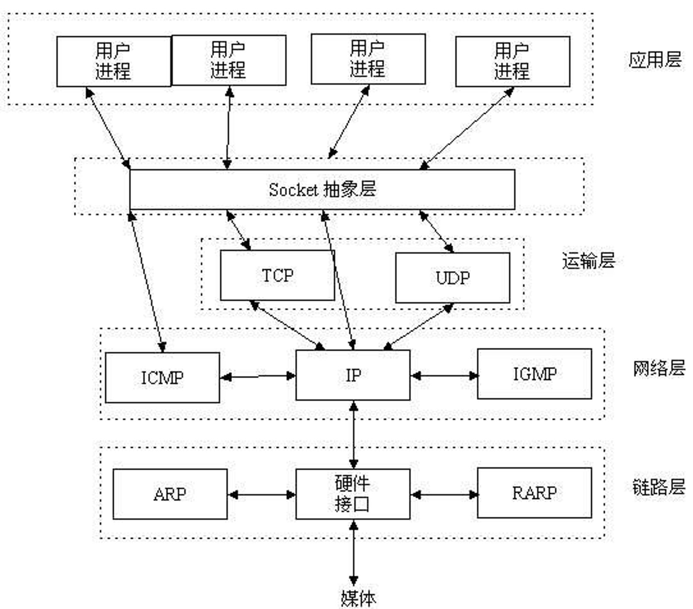
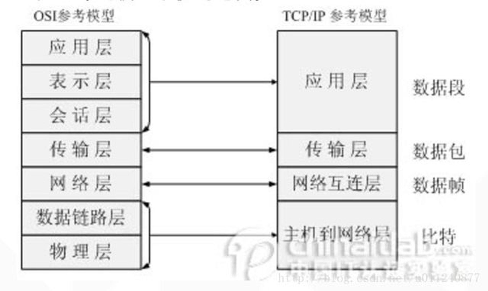

 每层都有相应的协议，如下图  

**IP：**

网络层协议；（高速公路）

**TCP和UDP：**

传输层协议；（卡车）

**HTTP：**

应用层协议；（货物）。HTTP(超文本传输协议)是利用TCP在两台电脑(通常是Web服务器和客户端)之间传输信息的协议。客户端使用Web浏览器发起HTTP请求给Web服务器，Web服务器发送被请求的信息给客户端。

**SOCKET：**

套接字，TCP/IP网络的API。(港口码头/车站)Socket是应用层与TCP/IP协议族通信的中间软件抽象层，它是一组接口。socket是在应用层和传输层之间的一个抽象层，它把TCP/IP层复杂的操作抽象为几个简单的接口供应用层调用已实现进程在网络中通信。

**TCP/IP：**

代表传输控制协议/网际协议，指的是一系列协议，TCP/IP 模型在 OSI 模型的基础上进行了简化，变成了四层，从下到上分别为：网络接口层、网络层、传输层、应用层。与 OSI 体系结构对比如下：

**TCP/UDP区别：**

**TCP**

（传输控制协议，Transmission Control Protocol）：(类似打电话)

面向连接、传输可靠（保证数据正确性）、有序（保证数据顺序）、传输大量数据（流模式）、速度慢、对系统资源的要求多，程序结构较复杂，

每一条TCP连接只能是点到点的，

TCP首部开销20字节。

**UDP**

(用户数据报协议，User Data Protocol)：（类似发短信）

面向非连接 、传输不可靠（可能丢包）、无序、传输少量数据（数据报模式）、速度快，对系统资源的要求少，程序结构较简单 ，

UDP支持一对一，一对多，多对一和多对多的交互通信，

UDP的首部开销小，只有8个字节。

**tcp三次握手建立连接：**

第一次握手：客户端发送syn包(seq=x)到服务器，并进入SYN_SEND状态，等待服务器确认；

第二次握手：服务器收到syn包，必须确认客户的SYN（ack=x+1），同时自己也发送一个SYN包（seq=y），即SYN+ACK包，此时服务器进入SYN_RECV状态；

第三次握手：客户端收到服务器的SYN＋ACK包，向服务器发送确认包ACK(ack=y+1)，此包发送完毕，客户端和服务器进入ESTABLISHED状态，完成三次握手。

握手过程中传送的包里不包含数据，三次握手完毕后，客户端与服务器才正式开始传送数据。理想状态下，TCP连接一旦建立，在通信双方中的任何一方主动关闭连接之前，TCP 连接都将被一直保持下去。

主机A向主机B发出连接请求数据包：“我想给你发数据，可以吗？”，这是第一次对话；

主机B向主机A发送同意连接和要求同步（同步就是两台主机一个在发送，一个在接收，协调工作）的数据包：“可以，你什么时候发？”，这是第二次对话；

主机A再发出一个数据包确认主机B的要求同步：“我现在就发，你接着吧！”，这是第三次对话。

三次“对话”的目的是使数据包的发送和接收同步，经过三次“对话”之后，主机A才向主机B正式发送数据。

**Websocket**

Websocket协议解决了服务器与客户端全双工通信的问题。

注:什么是单工、半双工、全工通信？

信息只能单向传送为单工；

信息能双向传送但不能同时双向传送称为半双工；

信息能够同时双向传送则称为全双工。

websocket协议解析

wensocket协议包含两部分:一部分是“握手”，一部分是“数据传输”。

**WebSocket和Socket区别**

可以把WebSocket想象成HTTP(应用层)，HTTP和Socket什么关系，WebSocket和Socket就是什么关系。

HTTP 协议有一个缺陷：通信只能由客户端发起，做不到服务器主动向客户端推送信息。

WebSocket 协议在2008年诞生，2011年成为国际标准。所有浏览器都已经支持了。

它的最大特点就是，服务器可以主动向客户端推送信息，客户端也可以主动向服务器发送信息，是真正的双向平等对话，属于服务器推送技术的一种