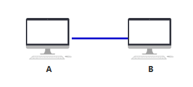
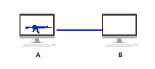
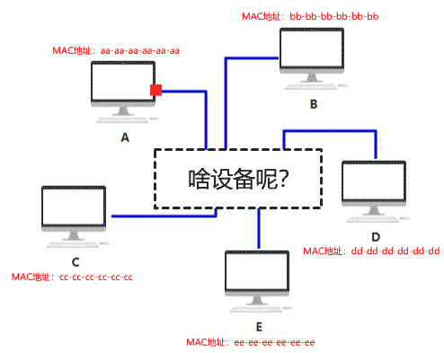
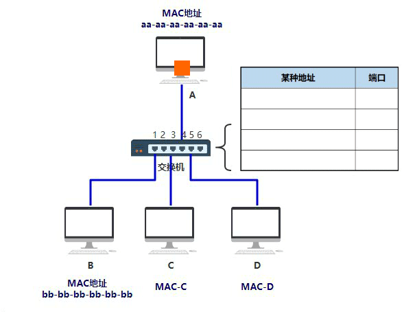
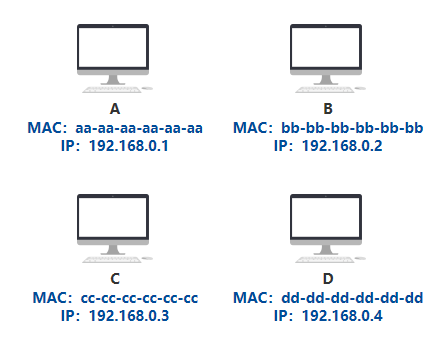
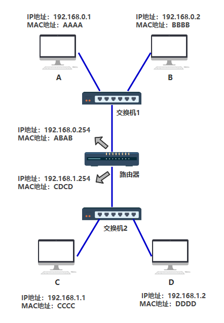
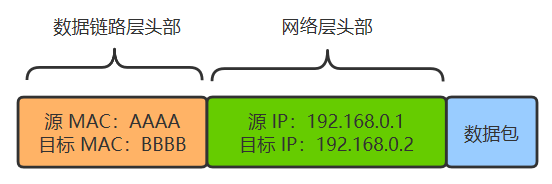
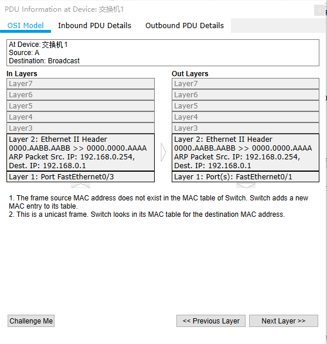

**你是一台电脑，你的名字叫 A**

很久很久之前，你不与任何其他电脑相连接，孤苦伶仃。

直到有一天，你希望与另一台电脑 B 建立通信，于是你们各开了一个网口，用一根**网线**连接了起来。

用一根网线连接起来怎么就能"通信"了呢？我可以给你讲 IO、讲中断、讲缓冲区，但这不是研究网络时该关心的问题。

如果你纠结，要么去研究一下操作系统是如何处理网络 IO 的，要么去研究一下包是如何被网卡转换成电信号发送出去的，要么就仅仅把它当做电脑里有个小人在**开枪**吧~

反正，你们就是连起来了，并且可以通信。

### **第一层**

有一天，一个新伙伴 C 加入了，但聪明的你们很快发现，可以每个人开**两个网口**，用一共**三根网线**，彼此相连。

随着越来越多的人加入，你发现身上开的网口实在太多了，而且网线密密麻麻，混乱不堪。（而实际上一台电脑根本开不了这么多网口，所以这种连线只在理论上可行，所以连不上的我就用红色虚线表示了，就是这么严谨哈哈~）

于是你们发明了一个中间设备，你们将网线都插到这个设备上，由这个设备做转发，就可以彼此之间通信了，本质上和原来一样，只不过网口的数量和网线的数量减少了，不再那么混乱。

你给它取名叫集线器，它仅仅是无脑将电信号转发到所有出口（广播），不做任何处理，你觉得它是没有智商的，因此把人家定性在了物理层。

你给它取名叫**集线器**，它仅仅是无脑将电信号**转发到所有出口（广播）**，不做任何处理，你觉得它是没有智商的，因此把人家定性在了**物理层**。

由于转发到了所有出口，那 BCDE 四台机器怎么知道数据包是不是发给自己的呢？

首先，你要给所有的连接到集线器的设备，都起个名字。原来你们叫 ABCD，但现在需要一个更专业的，**全局唯一**的名字作为标识，你把这个更高端的名字称为 **MAC 地址**。

你的 MAC 地址是 aa-aa-aa-aa-aa-aa，你的伙伴 b 的 MAC 地址是 bb-bb-bb-bb-bb-bb，以此类推，不重复就好。

这样，A 在发送数据包给 B 时，只要在头部拼接一个这样结构的数据，就可以了。

B 在收到数据包后，根据头部的目标 MAC 地址信息，判断这个数据包的确是发给自己的，于是便**收下**。

其他的 CDE 收到数据包后，根据头部的目标 MAC 地址信息，判断这个数据包并不是发给自己的，于是便**丢弃**。

虽然集线器使整个布局干净不少，但原来我只要发给电脑 B 的消息，现在却要发给连接到集线器中的所有电脑，这样既不安全，又不节省网络资源。

### **第二层**

如果把这个集线器弄得更智能一些，**只发给目标 MAC 地址指向的那台电脑**，就好了。

虽然只比集线器多了这一点点区别，但看起来似乎有智能了，你把这东西叫做**交换机**。也正因为这一点点智能，你把它放在了另一个层级，**数据链路层**。

如上图所示，你是这样设计的。

交换机内部维护一张 **MAC 地址表**，记录着每一个 MAC 地址的设备，连接在其哪一个端口上。

| MAC 地址          | 端口 |
| ----------------- | ---- |
| bb-bb-bb-bb-bb-bb | 1    |
| cc-cc-cc-cc-cc-cc | 3    |
| aa-aa-aa-aa-aa-aa | 4    |
| dd-dd-dd-dd-dd-dd | 5    |

假如你仍然要发给 B 一个数据包，构造了如下的数据结构从网口出去。

到达交换机时，交换机内部通过自己维护的 MAC 地址表，发现**目标机器 B 的 MAC 地址 bb-bb-bb-bb-bb-bb 映射到了端口 1 上**，于是把数据从 1 号端口发给了 B，完事~

你给这个通过这样传输方式而组成的小范围的网络，叫做**以太网**。

当然最开始的时候，MAC 地址表是空的，是怎么逐步建立起来的呢？

假如在 MAC 地址表为空是，你给 B 发送了如下数据

由于这个包从端口 4 进入的交换机，所以此时交换机就可以在 MAC地址表记录第一条数据：

**MAC：aa-aa-aa-aa-aa-aa-aa
****端口：4**

交换机看目标 MAC 地址（bb-bb-bb-bb-bb-bb）在地址表中并没有映射关系，于是将此包发给了**所有端口**，也即发给了所有机器。

之后，只有机器 B 收到了确实是发给自己的包，于是做出了**响应**，响应数据从端口 1 进入交换机，于是交换机此时在地址表中更新了第二条数据：

**MAC：bb-bb-bb-bb-bb-bb
****端口：1**

过程如下

经过该网络中的机器不断地通信，交换机最终将 MAC 地址表建立完毕~

随着机器数量越多，交换机的端口也不够了，但聪明的你发现，只要将多个交换机连接起来，这个问题就轻而易举搞定~

你完全不需要设计额外的东西，只需要按照之前的设计和规矩来，按照上述的接线方式即可完成所有电脑的互联，所以交换机设计的这种规则，真的很巧妙。你想想看为什么（比如 A 要发数据给 F）。

但是你要注意，上面那根红色的线，最终在 MAC 地址表中可不是一条记录呀，而是要把 EFGH 这四台机器与该端口（端口6）的映射全部记录在表中。

最终，**两个交换机将分别记录 A ~ H 所有机器的映射记录**。

**左边的交换机**

| MAC 地址          | 端口 |
| ----------------- | ---- |
| bb-bb-bb-bb-bb-bb | 1    |
| cc-cc-cc-cc-cc-cc | 3    |
| aa-aa-aa-aa-aa-aa | 4    |
| dd-dd-dd-dd-dd-dd | 5    |
| ee-ee-ee-ee-ee-ee | 6    |
| ff-ff-ff-ff-ff-ff | 6    |
| gg-gg-gg-gg-gg-gg | 6    |
| hh-hh-hh-hh-hh-hh | 6    |

**右边的交换机**

| MAC 地址          | 端口 |
| ----------------- | ---- |
| bb-bb-bb-bb-bb-bb | 1    |
| cc-cc-cc-cc-cc-cc | 1    |
| aa-aa-aa-aa-aa-aa | 1    |
| dd-dd-dd-dd-dd-dd | 1    |
| ee-ee-ee-ee-ee-ee | 2    |
| ff-ff-ff-ff-ff-ff | 3    |
| gg-gg-gg-gg-gg-gg | 4    |
| hh-hh-hh-hh-hh-hh | 6    |

这在只有 8 台电脑的时候还好，甚至在只有几百台电脑的时候，都还好，所以这种交换机的设计方式，已经足足支撑一阵子了。

但很遗憾，人是贪婪的动物，很快，电脑的数量就发展到几千、几万、几十万。

### **第三层**

交换机已经无法记录如此庞大的映射关系了。

此时你动了歪脑筋，你发现了问题的根本在于，连出去的那根红色的网线，后面不知道有多少个设备不断地连接进来，从而使得地址表越来越大。

那我可不可以让那根红色的网线，接入一个**新的设备**，这个设备就跟电脑一样有自己独立的 MAC 地址，而且同时还能帮我把数据包做一次**转发**呢？

这个设备就是**路由器，**它的功能就是，作为一台独立的拥有 MAC 地址的设备，并且可以帮我把数据包做一次转发**，**你把它定在了**网络层。**

注意，路由器的每一个端口，都有独立的 MAC 地址

好了，现在交换机的 MAC 地址表中，只需要多出一条 MAC 地址 ABAB 与其端口的映射关系，就可以成功把数据包转交给路由器了，这条搞定。**
**

那如何做到，把发送给 C 和 D，甚至是把发送给 DEFGH.... 的数据包，统统先发送给路由器呢？

不难想到这样一个点子，假如电脑 C 和 D 的 MAC 地址拥有共同的前缀，比如分别是

**C 的 MAC 地址：FFFF-FFFF-CCCC
**

**D 的 MAC 地址：****FFFF-FFFF-DDDD**

那我们就可以说，将目标 MAC 地址为 **FFFF-FFFF-？开头的**，统统先发送给路由器。

这样是否可行呢？答案是否定的。

我们先从现实中 MAC 地址的结构入手，MAC地址也叫物理地址、硬件地址，长度为 48 位，一般这样来表示

**00-16-EA-AE-3C-40**

它是由网络设备制造商生产时烧录在网卡的EPROM（一种闪存芯片，通常可以通过程序擦写）。其中**前 24 位（00-16-EA）代表网络硬件制造商的编号****，后 24 位（AE-3C-40）是该厂家自己分配的，一般表示系列号。**只要不更改自己的 MAC 地址，MAC 地址在世界是唯一的。形象地说，MAC地址就如同身份证上的身份证号码，具有唯一性。

那如果你希望向上面那样表示将目标 MAC 地址为 **FFFF-FFFF-？开头的**，统一从路由器出去发给某一群设备（后面会提到这其实是子网的概念），那你就需要要求某一子网下统统买一个厂商制造的设备，要么你就需要要求厂商在生产网络设备烧录 MAC 地址时，提前按照你规划好的子网结构来定 MAC 地址，并且日后这个网络的结构都不能轻易改变。

这显然是不现实的。

于是你发明了一个新的地址，给每一台机器一个 32 位的编号，如：

**11000000101010000000000000000001**

你觉得有些不清晰，于是把它分成四个部分，中间用点相连。

**11000000.10101000.00000000.00000001**

你还觉得不清晰，于是把它转换成 10 进制。

**192.168.0.1**

最后你给了这个地址一个响亮的名字，**IP 地址**。现在每一台电脑，同时有自己的 MAC 地址，又有自己的 IP 地址，只不过 IP 地址是**软件层面**上的，可以随时修改，MAC 地址一般是无法修改的。

这样一个可以随时修改的 IP 地址，就可以根据你规划的网络拓扑结构，来调整了。

如上图所示，假如我想要发送数据包给 ABCD 其中一台设备，不论哪一台，我都可以这样描述，**"将 IP 地址为 192.168.0 开头的全部发送给到路由器，之后再怎么转发，交给它！"**，巧妙吧。

那交给路由器之后，路由器又是怎么把数据包准确转发给指定设备的呢？

别急我们慢慢来。

我们先给上面的组网方式中的每一台设备，加上自己的 IP 地址

现在两个设备之间传输，除了加上数据链路层的头部之外，还要再增加一个网络层的头部。

假如 A 给 B 发送数据，由于它们直接连着交换机，所以 A 直接发出如下数据包即可，其实网络层没有体现出作用。

但假如 A 给 C 发送数据，A 就需要先转交给路由器，然后再由路由器转交给 C。由于最底层的传输仍然需要依赖以太网，所以数据包是分成两段的。

A ~ 路由器这段的包如下：

路由器到 C 这段的包如下：

好了，上面说的两种情况（A->B，A->C），相信细心的读者应该会有不少疑问，下面我们一个个来展开。

A 给 C 发数据包，怎么知道是否要通过路由器转发呢？

**答案：子网**

如果源 IP 与目的 IP 处于一个子网，直接将包通过交换机发出去。

如果源 IP 与目的 IP 不处于一个子网，就交给路由器去处理。

好，那现在只需要解决，什么叫处于一个子网就好了。

192.168.0.1 和 192.168.0.2 处于同一个子网

192.168.0.1 和 192.168.1.1 处于不同子网

这两个是我们人为规定的，即我们想表示，对于 192.168.0.1 来说：

**192.168.0.xxx 开头的，就算是在一个子网，否则就是在不同的子网。**

那对于计算机来说，怎么表达这个意思呢？于是人们发明了**子网掩码**的概念

假如某台机器的子网掩码定为 255.255.255.0

这表示，将源 IP 与目的 IP 分别同这个子网掩码进行**与运算****，相等则是在一个子网，不相等就是在不同子网**，就这么简单。

比如

**A电脑**：192.168.0.1 & 255.255.255.0 = 192.168.0.0

**B电脑**：192.168.0.2 & 255.255.255.0 = 192.168.0.0

**C电脑**：192.168.1.1 & 255.255.255.0 = 192.168.1.0

**D电脑**：192.168.1.2 & 255.255.255.0 = 192.168.1.0

那么 A 与 B 在同一个子网，C 与 D 在同一个子网，但是 A 与 C 就不在同一个子网，与 D 也不在同一个子网，以此类推。

所以如果 A 给 C 发消息，A 和 C 的 IP 地址分别 & A 机器配置的子网掩码，发现不相等，则 A 认为 C 和自己不在同一个子网，于是把包发给路由器，就不管了，**之后怎么转发，A 不关心**。

A 如何知道，哪个设备是路由器？

**答案：在 A 上要设置默认网关**

上一步 A 通过是否与 C 在同一个子网内，判断出自己应该把包发给路由器，那路由器的 IP 是多少呢？

其实说发给路由器不准确，应该说 A 会把包发给**默认网关**。

对 A 来说，A 只能**直接**把包发给同处于一个子网下的某个 IP 上，所以发给路由器还是发给某个电脑，对 A 来说也不关心，只要这个设备有个 IP 地址就行。

所以**默认网关，就是 A 在自己电脑里配置的一个 IP 地址**，以便在发给不同子网的机器时，发给这个 IP 地址。

仅此而已！

路由器如何知道C在哪里？

**答案：路由表**

现在 A 要给 C 发数据包，已经可以成功发到路由器这里了，最后一个问题就是，**路由器怎么知道，收到的这个数据包，该从自己的哪个端口出去**，才能直接（或间接）地最终到达目的地 C 呢。

路由器收到的数据包有目的 IP 也就是 C 的 IP 地址，需要转化成从自己的哪个端口出去，很容易想到，应该有个表，就像 MAC 地址表一样。

这个表就叫**路由表**。

至于这个路由表是怎么出来的，有很多路由算法，本文不展开，因为我也不会哈哈~

不同于 MAC 地址表的是，路由表并不是一对一这种明确关系，我们下面看一个路由表的结构。

| 目的地址      | 子网掩码        | 下一跳 | 端口 |
| ------------- | --------------- | ------ | ---- |
| 192.168.0.0   | 255.255.255.0   |        | 0    |
| 192.168.0.254 | 255.255.255.255 |        | 0    |
| 192.168.1.0   | 255.255.255.0   |        | 1    |
| 192.168.1.254 | 255.255.255.255 |        | 1    |

我们学习一种新的表示方法，由于子网掩码其实就表示前多少位表示子网的网段，所以如 192.168.0.0（255.255.255.0） 也可以简写为 192.168.0.0/24

| 目的地址         | 下一跳 | 端口 |
| ---------------- | ------ | ---- |
| 192.168.0.0/24   |        | 0    |
| 192.168.0.254/32 |        | 0    |
| 192.168.1.0/24   |        | 1    |
| 192.168.1.254/32 |        | 1    |

这就很好理解了，路由表就表示，**192.168.0.xxx 这个子网下的，都转发到 0 号端口，192.168.1.xxx 这个子网下的，都转发到 1 号端口**。下一跳列还没有值，我们先不管

配合着结构图来看（这里把子网掩码和默认网关都补齐了）图中 & 笔误，结果应该是 .0

刚才说的都是 IP 层，但发送数据包的数据链路层需要知道 MAC 地址，可是我只知道 IP 地址该怎么办呢？

**答案：arp**

假如你（A）此时**不知道**你同伴 B 的 MAC 地址（现实中就是不知道的，刚刚我们只是假设已知），你只知道它的 IP 地址，你该怎么把数据包准确传给 B 呢？

答案很简单，在网络层，**我需要把 IP 地址对应的 MAC 地址找到**，也就是通过某种方式，找到 **192.168.0.2** 对应的 MAC 地址 **BBBB**。

这种方式就是 **arp 协议**，同时电脑 A 和 B 里面也会有一张 **arp 缓存表**，表中记录着 **IP 与 MAC 地址**的对应关系。

| IP 地址     | MAC 地址 |
| ----------- | -------- |
| 192.168.0.2 | BBBB     |

一开始的时候这个表是**空的**，电脑 A 为了知道电脑 B（192.168.0.2）的 MAC 地址，将会**广播**一条 arp 请求，B 收到请求后，带上自己的 MAC 地址给 A 一个**响应**。此时 A 便更新了自己的 arp 表。

这样通过大家不断广播 arp 请求，最终所有电脑里面都将 arp 缓存表更新完整。

**总结一下**

好了，总结一下，到目前为止就几条规则

**从各个节点的视角来看**

**电脑视角****：**

- 首先我要知道我的 IP 以及对方的 IP
- 通过子网掩码判断我们是否在同一个子网
- 在同一个子网就通过 arp 获取对方 mac 地址直接扔出去
- 不在同一个子网就通过 arp 获取默认网关的 mac 地址直接扔出去

**交换机视角：**

- 我收到的数据包必须有目标 MAC 地址
- 通过 MAC 地址表查映射关系
- 查到了就按照映射关系从我的指定端口发出去
- 查不到就所有端口都发出去

**路由器视角：**

- 我收到的数据包必须有目标 IP 地址
- 通过路由表查映射关系
- 查到了就按照映射关系从我的指定端口发出去（不在任何一个子网范围，走其路由器的默认网关也是查到了）
- 查不到则返回一个路由不可达的数据包

如果你嗅觉足够敏锐，你应该可以感受到下面这句话：

网络层（IP协议）本身没有传输包的功能，包的实际传输是委托给数据链路层（以太网中的交换机）来实现的。

**涉及到的三张表分别是**

- 交换机中有 **MAC 地址**表用于映射 MAC 地址和它的端口
- 路由器中有**路由表**用于映射 IP 地址(段)和它的端口
- 电脑和路由器中都有 **arp 缓存表**用于缓存 IP 和 MAC 地址的映射关系

**这三张表是怎么来的**

- MAC 地址表是通过以太网内各节点之间不断通过交换机通信，不断完善起来的。
- 路由表是各种路由算法 + 人工配置逐步完善起来的。
- arp 缓存表是不断通过 arp 协议的请求逐步完善起来的。

知道了以上这些，目前网络上两个节点是如何发送数据包的这个过程，就完全可以解释通了！

那接下来我们就放上本章 **最后一个** 网络拓扑图吧，请做好 **战斗** 准备！

这时路由器 1 连接了路由器 2，所以其路由表有了下一条地址这一个概念，所以它的路由表就变成了这个样子。如果匹配到了有下一跳地址的一项，则需要再次匹配，找到其端口，并找到下一跳 IP 的 MAC 地址。

也就是说找来找去，最终必须能映射到一个端口号，然后从这个端口号把数据包发出去。

| 目的地址         | 下一跳        | 端口 |
| ---------------- | ------------- | ---- |
| 192.168.0.0/24   |               | 0    |
| 192.168.0.254/32 |               | 0    |
| 192.168.1.0/24   |               | 1    |
| 192.168.1.254/32 |               | 1    |
| 192.168.2.0/24   | 192.168.100.5 |      |
| 192.168.100.0/24 |               | 2    |
| 192.168.100.4/32 |               | 2    |

**这时如果 A 给 F 发送一个数据包，能不能通呢？如果通的话整个过程是怎样的呢？**

思考一分钟...

**详细过程动画描述：**

**详细过程文字描述：**

**1.** 首先 A（192.168.0.1）通过子网掩码（255.255.255.0）计算出自己与 F（192.168.2.2）并不在同一个子网内，于是决定发送给默认网关（192.168.0.254）

**2.** A 通过 ARP 找到 默认网关 192.168.0.254 的 MAC 地址。

**3.** A 将源 MAC 地址（AAAA）与网关 MAC 地址（ABAB）封装在数据链路层头部，又将源 IP 地址（192.168.0.1）和目的 IP 地址（192.168.2.2）（注意这里千万不要以为填写的是默认网关的 IP 地址，从始至终这个数据包的两个 IP 地址都是不变的，只有 MAC 地址在不断变化）封装在网络层头部，然后发包

**4.** 交换机 1 收到数据包后，发现目标 MAC 地址是 ABAB，转发给路由器1

**5.** 数据包来到了路由器 1，发现其目标 IP 地址是 192.168.2.2，查看其路由表，发现了下一跳的地址是 192.168.100.5

**6.** 所以此时路由器 1 需要做两件事，第一件是再次匹配路由表，发现匹配到了端口为 2，于是将其封装到数据链路层，最后把包从 2 号口发出去。

**7.** 此时路由器 2 收到了数据包，看到其目的地址是 192.168.2.2，查询其路由表，匹配到端口号为 1，准备从 1 号口把数据包送出去。

**8.** 但此时路由器 2 需要知道 192.168.2.2 的 MAC 地址了，于是查看其 arp 缓存，找到其 MAC 地址为 FFFF，将其封装在数据链路层头部，并从 1 号端口把包发出去。

**9.** 交换机 3 收到了数据包，发现目的 MAC 地址为 FFFF，查询其 MAC 地址表，发现应该从其 6 号端口出去，于是从 6 号端口把数据包发出去。

**10.** **F 最终收到了数据包！**并且发现目的 MAC 地址就是自己，于是收下了这个包

**更详细且精准的过程：**

读到这相信大家已经很累了，理解上述过程基本上网络层以下的部分主流程就基本疏通了，如果你想要本过程更为专业的过程描述，可以在公众号"低并发编程"后台回复"网络"，获得我模拟这个过程的 Cisco Packet Tracer 源文件。

每一步包的传输都会有各层的原始数据，以及专业的过程描述

同时在此基础之上你也可以设计自己的网络拓扑结构，进行各种实验，来加深网络传输过程的理解。

**后记**

至此，经过物理层、数据链路层、网络层这前三层的协议，以及根据这些协议设计的各种网络设备（网线、集线器、交换机、路由器），理论上只要拥有对方的 IP 地址，就已经将地球上任意位置的两个节点连通了。

本文经过了很多次的修改，删减了不少影响主流程的内容，就是为了让读者能抓住网络传输前三层的真正核心思想。同时网络相关的知识也是多且杂，我也还有很多搞不清楚的地方，非常欢迎大家与我交流，共同进步。

读到这里都是真爱了，当然要赠一个投票。

由于转发到了所有出口，那 BCDE 四台机器怎么知道数据包是不是发给自己的呢？

首先，你要给所有的连接到集线器的设备，都起个名字。原来你们叫 ABCD，但现在需要一个更专业的，全局唯一的名字作为标识，你把这个更高端的名字称为 MAC 地址。

你的 MAC 地址是 aa-aa-aa-aa-aa-aa，你的伙伴 b 的 MAC 地址是 bb-bb-bb-bb-bb-bb，以此类推，不重复就好。

这样，A 在发送数据包给 B 时，只要在头部拼接一个这样结构的数据，就可以了。

图片

B 在收到数据包后，根据头部的目标 MAC 地址信息，判断这个数据包的确是发给自己的，于是便收下。

其他的 CDE 收到数据包后，根据头部的目标 MAC 地址信息，判断这个数据包并不是发给自己的，于是便丢弃。

图片

虽然集线器使整个布局干净不少，但原来我只要发给电脑 B 的消息，现在却要发给连接到集线器中的所有电脑，这样既不安全，又不节省网络资源。

第二层

如果把这个集线器弄得更智能一些，只发给目标 MAC 地址指向的那台电脑，就好了。

图片

虽然只比集线器多了这一点点区别，但看起来似乎有智能了，你把这东西叫做交换机。也正因为这一点点智能，你把它放在了另一个层级，数据链路层。

图片

如上图所示，你是这样设计的。

交换机内部维护一张 MAC 地址表，记录着每一个 MAC 地址的设备，连接在其哪一个端口上。

MAC 地址	端口
bb-bb-bb-bb-bb-bb	1
cc-cc-cc-cc-cc-cc	3
aa-aa-aa-aa-aa-aa	4
dd-dd-dd-dd-dd-dd	5
假如你仍然要发给 B 一个数据包，构造了如下的数据结构从网口出去。

图片

到达交换机时，交换机内部通过自己维护的 MAC 地址表，发现目标机器 B 的 MAC 地址 bb-bb-bb-bb-bb-bb 映射到了端口 1 上，于是把数据从 1 号端口发给了 B，完事~

你给这个通过这样传输方式而组成的小范围的网络，叫做以太网。

当然最开始的时候，MAC 地址表是空的，是怎么逐步建立起来的呢？

假如在 MAC 地址表为空是，你给 B 发送了如下数据

图片

由于这个包从端口 4 进入的交换机，所以此时交换机就可以在 MAC地址表记录第一条数据：

MAC：aa-aa-aa-aa-aa-aa-aa
端口：4

交换机看目标 MAC 地址（bb-bb-bb-bb-bb-bb）在地址表中并没有映射关系，于是将此包发给了所有端口，也即发给了所有机器。

之后，只有机器 B 收到了确实是发给自己的包，于是做出了响应，响应数据从端口 1 进入交换机，于是交换机此时在地址表中更新了第二条数据：

MAC：bb-bb-bb-bb-bb-bb
端口：1

过程如下

图片

经过该网络中的机器不断地通信，交换机最终将 MAC 地址表建立完毕~

图片
随着机器数量越多，交换机的端口也不够了，但聪明的你发现，只要将多个交换机连接起来，这个问题就轻而易举搞定~

图片

你完全不需要设计额外的东西，只需要按照之前的设计和规矩来，按照上述的接线方式即可完成所有电脑的互联，所以交换机设计的这种规则，真的很巧妙。你想想看为什么（比如 A 要发数据给 F）。

但是你要注意，上面那根红色的线，最终在 MAC 地址表中可不是一条记录呀，而是要把 EFGH 这四台机器与该端口（端口6）的映射全部记录在表中。

最终，两个交换机将分别记录 A ~ H 所有机器的映射记录。

左边的交换机

MAC 地址	端口
bb-bb-bb-bb-bb-bb	1
cc-cc-cc-cc-cc-cc	3
aa-aa-aa-aa-aa-aa	4
dd-dd-dd-dd-dd-dd	5
ee-ee-ee-ee-ee-ee
6
ff-ff-ff-ff-ff-ff
6
gg-gg-gg-gg-gg-gg
6
hh-hh-hh-hh-hh-hh
6
右边的交换机

MAC 地址	端口
bb-bb-bb-bb-bb-bb	1
cc-cc-cc-cc-cc-cc	1
aa-aa-aa-aa-aa-aa	1
dd-dd-dd-dd-dd-dd	1
ee-ee-ee-ee-ee-ee
2
ff-ff-ff-ff-ff-ff
3
gg-gg-gg-gg-gg-gg
4
hh-hh-hh-hh-hh-hh
6
这在只有 8 台电脑的时候还好，甚至在只有几百台电脑的时候，都还好，所以这种交换机的设计方式，已经足足支撑一阵子了。

但很遗憾，人是贪婪的动物，很快，电脑的数量就发展到几千、几万、几十万。

第三层

交换机已经无法记录如此庞大的映射关系了。

此时你动了歪脑筋，你发现了问题的根本在于，连出去的那根红色的网线，后面不知道有多少个设备不断地连接进来，从而使得地址表越来越大。

那我可不可以让那根红色的网线，接入一个新的设备，这个设备就跟电脑一样有自己独立的 MAC 地址，而且同时还能帮我把数据包做一次转发呢？

这个设备就是路由器，它的功能就是，作为一台独立的拥有 MAC 地址的设备，并且可以帮我把数据包做一次转发，你把它定在了网络层。

图片

注意，路由器的每一个端口，都有独立的 MAC 地址

好了，现在交换机的 MAC 地址表中，只需要多出一条 MAC 地址 ABAB 与其端口的映射关系，就可以成功把数据包转交给路由器了，这条搞定。

那如何做到，把发送给 C 和 D，甚至是把发送给 DEFGH.... 的数据包，统统先发送给路由器呢？

不难想到这样一个点子，假如电脑 C 和 D 的 MAC 地址拥有共同的前缀，比如分别是

C 的 MAC 地址：FFFF-FFFF-CCCC
D 的 MAC 地址：FFFF-FFFF-DDDD
那我们就可以说，将目标 MAC 地址为 FFFF-FFFF-？开头的，统统先发送给路由器。

这样是否可行呢？答案是否定的。

我们先从现实中 MAC 地址的结构入手，MAC地址也叫物理地址、硬件地址，长度为 48 位，一般这样来表示

00-16-EA-AE-3C-40

它是由网络设备制造商生产时烧录在网卡的EPROM（一种闪存芯片，通常可以通过程序擦写）。其中前 24 位（00-16-EA）代表网络硬件制造商的编号，后 24 位（AE-3C-40）是该厂家自己分配的，一般表示系列号。只要不更改自己的 MAC 地址，MAC 地址在世界是唯一的。形象地说，MAC地址就如同身份证上的身份证号码，具有唯一性。

那如果你希望向上面那样表示将目标 MAC 地址为 FFFF-FFFF-？开头的，统一从路由器出去发给某一群设备（后面会提到这其实是子网的概念），那你就需要要求某一子网下统统买一个厂商制造的设备，要么你就需要要求厂商在生产网络设备烧录 MAC 地址时，提前按照你规划好的子网结构来定 MAC 地址，并且日后这个网络的结构都不能轻易改变。

这显然是不现实的。

于是你发明了一个新的地址，给每一台机器一个 32 位的编号，如：

11000000101010000000000000000001

你觉得有些不清晰，于是把它分成四个部分，中间用点相连。

11000000.10101000.00000000.00000001

你还觉得不清晰，于是把它转换成 10 进制。

192.168.0.1

最后你给了这个地址一个响亮的名字，IP 地址。现在每一台电脑，同时有自己的 MAC 地址，又有自己的 IP 地址，只不过 IP 地址是软件层面上的，可以随时修改，MAC 地址一般是无法修改的。

这样一个可以随时修改的 IP 地址，就可以根据你规划的网络拓扑结构，来调整了。

图片

如上图所示，假如我想要发送数据包给 ABCD 其中一台设备，不论哪一台，我都可以这样描述，"将 IP 地址为 192.168.0 开头的全部发送给到路由器，之后再怎么转发，交给它！"，巧妙吧。

那交给路由器之后，路由器又是怎么把数据包准确转发给指定设备的呢？

别急我们慢慢来。

我们先给上面的组网方式中的每一台设备，加上自己的 IP 地址

图片

现在两个设备之间传输，除了加上数据链路层的头部之外，还要再增加一个网络层的头部。

假如 A 给 B 发送数据，由于它们直接连着交换机，所以 A 直接发出如下数据包即可，其实网络层没有体现出作用。

图片

但假如 A 给 C 发送数据，A 就需要先转交给路由器，然后再由路由器转交给 C。由于最底层的传输仍然需要依赖以太网，所以数据包是分成两段的。

A ~ 路由器这段的包如下：

图片

路由器到 C 这段的包如下：

图片

好了，上面说的两种情况（A->B，A->C），相信细心的读者应该会有不少疑问，下面我们一个个来展开。

A 给 C 发数据包，怎么知道是否要通过路由器转发呢？

答案：子网

如果源 IP 与目的 IP 处于一个子网，直接将包通过交换机发出去。

如果源 IP 与目的 IP 不处于一个子网，就交给路由器去处理。

好，那现在只需要解决，什么叫处于一个子网就好了。

192.168.0.1 和 192.168.0.2 处于同一个子网

192.168.0.1 和 192.168.1.1 处于不同子网

这两个是我们人为规定的，即我们想表示，对于 192.168.0.1 来说：

192.168.0.xxx 开头的，就算是在一个子网，否则就是在不同的子网。

那对于计算机来说，怎么表达这个意思呢？于是人们发明了子网掩码的概念

假如某台机器的子网掩码定为 255.255.255.0

这表示，将源 IP 与目的 IP 分别同这个子网掩码进行与运算，相等则是在一个子网，不相等就是在不同子网，就这么简单。

比如

A电脑：192.168.0.1 & 255.255.255.0 = 192.168.0.0

B电脑：192.168.0.2 & 255.255.255.0 = 192.168.0.0

C电脑：192.168.1.1 & 255.255.255.0 = 192.168.1.0

D电脑：192.168.1.2 & 255.255.255.0 = 192.168.1.0

那么 A 与 B 在同一个子网，C 与 D 在同一个子网，但是 A 与 C 就不在同一个子网，与 D 也不在同一个子网，以此类推。

图片

所以如果 A 给 C 发消息，A 和 C 的 IP 地址分别 & A 机器配置的子网掩码，发现不相等，则 A 认为 C 和自己不在同一个子网，于是把包发给路由器，就不管了，之后怎么转发，A 不关心。

A 如何知道，哪个设备是路由器？

答案：在 A 上要设置默认网关

上一步 A 通过是否与 C 在同一个子网内，判断出自己应该把包发给路由器，那路由器的 IP 是多少呢？

其实说发给路由器不准确，应该说 A 会把包发给默认网关。

对 A 来说，A 只能直接把包发给同处于一个子网下的某个 IP 上，所以发给路由器还是发给某个电脑，对 A 来说也不关心，只要这个设备有个 IP 地址就行。

所以默认网关，就是 A 在自己电脑里配置的一个 IP 地址，以便在发给不同子网的机器时，发给这个 IP 地址。

图片

仅此而已！

路由器如何知道C在哪里？

答案：路由表

现在 A 要给 C 发数据包，已经可以成功发到路由器这里了，最后一个问题就是，路由器怎么知道，收到的这个数据包，该从自己的哪个端口出去，才能直接（或间接）地最终到达目的地 C 呢。

路由器收到的数据包有目的 IP 也就是 C 的 IP 地址，需要转化成从自己的哪个端口出去，很容易想到，应该有个表，就像 MAC 地址表一样。

这个表就叫路由表。

至于这个路由表是怎么出来的，有很多路由算法，本文不展开，因为我也不会哈哈~

不同于 MAC 地址表的是，路由表并不是一对一这种明确关系，我们下面看一个路由表的结构。

目的地址	子网掩码	下一跳	端口
192.168.0.0	255.255.255.0	
0
192.168.0.254	255.255.255.255	
0
192.168.1.0	255.255.255.0	
1
192.168.1.254	255.255.255.255	
1
我们学习一种新的表示方法，由于子网掩码其实就表示前多少位表示子网的网段，所以如 192.168.0.0（255.255.255.0） 也可以简写为 192.168.0.0/24

目的地址	下一跳	端口
192.168.0.0/24	
0
192.168.0.254/32	
0
192.168.1.0/24	
1
192.168.1.254/32	
1
这就很好理解了，路由表就表示，192.168.0.xxx 这个子网下的，都转发到 0 号端口，192.168.1.xxx 这个子网下的，都转发到 1 号端口。下一跳列还没有值，我们先不管

配合着结构图来看（这里把子网掩码和默认网关都补齐了）图中 & 笔误，结果应该是 .0

图片

刚才说的都是 IP 层，但发送数据包的数据链路层需要知道 MAC 地址，可是我只知道 IP 地址该怎么办呢？

答案：arp

假如你（A）此时不知道你同伴 B 的 MAC 地址（现实中就是不知道的，刚刚我们只是假设已知），你只知道它的 IP 地址，你该怎么把数据包准确传给 B 呢？

答案很简单，在网络层，我需要把 IP 地址对应的 MAC 地址找到，也就是通过某种方式，找到 192.168.0.2 对应的 MAC 地址 BBBB。

这种方式就是 arp 协议，同时电脑 A 和 B 里面也会有一张 arp 缓存表，表中记录着 IP 与 MAC 地址的对应关系。

IP 地址	MAC 地址
192.168.0.2	BBBB
一开始的时候这个表是空的，电脑 A 为了知道电脑 B（192.168.0.2）的 MAC 地址，将会广播一条 arp 请求，B 收到请求后，带上自己的 MAC 地址给 A 一个响应。此时 A 便更新了自己的 arp 表。

这样通过大家不断广播 arp 请求，最终所有电脑里面都将 arp 缓存表更新完整。

总结一下

好了，总结一下，到目前为止就几条规则

从各个节点的视角来看

电脑视角：

首先我要知道我的 IP 以及对方的 IP

通过子网掩码判断我们是否在同一个子网

在同一个子网就通过 arp 获取对方 mac 地址直接扔出去

不在同一个子网就通过 arp 获取默认网关的 mac 地址直接扔出去

交换机视角：

我收到的数据包必须有目标 MAC 地址

通过 MAC 地址表查映射关系

查到了就按照映射关系从我的指定端口发出去

查不到就所有端口都发出去

路由器视角：

我收到的数据包必须有目标 IP 地址

通过路由表查映射关系

查到了就按照映射关系从我的指定端口发出去（不在任何一个子网范围，走其路由器的默认网关也是查到了）

查不到则返回一个路由不可达的数据包

如果你嗅觉足够敏锐，你应该可以感受到下面这句话：

网络层（IP协议）本身没有传输包的功能，包的实际传输是委托给数据链路层（以太网中的交换机）来实现的。

涉及到的三张表分别是

交换机中有 MAC 地址表用于映射 MAC 地址和它的端口

路由器中有路由表用于映射 IP 地址(段)和它的端口

电脑和路由器中都有 arp 缓存表用于缓存 IP 和 MAC 地址的映射关系

这三张表是怎么来的

MAC 地址表是通过以太网内各节点之间不断通过交换机通信，不断完善起来的。

路由表是各种路由算法 + 人工配置逐步完善起来的。

arp 缓存表是不断通过 arp 协议的请求逐步完善起来的。

知道了以上这些，目前网络上两个节点是如何发送数据包的这个过程，就完全可以解释通了！

图片

那接下来我们就放上本章 最后一个 网络拓扑图吧，请做好 战斗 准备！

图片

这时路由器 1 连接了路由器 2，所以其路由表有了下一条地址这一个概念，所以它的路由表就变成了这个样子。如果匹配到了有下一跳地址的一项，则需要再次匹配，找到其端口，并找到下一跳 IP 的 MAC 地址。

也就是说找来找去，最终必须能映射到一个端口号，然后从这个端口号把数据包发出去。

目的地址	下一跳	端口
192.168.0.0/24	
0
192.168.0.254/32	
0
192.168.1.0/24	
1
192.168.1.254/32	
1
192.168.2.0/24	192.168.100.5	
192.168.100.0/24	
2
192.168.100.4/32	
2
这时如果 A 给 F 发送一个数据包，能不能通呢？如果通的话整个过程是怎样的呢？

图片

思考一分钟...

详细过程动画描述：

图片

详细过程文字描述：

1.  首先 A（192.168.0.1）通过子网掩码（255.255.255.0）计算出自己与 F（192.168.2.2）并不在同一个子网内，于是决定发送给默认网关（192.168.0.254） 
2.  A 通过 ARP 找到 默认网关 192.168.0.254 的 MAC 地址。 
3.  A 将源 MAC 地址（AAAA）与网关 MAC 地址（ABAB）封装在数据链路层头部，又将源 IP 地址（192.168.0.1）和目的 IP 地址（192.168.2.2）（注意这里千万不要以为填写的是默认网关的 IP 地址，从始至终这个数据包的两个 IP 地址都是不变的，只有 MAC 地址在不断变化）封装在网络层头部，然后发包
   图片 
4.  交换机 1 收到数据包后，发现目标 MAC 地址是 ABAB，转发给路由器1 
5.  数据包来到了路由器 1，发现其目标 IP 地址是 192.168.2.2，查看其路由表，发现了下一跳的地址是 192.168.100.5 
6.  所以此时路由器 1 需要做两件事，第一件是再次匹配路由表，发现匹配到了端口为 2，于是将其封装到数据链路层，最后把包从 2 号口发出去。 
7.  此时路由器 2 收到了数据包，看到其目的地址是 192.168.2.2，查询其路由表，匹配到端口号为 1，准备从 1 号口把数据包送出去。 
8.  但此时路由器 2 需要知道 192.168.2.2 的 MAC 地址了，于是查看其 arp 缓存，找到其 MAC 地址为 FFFF，将其封装在数据链路层头部，并从 1 号端口把包发出去。 
9.  交换机 3 收到了数据包，发现目的 MAC 地址为 FFFF，查询其 MAC 地址表，发现应该从其 6 号端口出去，于是从 6 号端口把数据包发出去。 
10.  F 最终收到了数据包！并且发现目的 MAC 地址就是自己，于是收下了这个包
    更详细且精准的过程：
    读到这相信大家已经很累了，理解上述过程基本上网络层以下的部分主流程就基本疏通了，如果你想要本过程更为专业的过程描述，可以在公众号"低并发编程"后台回复"网络"，获得我模拟这个过程的 Cisco Packet Tracer 源文件。 

图片

每一步包的传输都会有各层的原始数据，以及专业的过程描述

图片

同时在此基础之上你也可以设计自己的网络拓扑结构，进行各种实验，来加深网络传输过程的理解。

后记

至此，经过物理层、数据链路层、网络层这前三层的协议，以及根据这些协议设计的各种网络设备（网线、集线器、交换机、路由器），理论上只要拥有对方的 IP 地址，就已经将地球上任意位置的两个节点连通了。

图片

本文经过了很多次的修改，删减了不少影响主流程的内容，就是为了让读者能抓住网络传输前三层的真正核心思想。同时网络相关的知识也是多且杂，我也还有很多搞不清楚的地方，非常欢迎大家与我交流，共同进步。

读到这里都是真爱了，当然要赠一个投票。