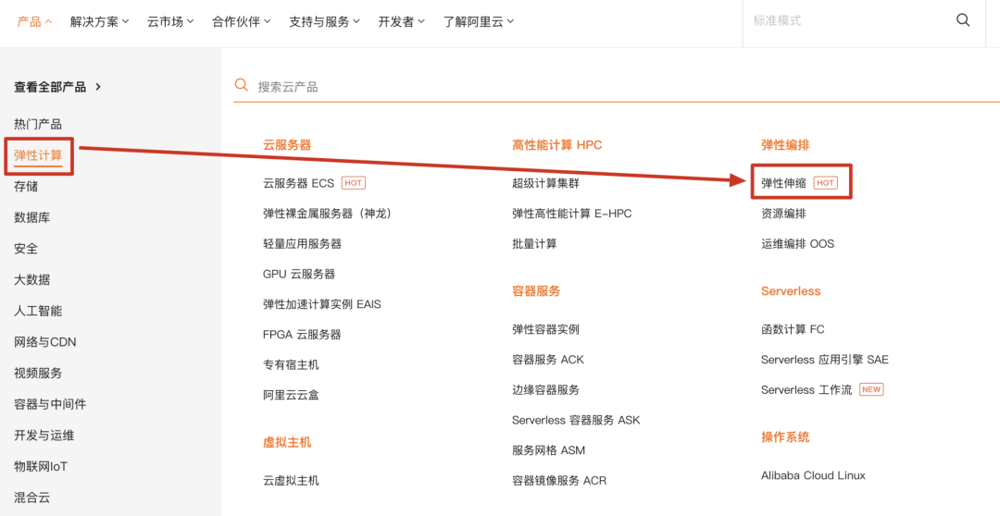
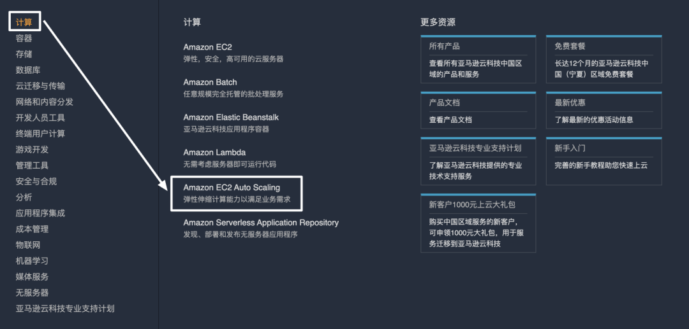
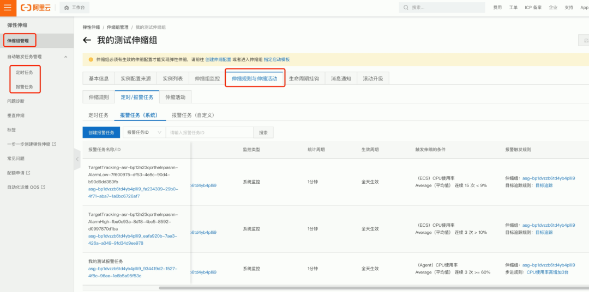
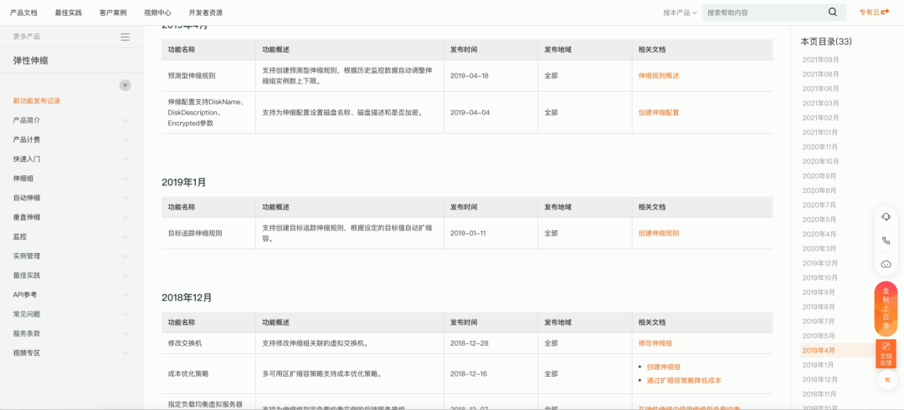

弹性伸缩逐渐变成了各大云厂商的标配。比如国内的阿里云。

 

 

国外的亚马逊云。

 

 

如果是公司内部自己用的私有云，那就看公司规模了。规模小的可能没有弹性伸缩，或者仅仅提供一小部分简单的功能，规模大的则必然有单独的弹性伸缩产品。

 

什么是弹性伸缩呢？简单说就是，**在需要很多机器的时候，自动扩容机器数量，在不需要那么多机器的时候，自动缩减机器数量**。

 

比如正常情况下，你的项目 1 台服务器就够了，但节假日的时候访问人数突然增多，需要 5 台机器才能扛得住，那就把机器临时加到 5 台，然后节假日结束了，再缩减回原来的 1 台。

 

这个过程完全可以由人手动去操作，可是人操作就会失误，也会增加人力成本。而且这还只是简单的情况，如果是完全无法预测的高峰，比如突然有一条新闻上热搜了，而你恰好是做资讯类的产品，那必然访问人数突然增加，这时候你手动扩充机器根本来不及。

 

而弹性伸缩，就是把这部分尽可能智能化，解放人们在这方面浪费的时间，并且要做得比人更好，更智能，更靠谱。

 

怎么做呢？让我们从最初没有弹性伸缩时的场景开始出发。

 

 

## **无弹性**

 

 

我们假设部署一个服务，已经有了一个自动化运维的平台，在这个平台下你新建一个服务，一个服务下有多台服务器，具体数量可以在服务配置里手动填写，每台服务器都部署着同样的代码。

 

服务名称：flash-demo

代码仓库或镜像地址：https://xxx

服务器数量：10

服务器规格：4核 8G 100G硬盘

 

然后这个平台下，你可以选择一个服务，并且选择对应的最新代码，或者最新镜像，点击发布。之后这个平台就会为你申请你指定数量的机器，并且部署上你的代码。

 

你这个服务的特征是，每个周末访问的人就变多，于是你在**每个周五晚上**，在服务器配置中把服务器数量改成 20。然后还要在**每个周日晚上**，把服务器数量改回成 10。

 

就这样日复一日，年复一年。

 

 

## **定时任务**

 

 

你再也受不了这种重复性的劳动了，打算把它自动化！

 

于是你在服务器配置中，增加一项配置，参数为**时间**和**数量**，可以配置多个。表示达到某个时间，机器数量就调整多少。

 

服务名称：flash-demo

代码仓库或镜像地址：https://xxx

服务器数量：10

服务器规格：4核 8G 100G硬盘

时间：周五晚上 8:00

数量：+10

时间：周日晚上 8:00

数量：-10

 

这就把你刚刚的重复劳动自动化了，程序会自动在每周五晚上 8:00 增加 10 台机器，每周日晚上 8:00 再减少 10 台机器。

 

你从中解脱！你管它叫**定时任务**。

 

 

## **报警任务**

 

 

直到有一天，你的网站不知道什么原因，访问人数瞬间增多，可是你隔了好久才反应过来。

你赶紧手动增加机器数量，才逐渐缓解下来。但由于时间的耽误，损失的利益已经不可挽回了。于是你决定，由程序来自动监控并处理。

 

接着刚刚定时任务的思路，你又增加了一项配置。

 

服务名称：flash-demo

代码仓库或镜像地址：https://xxx

服务器数量：10

服务器规格：4核 8G 100G硬盘

时间：周五晚上 8:00

数量：+10

时间：周日晚上 8:00

数量：-10

触发条件：QPS > 100

数量：+2

触发条件：QPS < 50

数量：-2

 

这样，每当网站访问人数突增时，单机 QPS 一旦高于 100，就自动触发增加机器的操作，加 2 台机器。同时，如果 QPS 降下来了，小于 50，则减少 2 台机器，节省资源。

 

你管它叫**报警任务**。

 

 

## **拆分出独立的弹性伸缩模块**

 

 

服务配置项越来越多，不但页面越来越丑，而且也不好管理。另外如果有其他服务想要复用，只能完全复制一份。于是你想到了解耦的思想，把弹性伸缩任务这个功能，单独抽成一个模块。

 

服务名称：flash-demo

代码仓库或镜像地址：https://xxx

服务器数量：10

服务器规格：4核 8G 100G硬盘

绑定的任务：task-1，task-2，task-3，task-4

 

任务名称：task-1

任务类型：定时任务

时间：周五晚上 8:00

数量：+10

 

任务名称：task-2

任务类型：定时任务

时间：周日晚上 8:00

数量：-10

 

任务名称：task-3

任务类型：报警任务

触发条件：QPS > 100

数量：+2

 

任务名称：task-4

任务类型：报警任务

触发条件：QPS < 50

数量：-2

 

这样，服务是一个模块，弹性伸缩是一个模块，弹性伸缩模块下就是各种弹性任务，分别绑定到不同的服务上，一下就清爽多了，方便管理，也可以复用。

 

 

## **拆分出伸缩组**

 

 

你发现，目前弹性扩张的机器规格和部署的项目，都是**和原服务相同**的。

 

而且，假如原服务有 5 台机器，你设置的某一个弹性伸缩任务一触发减少了 5 台机器，结果导致你原服务一台机器都没有了，那就危险了。

 

再有，你的服务下的机器列表，你也无法分辨出哪个是你原有的机器，哪个是弹性伸缩得到的机器，虽然你可以通过加标签的方式。

 

所以，暴露的问题就是，弹性伸缩的这部分机器，没有一个统一的管理。那么很自然，再抽出来一个概念就好了，你叫它**伸缩组**。

 

同一个伸缩组下的机器规格是一样的，你可以个性化指定，这样就可以做到原服务有的非弹性机器规格是 4核 8G，然后弹性扩容的机器是不同的 2核 4G，已达到个性化的需求。

 

**伸缩组需要绑定一个伸缩任务**，那么一个伸缩任务触发后，就只在伸缩组里面进行扩展和收缩，不会影响原服务固定的非弹性机器数量。然后伸缩组也可以配置最大实例数与最小实例数，以便更精细地控制。伸缩组还可以增加监控，单独监控某一伸缩组内的机器情况，就与原非弹性机器解耦开了。

 

任务名称：task-1

任务类型：定时任务

时间：周五晚上 8:00

绑定伸缩组：伸缩组 A

数量：+10

 

伸缩组名称：伸缩组 A

机器规格：4核8G

最大实力数：30

最小实力数：10

 

总之，一切解耦带来的便利，都因为一个伸缩组被拆出来，而得到。

 

 

## **拆分出弹性规则**

 

 

我们看刚刚的一个人物，其中有一项其实表示了如何在伸缩组里变更机器的含义。

 

任务名称：task-1

任务类型：定时任务

时间：周五晚上 8:00

绑定伸缩组：伸缩组 A

数量：+10

 

这表示当触发某条件时，就增加 10 台机器。

 

但这个规则也会慢慢变得复杂，可能不仅仅是单纯增加几台或者减少几台，还有可能表达调整至几台，根据超出阈值的程度动态增减几台等等。一旦复杂起来，把规则描述放在任务中就不太合适了，那好办，拆出来。

 

任务名称：task-1

任务类型：定时任务

时间：周五晚上 8:00

绑定伸缩组：伸缩组 A

绑定弹性规则：单纯增加 10 台

 

弹性规则名称：单纯增加 10 台

规则类型：简单规则

执行操作类型：增加

数量：10

实例预热时间：300 ms

 

顾名思义，大家应该能看懂，这里有个实例预热时间，意思是实例启动成功后，过 300 ms 再加入负载均衡策略池里，允许被上层应用访问，这样就可以留一部分预热时间，用于比如 Java 应用程序的类加载过程。

 

总之，你能想到的更灵活的改动，都直接在某一规则当中就好了。你可以配置一个特别复杂精细的规则，然后绑定给任务去用，这一部分复杂性就完全不影响一个任务本身了，任务可以专注于自己的判断条件，而不用去管具体触发后的执行规则是什么。

 

 

## **操作智能化**

 

 

有的时候，你可能希望达到某个需求，就是**希望 CPU 维持在 10% 左右**。为了达到这个需求，其实可以通过**两个报警**任务来实现，一个是 CPU 大于 12% 时增加 2 台机器，一个是 CPU 小于 8% 时减少 2 台机器，通过两个报警任务，大概实现将 CPU 维持在 10% 左右这个用户需求。

 

但这时候你完全可以发挥你的产品思维，报警任务是底层的控制手段，而用户诉求很可能是它们的组合和抽象，那我们完全可以就让用户配置一个 CPU 维持在 10% 这样一个最终目标，然后由程序自动将其拆解为对应的多个报警任务和弹性规则的组合，以满足用户的这一目标。

 

这样，方便了用户的配置，将底层复杂的配置实现对用户保持了透明。这样做的好处是显而易见的，当然坏处就是有**潜规则**了，用户不知道你底层是怎么玩的，可能会心里没底。毕竟用弹性伸缩的用户，都是开发人员嘛，开发人员还是希望能够知道更多细节的。

 

 

## **可预测智能化**

 

 

如果说上面的操作智能化可以简化一部分不希望关注太多细节的用户，那可预测智能化就是更加简化了。

 

我们可以根据用户服务的**历史数据**，基于机器学习的方式，了解这个服务什么时候有可能处于高峰，什么时候又处于低谷，然后自动帮忙配置出一系列的定时任务和报警任务。

 

定时任务用于提前预测可能出现的高峰和低谷，动态调整机器数。而报警任务作为一个兜底方案，万一没预测到的地方，也不至于就没有办法了。

 

此时用户仅仅需要一键开启智能化，就可以完全不用管弹性伸缩这玩意了，当然，你得有足够的历史数据供弹性伸缩平台去分析，不能直接丢过去一个任务就让人家给你智能管理。

 

可预测智能化有两个方向可以做，一个方向是**前置预测**，就是完全基于历史数据，提前就把该扩容的机器扩好，流量洪峰来的时候直接就稳稳接住，这样是最 Q 弹的。另一个方向是**后置预测**，就是当一波流量洪峰来的时候，发现这波流量比较迅猛，之后短时间内可能很快达到一个高峰，那就别两台两台扩了，直接先扩个 20 台再说，当然这样还是有一小段时间是没有完美接住流量的，不过已经比无预测无脑一点点扩容的策略智能一些了。

 

 

## **原理是啥**

 

 

有人问弹性伸缩的原理是啥，我觉得没有多大意义，因为没什么原理。这个产品难点在于整个思想的设计和细节的处理，具体原理就三个重点：

 

**一、如何获取指标数据**

 

因为弹性伸缩主要是根据某些指标达到设定的阈值了，然后触发什么什么操作。所以指标获取是第一步，比如 CPU 负载、内存使用率等系统指标，以及 QPS 等业务指标，无论哪种指标，一定是有另外一个统一的打点监控平台去收集的，只需要调他们接口获取就好了，就是一个数值的获取嘛。

 

**二、如何进行指标聚合**

 

比如你的用户配置了一个

CPU 使用率大于 10% 增加 1 台机器

 

又配置了一个

CPU 使用率大于 10% 增加 2 台机器

 

那此时你的逻辑是，提示用户不能这样进行配置，还是有自己的一套聚合逻辑，比如取最大值，就增加 2 台。这是你要去综合考虑的细节问题。

 

**三、如何调度机器**

 

触发阈值后，最后一步就是增加或减少机器，或者更复杂的运维操作比如重启机器、执行一些 shell 脚本等。这些也一定是有一个专门的调度产品和团队在去做的，他们的底层就是 k8s 调度 docker 容器那一套了，对于弹性计算产品来说，也是调几个接口的事情，无需关心底层具体调度逻辑。

 

所以也能看出，当分工足够细致时，每一层都在做 CRUD 和调包侠的事情，一旦变得复杂了，那就该考虑再拆出一层让另一个团队或产品去做了。

 

关于弹性伸缩，你了解了么？了不了解我也就写到这了，哈哈哈。本篇文章并不是自己想像出来的一步步优化和解耦，而是根据阿里云的弹性伸缩产品实际的发展路线来梳理的。

 

 

你看，这些概念，就是我们上面讲的概念。而且它们也并不是一蹴而就的，也是有一个不断迭代的发展过程，具体我们可以看产品发布记录。

 

 

可以看到 2019 年 1 月开始支持的这个目标追踪伸缩规则，其实就是我们的操作智能化的意思，新建一个目标追踪伸缩规则，就等于建立了多个报警任务，并且绑定简单扩缩容规则，以达到追踪一个指定的监控值，比如将 CPU 使用率追踪保持为 10%。

 

而阿里云的弹性伸缩还有很多更复杂的设计，大家感兴趣也可以去体验一下。

 

本文所讲的弹性伸缩如果你都能理解了，那市面上大部分弹性伸缩的设计，都不会复杂过本文介绍的了。甚至大多数公司的所谓弹性伸缩，就只是我们讲的最初设计，仅仅在服务配置上多一个参数，以最简单的增减机器的方式来实现，这对大部分小规模的业务场景，已经足够了。