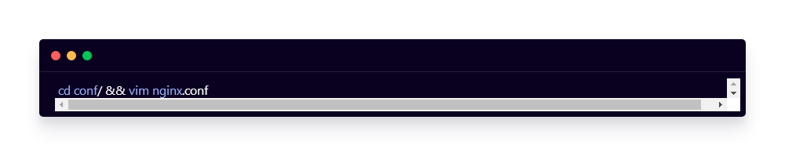
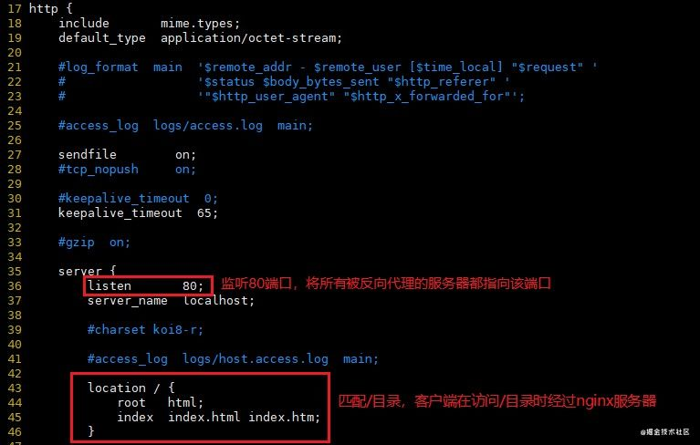
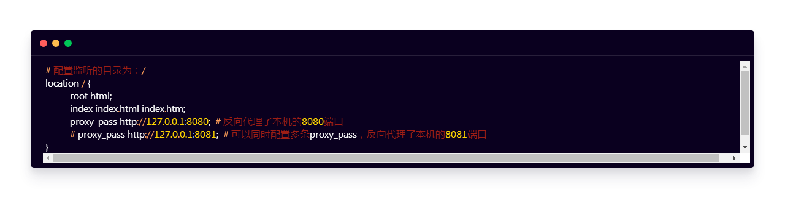
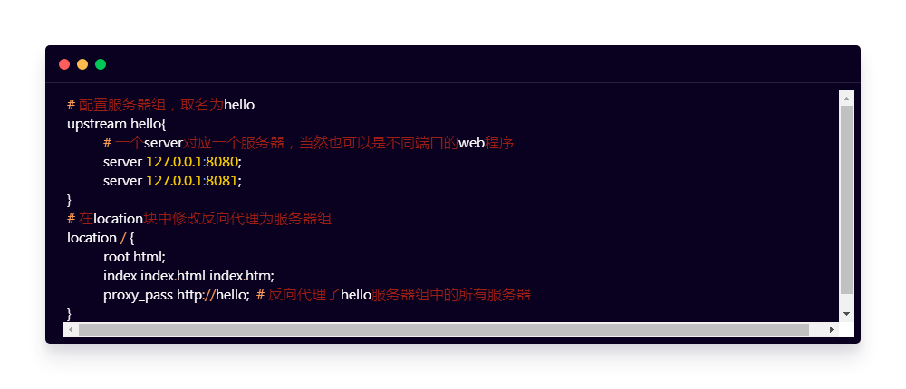

### 1. 配置文件

在Nginx的安装目录下有一个conf文件夹，打开其中的nginx.conf文件

### 2. 反向代理单个服务器

那么，如何使用Nginx进行反向代理？

在location参数中添加proxy_pass字段，并填写需要反向代理的服务器地址与端口号：

注意：每一行的配置都需要以封号结尾！！！

### 3. 反向代理多台服务器

如果有多台服务器怎么办？除了不断地添加proxy_pass参数，更好的解决方案是配置upstream服务器组！

在配置文件的http块中添加upstream属性：

