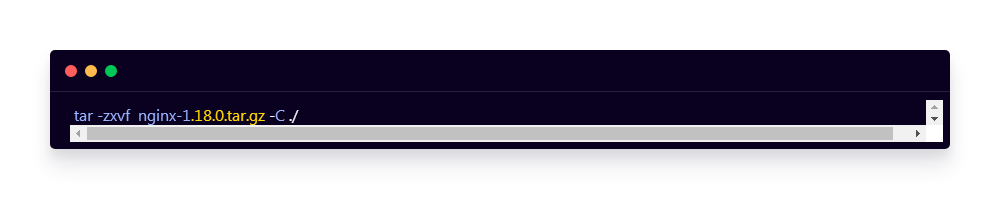
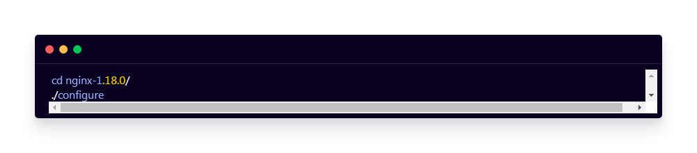
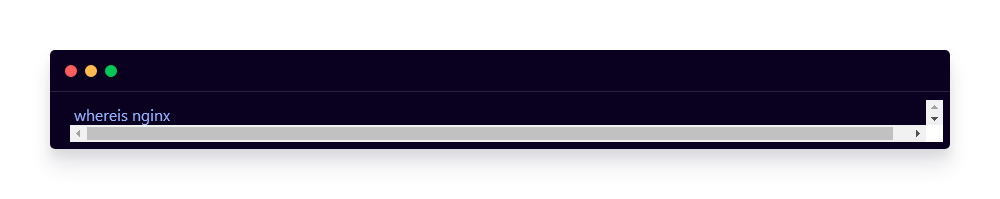
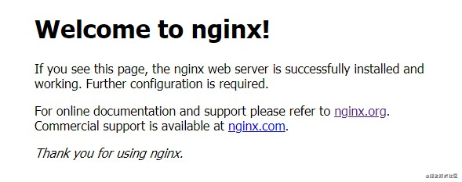

由于Nginx被大量使用在Web服务器中，所以本教程选择了Centos服务器的7.4版本作为演示！

### 1. 下载

**进入官方下载页面：[**[**http://nginx.org/en/download.html](https://link.zhihu.com/?target=http%3A//nginx.org/en/download.html)**](http://nginx.org/en/download.html](https://link.zhihu.com/?target=http%3A//nginx.org/en/download.html))**，选择Stable version稳定版本进行下载，并上传至服务器。**

### 2. 安装

上传tar包至服务器后，解压到当前目录

进入解压后的目录，执行configure脚本

使用make命令进行安装

安装完成后，使用whereis命令查找Nginx的安装位置 (默认安装在/user/local/目录下)

进入安装目录下的bin文件夹，启动nginx服务，访问服务器默认的80端口查看是否安装成功！

