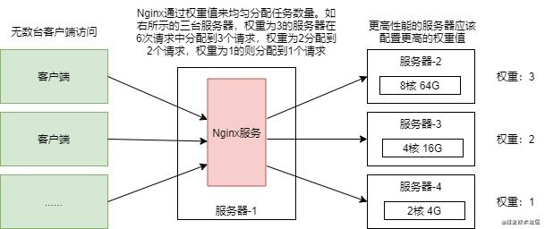
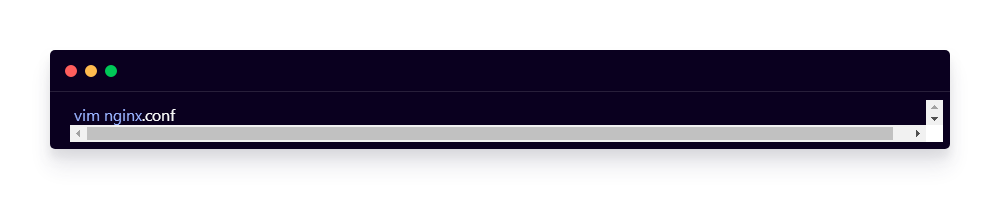

### 1. 什么是负载均衡？

由于不同服务器的配置不同，为了让性能高的服务器分配到更多的请求，便引入了负载均衡的概念。


前面提到过，Nginx的负载均衡方式可以有很多种，如加权轮询(默认)、IP哈希、url哈希等等，这里就以加权轮询作为介绍。


加权轮询，也就是通过给服务器添加各自的权重值，Nginx通过权重来进行请求的分配，权重越高接收到的请求数量越多，反之越少：





上图配置了三台服务器，在加权轮询的模式下，6次不同的请求中，权重为3的服务器将会分配到3次请求，权重为2的服务器会分配到2个请求，权重为1的服务器则会分配到1个请求。负载均衡大大减少了在高并发的环境下服务器宕机的风险！


### 2. 配置Nginx负载均衡

同样地，打开nginx.conf文件进行配置：





```properties
#stream {
#    upstream testdocker {
#        hash $remote_addr consistent;
#        server 172.20.0.9:30105;
#    }
#    server {
#        listen 30105;
#        proxy_connect_timeout 10s;
#        proxy_timeout 600s;
#        proxy_pass testdocker;
#    }
#
#}

server {
    listen 9092;
    server_name 127.0.0.1;
    add_header X-Frame-Options "ALLOWALL";
    add_header Strict-Transport-Security "max-age=63072000; includeSubdomains; preload";
    add_header Access-Control-Allow-Headers *;

    underscores_in_headers on;
    root /mnt;

    location ^~ /gate/
    {
        autoindex_localtime on;

        access_log  /var/log/nginx/access_test_gate.log main;
        error_log /var/log/nginx/error_test_gate.log warn;

        proxy_pass http://172.20.0.9:21201;
        proxy_set_header Host $host;
        proxy_set_header X-Real-IP $remote_addr;
        proxy_set_header X-Forwarded-For $proxy_add_x_forwarded_for;
        proxy_set_header REMOTE-HOST $remote_addr;
        proxy_set_header  X-NginX-Proxy    true;
        proxy_http_version 1.1;
        proxy_set_header Upgrade $http_upgrade;
        proxy_set_header Connection "Upgrade";
#        proxy_ssl_server_name   on;
#        proxy_ssl_name  "www.cloudflare.com";
        proxy_connect_timeout 600;
        proxy_read_timeout 600;
        proxy_send_timeout 600;


    }
    
    location ^~ /slo-test/
    {
        autoindex_localtime on;

        access_log  /var/log/nginx/access_test_slo.log;
        error_log /var/log/nginx/error_test_slo.log warn;

        proxy_pass http://172.20.0.9:29201;
        proxy_set_header Host $host;
        proxy_set_header X-Real-IP $remote_addr;
        proxy_set_header X-Forwarded-For $proxy_add_x_forwarded_for;
        proxy_set_header REMOTE-HOST $remote_addr;
        proxy_set_header  X-NginX-Proxy    true;
        proxy_http_version 1.1;
        proxy_set_header Upgrade $http_upgrade;
        proxy_set_header Connection "Upgrade";
#        proxy_ssl_server_name   on;
#        proxy_ssl_name  "www.cloudflare.com";
        proxy_connect_timeout 600;
        proxy_read_timeout 600;
        proxy_send_timeout 600;


    }

    location ^~ /callback/
    {   
        autoindex_localtime on;
        
        access_log  /var/log/nginx/access_test_callback.log;
        error_log /var/log/nginx/error_test_callback.log warn;
        
        proxy_pass http://172.20.0.9:31201;
        proxy_set_header Host $host;
        proxy_set_header X-Real-IP $remote_addr;
        proxy_set_header X-Forwarded-For $proxy_add_x_forwarded_for;
        proxy_set_header REMOTE-HOST $remote_addr;
        proxy_set_header  X-NginX-Proxy    true;
        proxy_http_version 1.1;
        proxy_set_header Upgrade $http_upgrade;
        proxy_set_header Connection "Upgrade";
#        proxy_ssl_server_name   on;
#        proxy_ssl_name  "www.cloudflare.com";
        proxy_connect_timeout 600;
        proxy_read_timeout 600;
        proxy_send_timeout 600;

    
    }

location ^~ /fast/
    {
        autoindex_localtime on;

        access_log  /var/log/nginx/access_test_fast.log;
        error_log /var/log/nginx/error_test_fast.log warn;

        proxy_pass http://172.20.0.9:50201;
        proxy_set_header Host $host;
        proxy_set_header X-Real-IP $remote_addr;
        proxy_set_header X-Forwarded-For $proxy_add_x_forwarded_for;
        proxy_set_header REMOTE-HOST $remote_addr;
        proxy_set_header  X-NginX-Proxy    true;
        proxy_http_version 1.1;
        proxy_set_header Upgrade $http_upgrade;
        proxy_set_header Connection "Upgrade";
#        proxy_ssl_server_name   on;
#        proxy_ssl_name  "www.cloudflare.com";
        proxy_connect_timeout 600;
        proxy_read_timeout 600;
        proxy_send_timeout 600;


    }
    
    location ^~ /verify/
    {
        autoindex_localtime on;

        access_log  /var/log/nginx/access_test_verify.log;
        error_log /var/log/nginx/error_test_verify.log warn;

        proxy_pass http://172.20.0.9:27221;
        proxy_set_header Host $host;
        proxy_set_header X-Real-IP $remote_addr;
        proxy_set_header X-Forwarded-For $proxy_add_x_forwarded_for;
        proxy_set_header REMOTE-HOST $remote_addr;
        proxy_set_header  X-NginX-Proxy    true;
        proxy_http_version 1.1;
        proxy_set_header Upgrade $http_upgrade;
        proxy_set_header Connection "Upgrade";
#        proxy_ssl_server_name   on;
#        proxy_ssl_name  "www.cloudflare.com";
        proxy_connect_timeout 600;
        proxy_read_timeout 600;
        proxy_send_timeout 600;
    }

    location ^~ /gm/
    {
        autoindex_localtime on;

        access_log  /var/log/nginx/access_test_gm.log;
        error_log /var/log/nginx/error_test_gm.log warn;

        proxy_pass http://172.20.0.9:23201;
        proxy_set_header Host $host;
        proxy_set_header X-Real-IP $remote_addr;
        proxy_set_header X-Forwarded-For $proxy_add_x_forwarded_for;
        proxy_set_header REMOTE-HOST $remote_addr;
        proxy_http_version 1.1;
        proxy_set_header Upgrade $http_upgrade;
        proxy_set_header Connection "Upgrade";
#        proxy_ssl_server_name   on;
#        proxy_ssl_name  "www.cloudflare.com";
        proxy_connect_timeout 600;
        proxy_read_timeout 600;
        proxy_send_timeout 600;


    }


    location /testing
    {
        root /mnt;
        index   index.html index.htm;
        try_files $uri $uri/ /index.html;
    }

    location /connector11
    {
        autoindex_localtime on;

        access_log  /var/log/nginx/access_test_connector11.log main;
        access_log  /var/log/nginx/access_test_connector11_stream.log upstream_time;
        error_log /var/log/nginx/error_test_connector11.log warn;

        proxy_pass http://172.20.0.9:22301;
        proxy_set_header Host $host;
        proxy_set_header X-Real-IP $remote_addr;
        proxy_set_header X-Forwarded-For $proxy_add_x_forwarded_for;
        proxy_set_header REMOTE-HOST $remote_addr;
        proxy_http_version 1.1;
        proxy_set_header Upgrade $http_upgrade;
        proxy_set_header Connection "Upgrade";
        proxy_set_header Origin "";

        proxy_connect_timeout 600;
        proxy_read_timeout 600;
        proxy_send_timeout 600;

    }
    location /ethantest
    {   
        autoindex_localtime on;
        
        access_log  /var/log/nginx/access_ethantest.log main;
        error_log /var/log/nginx/error_ethantest.log warn;
        
        proxy_pass http://172.20.0.9:33333;
        proxy_set_header Host $host;
        proxy_set_header X-Real-IP $remote_addr;
        proxy_set_header X-Forwarded-For $proxy_add_x_forwarded_for;
        proxy_set_header REMOTE-HOST $remote_addr;
        proxy_http_version 1.1;
        proxy_set_header Upgrade $http_upgrade;
        proxy_set_header Connection "Upgrade";
        proxy_set_header Origin "";
        
        proxy_connect_timeout 600;
        proxy_read_timeout 600;
        proxy_send_timeout 600;
    
    }


#    location /
#    {
#   resolver 8.8.8.8;
#   #resolver 223.5.5.5 223.6.6.6 1.2.4.8 114.114.114.114 valid=3600s;
#        autoindex_localtime on;
#
#        access_log  /var/log/nginx/access_test_proxy.log  upstream_time;
#        access_log  /var/log/nginx/access_test_proxy_host.log  host;
#        error_log /var/log/nginx/error_test_proxy.log warn;
#   
#        #proxy_pass http://test-admin.tzhfyz.com;
#   proxy_pass $http_x_custom_header;
#        #proxy_set_header Host $host;
#        #proxy_set_header X-Real-IP $remote_addr;
#        #proxy_set_header X-Forwarded-For $proxy_add_x_forwarded_for;
#        #proxy_set_header REMOTE-HOST $remote_addr;
#        proxy_http_version 1.1;
#        proxy_set_header Upgrade $http_upgrade;
#        proxy_set_header Connection "Upgrade";
#        proxy_ssl_server_name   on;
#        #proxy_ssl_name  "www.cloudflare.com";
#        proxy_connect_timeout 60;
#        proxy_read_timeout 600;
#        proxy_send_timeout 600;
#
#
#    }

}
```