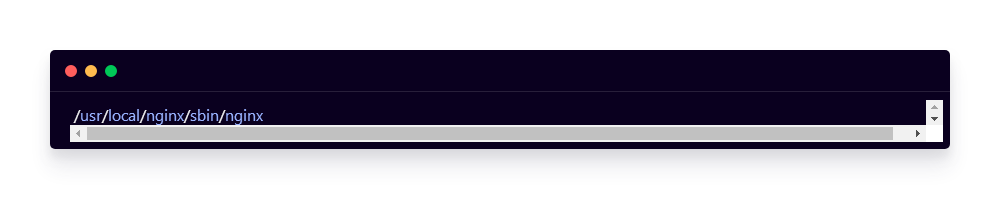
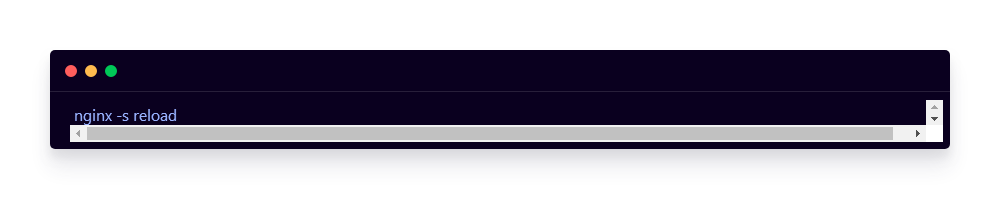
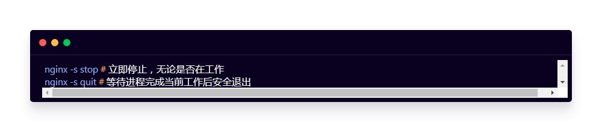

### 1. 启动服务

配置完成后，进入Nginx安装目录下的sbin文件夹，运行nginx程序即可：

如果之前已经启动，无需关闭nginx服务，只需要让nginx重新加载配置文件即可：

刷新浏览器，若反向代理成功，访问的路径会自动映射到配置文件中的服务器地址！

将来，随着用户量的增长，可能需要添加新的服务器；这时只需要修改配置文件，使用 nginx -s reload 命令即可，无需关闭nginx服务器！

### 2. 关闭服务

关闭nginx服务的方式一般分为两种：

