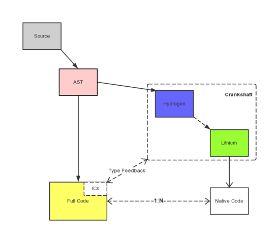

# Node.js 基本架构解析

### 1、Node.js 简介

​     Node.js 最初开始于 2009 年，是一个可以让 JavaScript 代码离开浏览器的执行环境也可以执行的项目。 它不是一个前端的 web 框架，不能将其与 Java 的 Spring 做类比；同时它也不是一门编程语言，它并不是面向后端的一门 js，它仅仅是以 js 为后缀的，所以也不能将其与 Python 或 PHP 做对比。那 Node.js 是什么？

​     我们一般称 Node.js 是一个平台，它将多种技术组合起来，让 JavaScript 也能调用系统接口、或进行后端开发的应用。Node.js 依赖的架构主要有 V8 引擎 和 libuv，以及一些 C/C++ 实现的 c-ares、http-parser、OpenSSL、zlib。

​     说白话就是，Node.js 给 JavaScript 提供了一个平台，让 JavaScript 可以调用一些 C/C++ 的接口，这大大扩展了 JavaScript 的能力，进而使 JavaScript 有了后端开发的能力。以下是 Node.js 的工作流程：

  ps：Node.js 的版本 已经到 15 了，双数是稳定版，单数是非稳定版，Node 8 可能不太支持 Vue3，建议使用 Node 10 或 12。至于 Node.js 的安装，可以到 Node 官网 直接下载安装包，傻瓜式安装就行了，安装完毕之后在命令行输入 node -v 后，如果能显示当前版本即表示安装成功。

### 2、Node.js 基本架构

​     Node.js 主要有 Node Standard Library、Node Bindings、V8、Libuv 四部分，架构图如下：

Node Standard Library 是 Node 专门提供给开发人员使用的标准库，如 Http，fs 等模块。

Node Bindings 是沟通 JS 和 C++ 的桥梁，封装 V8 引擎 和 Libuv 的细节，向上层提供基础 API 服务。

第三层是支撑 Node.js 运行的关键，由 C/C++ 实现。

V8 是 Google 开发的 JavaScript 引擎，提供 JavaScript 运行环境，可以说它就是 Node.js 的发动机。

Libuv 是专门为 Node.js 开发的一个封装库，提供跨平台的异步 I/O 能力.

C-ares：提供了异步处理 DNS 相关的能力。

http_parser、OpenSSL、zlib 等：提供包括 http 解析、SSL、数据压缩等其他的能力。

### 3、Node bindings 是个啥？

​     Node Bindings 是沟通 JS 和 C++ 的桥梁，封装 V8 引擎 和 Libuv 的细节，向上层提供基础 API 服务。

​     举个例子：C/C++ 实现了一个 http_parser 的库，非常高效，但是前端开发人员只会写 JavaScript，直接调用这个库肯定是不能成功的，所以就需要一个中间的桥梁。于是 Node.js 的作者就用 C++ 对 http_parser 库进行封装，使它符合某些要求（比如统一数据类型等），封装的文件叫做 http_parser_bindings.cpp。同时 Node.js 提供的编译工具可以将其编译为.node文件。这样 JavaScript 代码可以直接 require 这个 .node 文件，这样 JavaScript 就能调用 C++ 库。

​     中间的桥梁就是 binding，由于 Node.js 提供了很多 binding，多个 binding 就构成了 Node 基本架构中的 Node bindings 了。有了这个 Node Bindings 后，JavaScript 和 C++ 就可以进行一些相互调用的操作，进而实现功能上的一些通信。这里有官网提供的示例，便于大家理解 JS 和 C++ 是如何进行通信的：JS 调用 C++ 代码、C++ 调用 JS 回调。

​     ps：除了 Node.js 提供的这些 Bindings 之外，还支持开发人员自定义封装 C/C++ 来扩展你想要实现的功能。

### 4、为什么是 libuv？

​     Node.js 最早时是使用了 Google 的 V8 解析引擎 和 Marc Lehmann 的 libev。Node.js 将事件驱动的 I/O 模型与适合该模型的编程语言（JavaScript）融合在了一起，但随着 Node.js 的日益流行，Node.js 也需要同时支持 Windows，但是 libev 只能在 Unix 环境下运行，而在 Windows 系统平台上与 kqueue(FreeBSD) 或者 epoll(Linux) 等内核事件通知相应的机制是 IOCP。

​     基于上述背景，Node.js 之父 Ryan 就着手开发了一个 跨平台的异步 I/O 库，将上述操作系统对应的库都整合到一起，于是乎就诞生了 libuv，libuv 会根据不同的操作系统自动选择合适的方案，它的所有功能都是异步的，一般是用于 操作TCP/UDP/DNS/文件等的异步操作。

​     为啥是异步？因为即便是 SSD 的访问相较于高速的 CPU，仍然是慢速设备。于是基于 事件驱动 的 IO 模型就应运而生，解决了高速设备同步等待慢速设备或访问的问题。这不是 libuv 的独创，linux kernel 原生支持的 NIO也是这个思路。 但 libuv 统一了网络访问，文件访问，做到了跨平台。

上述 libuv 的架构图中，从左往右分为两部分，一部分是与网络I/O相关的请求，而另外一部分是由文件I/O, DNS Ops以及User code组成的请求。

​     从图中可以看出，对于Network I/O和以File I/O为代表的另一类请求，异步处理的底层支撑机制是完全不一样的。对于Network I/O 相关的请求， 根据 OS 平台不同，分别使用 Linux 上的 epoll，OSX 和 BSD 类 OS 上 的 kqueue，SunOS 上的event ports 以及 Windows 上的 IOCP 机制。而对于 File I/O 为代表的请求，则使用 thread pool。利用 thread pool 的方式实现异步请求处理，在各类 OS 上都能获得很好的支持。

### 5、V8 引擎又是啥？

​     V8 是目前商用的执行 JavaScript 最快的一个引擎，它的功能有很多：将 JavaScript 源代码变成本地代码并执行、维护 JavaScript 的调用栈，确保 JavaScript 函数的执行顺序、负责内存管理，为所有对象分配内存、垃圾回收，重复利用无用的内存、实现JS的标准库。

